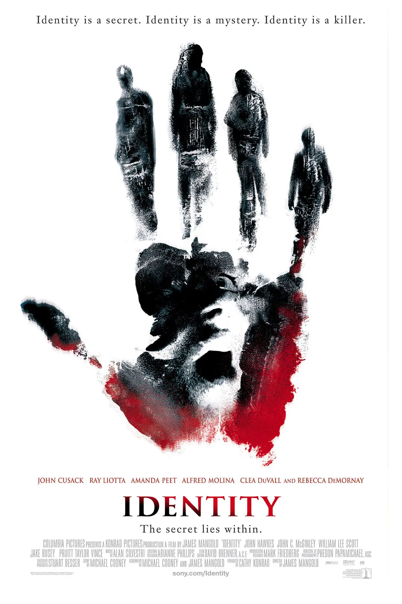
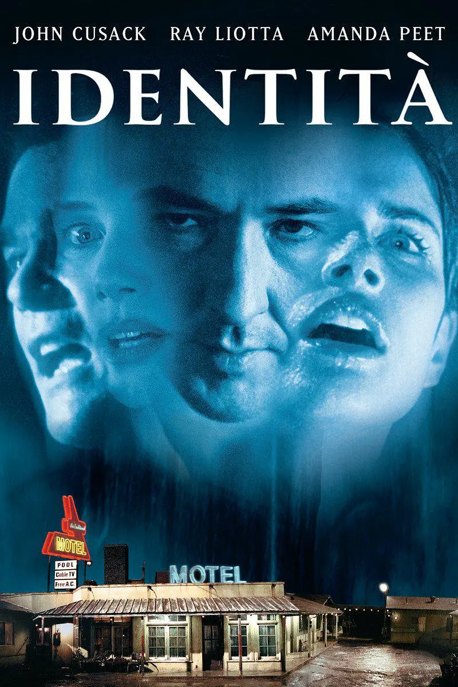

##  简介

- 
- 

《致命ID》（英语：Identity），是一部2003年美国惊悚电影，由詹姆斯·曼高德执导，约翰·库萨克、雷·利奥塔、阿曼达·皮特等主演。影片故事情节的灵感来自英国小说家阿加莎·克里斯蒂的作品《无人生还》。

> 连夜暴雨，洪水封路，曾担任警官的礼车司机艾德（约翰·库萨克饰）等11个人困在沙漠中的一间汽车旅馆内。人人各有心病，但他们原本都只想待天亮放晴之后继续自己的旅程与工作，谁知随即发生一连串谋杀案。凶手就在他们之中，但疑凶又遭谋杀。剩余的人互相猜忌，互相警戒、防备，深畏无法逃离人魔的掌心。但是后来他们发现不可思议的巧合——11人的生日竟然是同一天，而所有人的姓排列起来亦另有玄机。其中有人开始认为这是超自然事件，有人认为只是连环杀人。艾德明白真相之后舍身除奸。然而，他漏算了一个人。

## 演员表

* **导演：** 詹姆斯·曼高德
* **监制：** 卡西·康拉德 
* **编剧：** 迈克尔·科尼
* **主演：** 约翰·库萨克、雷·利奥塔、阿曼达·皮特、阿尔弗雷德·莫里纳、克里·杜瓦尔、瑞贝卡·德·莫妮、约翰·哈克斯、约翰·C·麦金雷、威廉姆·李·斯科特、杰克·布塞、普路特·泰勒·文斯、布莱特·罗尔
* **配乐：** 艾伦·西尔韦斯特里
* **摄影：** 芬顿·帕帕迈可
* **剪辑：** 大卫·布伦内尔
* **制片商：** 凯西·康拉德
* **片长：** 91分钟
* **产地：** 美国
* **语言：** 英语
* **上映日期：** 2003年4月25日

## 参考链接

* [维基百科：致命ID](https://zh.wikipedia.org/wiki/%E8%87%B4%E5%91%BDID){:target="_blank"}