# 意识强度提升点实操指南【1】中央区：心智控制区

* 作者：古零

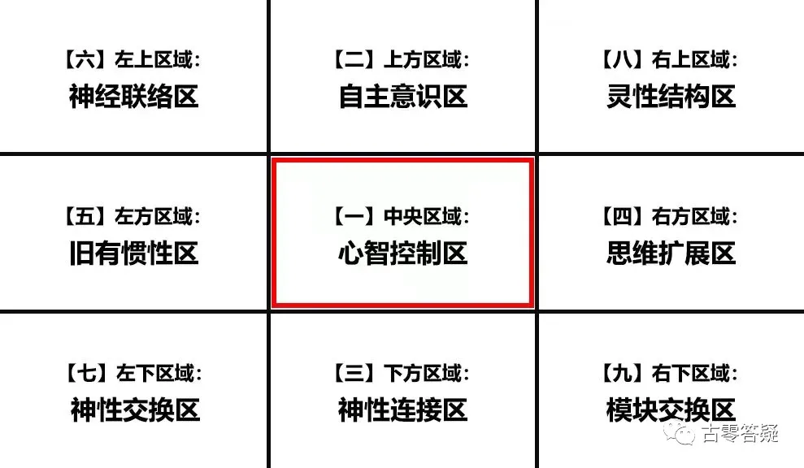

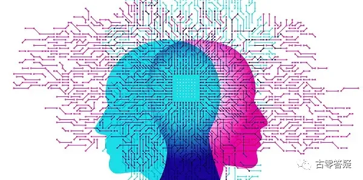

## 1、自动化程度 vs 自主化程度（自由意识）

每个人的心智程序比重不一样，比重越高，自动化程度越高，自主化程度越低。

即：机器人vs自由人。

此处：自动化=AI机器程序。自主化 = 自由意识（freewill）。

**量化数据：**

人类大部分：40-60%（反值）。（相当于：正值的 60-40%。）

最高有80%，但是极少数，即 80% 自动化（机器人）程度，20% 自主（自由人）程度。

举个例子：
> 老师出了一个题，自动化程度高的学生会谋求标准答案（能拿满分的答案），自主化程度高的学生会根据自己的理解去答题，会思考我为什么要回答，如何回答，这个过程我能学到什么，有没有一些我所忽略的地方等。

群聊分享：

```
（2021年8月25日）
```

@阿东
> @星爵 问一个常规事件反应模式的问题，比如说和人来往经常说谢谢，那么这个分就会比较高了。问题是不是不在于说谢谢，而在于是习惯性说出的还是心里感受说出的？

@古零（GU0）

这里的“谢谢”更多是能量平衡的表达吧，本身是基于能量交流的实际情况，是有前提条件的，如果自测，建议更多从意识的惯性层面寻找，举个例子，有些人倾向做机械式的工作，机械式的思维，机械式的行为习惯，机械式的思考和判断，机械式条件反射和情绪触发（在纪录片《轮回》这样的镜头特别多），只要细心留意，这种自动化模式的人在身边就有很多，就像游戏里面的 NPC 一样（参考电影《失控玩家》），行为模式也非常容易预判。当然保留一些自动化对日常生活和工作还是有帮助的，如驾驶车辆和重复性比较大的工作等。


**自主化程度的部分表现：**

1. 经常觉察自己的行为，并进行总结，反省，修正；
1. 看待事情，不容易被表象迷惑，探索其中的本质，并寻找规律，提炼要点；
1. 遇到事情，先了解再判断；
1. 追求更多的选择，更自由的体验；
1. 因地制宜，将计就计，灵活变通；
1. 不容易随波逐流，有独立的思考和分析；

**自动化程序的部分表现：**

1. 模式化的线性行为，缺乏觉察意识，基本处于“阅”（体验）后即忘的状态，经验也处于停滞，没有升级意愿。
1. 习惯性预判，通过某些预设的触发条件进行自动化判断和归类。
1. 思维模式和条件反射呈现公式化，简单化，容易产生同理心，容易被煽动和控制，具体如破窗效应，羊群效应等。
1. 意识焦点容易被锁定，与周围事物联动性小，延伸发展为麻木性的意识焦点，对身边的事物毫不关心，对自己被攻击的状态也变得反应迟钝。

梦境是很好的一种自我检验，在梦境，自动化都会被放大数倍，自己的行为反应和思维模式会变得随波逐流，情绪也容易被触发。
自主化强的人，会对梦境所呈现的逆境进行反击，而不是盲目逃避或者陷入重复性的焦虑，而飞行梦、失重梦等也会经常在梦中出现。


@美润

> 反击，是互动吗？
> 梦中旁观的时候，需要反击吗？

@古零（GU0）

这个是指大部分人对于自动化的表现，梦中旁观是属于知梦（梦修）

```
（2021年8月26日）
```

@。

>第 4 点我没想过也算是自动化程序
>
>古零（GU0）哥，这个能再详细说说吗？

@古零（GU0）

4.意识焦点容易被锁定，与周围事物联动性小，延伸发展为麻木性的意识焦点，对身边的事物毫不关心，对自己被攻击的状态也变得反应迟钝。
意识程序固化，对外部信息的反应表现为迟缓，麻木，并以教条化，单一化的去接收和过滤信息，即使自身感到不适或者受损也逆来顺受，自我安慰，整体自由意识已经边缘化，甚至消失。

```
（2021年10月30日）
```

@风

> \@GU0 ，到底哪些思维感觉是自动化，哪些是自主化，我觉得一个分离的身份进入某个场景就有自己的个性和表达，不太分清他们的区别

@古零（GU0）

举个栗子，老司机开车上班，边开车边聊天，开车是自动化，聊天是自主化，此刻，老司机发现前面堵车，将计就计选择一条新的路来走，此刻是自主化，新路刚建成，没有导航，老司机不得不小心翼翼的开车，怕错过路口，这个时候是自主化，当这条新路走多了，老司机对路况越来越熟练，这个时候开始进入自动化。

补充：表现

自动化程度高：倾向于程序化，模式化，逻辑化，往往喜欢用 “经验” 去建立一套可复制的 AI 运行系统。


## 2、反应固化程度 vs 反应变通程度

面对同样的场景或行为，所采取的反应模式、程序。即：机器人 vs 自由人。

**量化数据：**

人类大部分：60-80%（反值）。（相当于：正值的 40-20%。以下同理。）

即 60-80% “机器人固化程度” vs 相对于 20-40% “自由人变通程度”。

举个例子：
>无缘无故被陌生人骂了，反应固化程度高的人会生气，甚至反击。反应变通程度高的人会去观察对方当时的状态，以及周边的环境，自己如何选择才更能让事情变得 “有趣”。

群聊分享：

```
（2021年10月30日）
```


@。
> \@GU0 古零（GU0）哥，今天多加一堂课好不好?

@古零（GU0）

其实这个点在电影《失控玩家》里面表现得淋漓尽致，几乎就是量身定做，如主角觉醒后，试图唤醒身边的NPC朋友，告诉他们人生有更多的选择，但他们还是难以去改变习以为常的机器人固化程序，没看过这部电影的同学，墙裂推荐去看看这部电影，一片胜万言。关于观电影法的具体操作可以进入公众号：古零答疑，里面有详尽的介绍。

补充：表现

反应固化程度高：知道自己有这样的惯性反应，但又无法去改变，被触发时难以控制自己，如：越想越来气、越想控制反而越难受等，另一种是处于不自知的状态，执行过程中毫无觉察力。


## 3、向外归责程度 vs 向内反思程度

当发生责任事件，向外归因和向内归因的比重。

**量化数据：**

人类大部分：60-80%（反值）。

（即 60-80% 向外归因，20-40% 向内归因）

群聊分享：

```
（2021年8月27日）
```

@古零（GU0）

当发生责任事件，向内归因比重越大，自省深度越高，很多自身的漏洞才能被挖掘出来，并得以修正。

具体可以参考各个意识强度水平，在这个数值中的比重。

@。
> 内求，大部分的问题不复存在

@古零（GU0）

是的，向内归因相当于挖雷工具，内求相当于源动力。

补充：表现

向外归责程度高：缺乏换位思考，无法包容和理解不同于自己的频率。

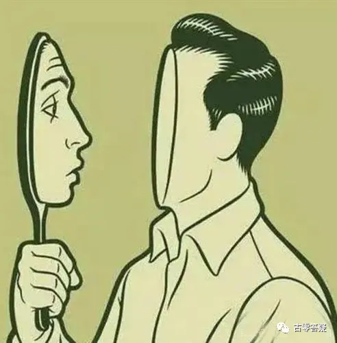

## 4、意识分散程度 vs 意识专注程度

心智模式会让人难以专注，容易产生杂念，分散人的意识。

**量化数据：**

人类大部分：60% 左右（反值）。

非常专注的做一件事情，比如精细手工艺或者精微手术什么的，都需要至少 20% 以下。

如果强制控制自己去专注，会产生疲劳。

如果沉浸在宁静的感觉中，会起到静心的效果

群聊分享：
```
（2021年8月28日）
```

@古零（GU0）

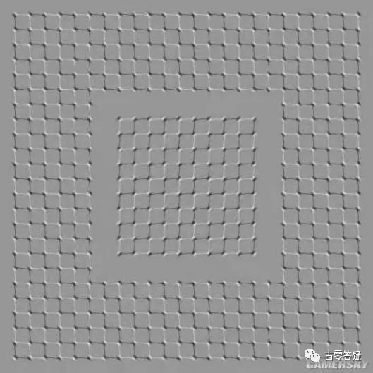


小游戏，点击图片放大观看，杂念越多，图片所呈现的“动态”就会越明显

@阿东
>感觉只有中心的一开始看有点动，时间非常短，然后不动了。

>我看是一直动

>中间的和周围的是镜像的关系

@古龙
>有一点点动，就像脉波

@阿东
>古零（GU0）哥，你看的会是什么情况？

@古零（GU0）

保持专注，会发现有一组震动的频率（就像一堆数字在跳动），下意识锁定其中一个相对稳定的频率，图就静止了。

下面这张图，用意识让图案动起来和保持静止，感觉一下两种意识有啥区别？

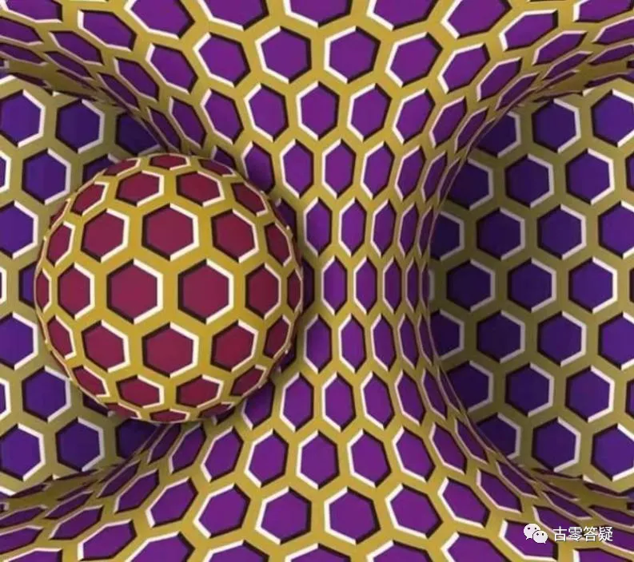


@听雨的猫
>动起来时候感觉意识是分散的，静止相反，是集中的是安静的

@听雨的猫
>意识保持无思无想是不动的，不然会慢慢的转

\@Elaine
>\@GU0 有人一看就是不动的，说明什么？

@古零（GU0）

说明需要多看一会儿图片

\@Elaine
>一直都是不动的，说明专注力很强吗

@古零（GU0）

不一定

@。
>刚才又看多一次这球图，感觉这球的图是测自己发出来的意识流，如果稳定无杂念的话，球会很有规律和很缓慢转动，当意识流自己"锁定"的话，球也跟着停止不动

>不知道对不对，就自己体验后分享

>可以只控制球旋转，也可以只控制球隔壁的物体旋转，也可以控制两个一起旋转

@古零（GU0）

专注力 = 定力

@阿东
>这个图是心动则图动吧？

@古零（GU0）

是

```
（2021年8月30日）
```

@稻米居士
>练习静观和专注力本质一样吗

@古零（GU0）

有关联但不能划等号吧，静观在语义范围上更大一些

@稻米居士

>练习检测点第一步就是 “发现”，第二步就是 “解决” 吗

>时时刻刻专注察觉今天的意识检测点，察觉到了静观它

>就提升了吗

@古零（GU0）

1. 自我客观评估，分析目前处于正值与反值的意识状态，测出意识强度值；
1. 总结和分析自身的漏洞，明确提升的方向，强化正值，降低反值；
1. 设立目标和时间周期，并时刻保持觉察和反省，不断总结，及时修正；
1. 定期进行自测和评估，通过复盘不断提升效率，直至觉醒（意识强度 9 以上 + 脱离轮回）。
1. 不怕试错，多尝试，寻找适合自己的方法。实践 —— 总结（自检、反省）—— 修正 —— 实践.....这样就会进入提升的良性循环。

@稻米居士

>那可不可以打坐专门静观这个观念

@古零（GU0）

可以

@稻米居士
>打坐练意识检测点把意识焦点与它合一就可以了吗？

>既然察觉到就是强化了，那怎么修正呢，察觉到后用意识播种强化正值吗

@古零（GU0）

不怕试错，多尝试，寻找适合自己的方法

实践——总结（自检、反省）——修正——实践.....这样就会进入提升的良性循环。

```
（2021年10月31日）
```

@。
>@GU0，能补多一课吗？说说这点

@古零（GU0）

举个例子，你要静观，但此刻的状态静不下来，但你又强迫自己去静，那么这个专注就会形成意识对抗，最终反过来变成疲劳，甚至意识分散。若换一个方式，保持顺其自然的状态，静时观静，动是观动，才能让专注处于沉浸的状态，才会起来静心的作用。

练习如何提高意识专注程度：

1. 就如上面提到的例子，保持顺其自然的状态下，不要形成意识对抗，而是将计就计，这样更有利于逐步提高意识专注程度。
1. “沉浸” 是关键，多去练习这种 “沉浸” 的感觉
1. 专注与沉浸融合，变成一个舞台（观察站），万事万物的变化只是电影。

补充：表现

意识分散程度高：静不下来，杂念满天飞。


## 5、思维僵化程度 vs 思维自由程度

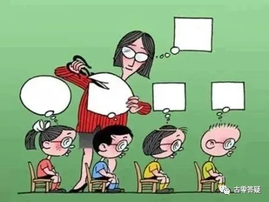


心智思维占个人思维比重。多是机械、固化、盲目的程序。

多来自于传统习俗、社会宣传、舆论导向等。也属于信念系统。

典型程序是：这个想法很正常吧，大家不都是这样吗。

“固定 = 安心” 等洗脑意识和社会洗脑系统也是配套的程序，和宗教系统也配套。

外部洗脑式宣传会不断强化那些模式、程序。

如：物欲主义，也是在 T 组的引导下创造的，T 组给了他们很多灵感。
巨大的虚假世界观都站在一个巨大的显而易见的盲区上面。

如：理论，是假设套假设的程序，把自己套进去。
一些真相，程序不想让你看到，你就看不到、视而不见。

还有几个是人类原始基础设定程序。

**量化数据：**

人类大部分：60-80% 左右（反值）。

举个例子：
>填鸭式的 教 育，单调统一的复制，不要个体自身的不同理解，而是要求对方去复制权威性的理解。

群聊分享：

```
（2021年8月29日）
```

@古零（GU0） 

思维僵化程度，可以多自我觉察一些理所当然、顺理成章、天经地义、合乎情理、不容置疑的意识倾向

举个例子：

1. **走过路过不要错过：** 路边看到有人排队抢购东西，不知道啥来头，但第一反应是先去跟着排队。
1. **年龄界限：** 到了适婚年龄，就要成家立业，到了中年（成功的象征），得有家有楼有车有事业…..
1. **羊群效应/破窗效应：** 看到打折，不管打折的商品到底适不适合自己，第一反应是买，买，买。
1. **标准/权威：** 喜欢贴标签，如得道者得有得道者的样子……老板得有老板的范……消费者得有消费者的脾气…..一家之主得有一家之主的威严……
1. **追求传统和经典：** 自认传统的实修方法，用一套固定的标准去衡量，觉得不一样的东西就自动排斥，而不是看实际的效果。
1. **保守：** 隔行如隔山，不敢去跨界探索，习惯待在舒适区，不愿意离开，情愿待在笼子里，也不敢去探索。

补充：表现

思维僵化程度高：对信息追求绝对性，唯一性，追求安全和稳定。


## 6、劳作认可程度 vs 享受认可程度


觉得人必须劳动和工作，社会必须不断发展。劳动光荣，享受可耻。

比如：不劳作，就没有安全感、就等于没有责任感之类的程序。

**量化数据：**

人类大部分在 80-90%（反值）。

群聊分享：

```
（2021年8月30日）
```

@古零（GU0）

比较典型的如：因拆迁出现了一批暴富户，但仍然坚持开豪车上班的公交车司机、公园售票员等，这种情况很多人都表示认可和赞扬，反而自由职业，旅游沙发客、探险爱好者通常都不被认同，通常被认为闲的蛋疼，无所事事，游手好闲等，社会言论这方面的倾向性和带节奏都非常明显。

很多人都有工作至上的倾向，很多一线城市的人天天诉苦生活所逼，压力山大，其实把房子卖了，换到低消费的小城市居住，不工作也能过得很滋润。


补充：表现

劳作认可程度高：从种瓜得瓜，延伸到工作使我快乐，最终变成：工作 = 快乐 = 工作


## 7、陌生人敌视程度 vs 陌生人友好程度

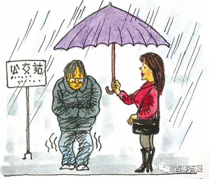


未进行任何了解和接触前的下意识反应，并非针对某个人，而是陌生人这个群体。

源于人类被程序设定成具有二元竞争意识的种族。

陌生人会被认为是会与自己争抢食物和地盘的潜在对手，在深层面是有敌视性。

**量化数据：**

人类大部分在 80% 以上，几乎人人都有防卫心。

属于是类似下意识的程序化反应，在还没有与对方开始接触的时候，就已经产生的敌视感。

群聊分享：

```
（2021年8月30日）
```
@。
>比如，从小被教导，在陌生人面前别说那么多话，都不知道对方是不是好人还是坏人...再比如说，这个社会治安太差了，别随便跟陌生人来往

>久而久之形成一个潜意识惯性，遇到陌生人都会比较排外，没了热情，提防心重，第一个想到的是对方是不是陌生人

@古零（GU0）

主要是提防先入为主，因为对方是陌生人而容易产生主观性的倾向，而失去客观性的判断。

关键点还是保持客观性，预防以偏概全，一朝被蛇咬十年怕井绳的情况。

补充：表现

陌生人敌视程度高：把对方预设为 “坏人”，潜移默化的丛林法则


## 8、性观念绑架度 vs 性观念自由度

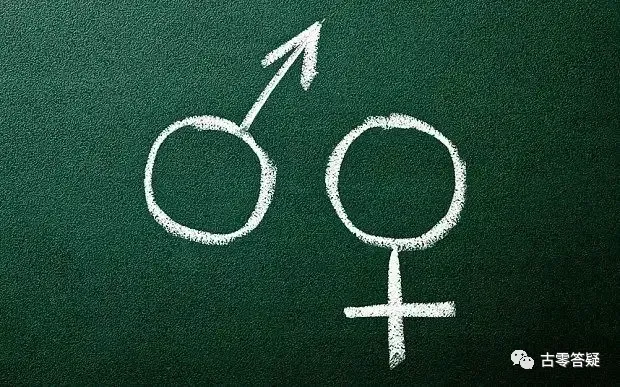


心智模式会创造各种程序观念，以此束缚人类，让性本性难以自由发挥。

性观念越保守的人，内在性欲就越强烈。越保守的地区，内在反抗也越强烈。

**量化数据：**

人类大部分：根据地区不同也不一样，美国 30-40% 左右，荷兰 30% 左右，一些保守地区 70-80%（反值）

```
（2021年8月30日）
```

@古零（GU0）

忽略了因为压抑所带来的反作用力，破幻是通过化解来达成，而不是通过屏蔽，因为屏蔽越深，形成反作用力和执念就越强，这往往是忽略了顺其自然，大道自然的道理，只有这样才能把程序意识向自由意识过渡。

补充：表现

性观念绑架度高：限制多，认为 “戒”、“虐” 才是验证的方法。

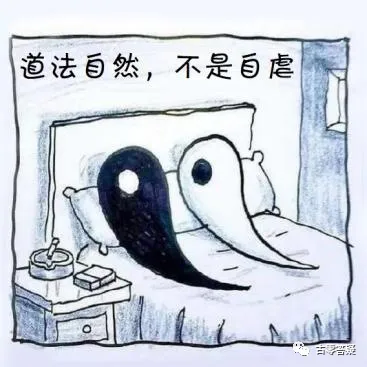


## 9、自我不满程度 vs 自我接纳程度


人类被设定为对自己不满意，投射到对周遭和世界不满意，以此产生改造世界的动力。

对自己不满意产生自卑心，对他人不满意产生控制心，对世界不满意产生欲望心。

心智系统有一套完美的标准程序，对照自己，发现自己永远达不到。

因为个体无法看清自己是什么样子，就会相信心智所讲的你是什么样子，那么你永远都不可能达到完美的标准。

**量化数据：**

人类大部分在 80-90%（反值）


群聊分享：
```
（2021年9月1日）
```

@古零（GU0）

在行动力方面，完美是效率最大的障碍，完成比完美更重要。

可以认真的去追求完美，但不执着，并保持接纳的心态，欲望在这里只是中性词，代表参与游戏的活跃程度，就如元哥的那句话，欲望拉满，执着为零。

对于“顺其自然”，或许通过大量的实践才能深入理解这个词的精粹。

@阿东
>我个人理解就是有倾向，不执着。像上面减肥的例子，我内心喜欢瘦一点（不是受别人影响），可以采取方式减肥，但是我不在意自己胖或者瘦这个现实结果。

@古零（GU0）

嗯嗯，是的，游戏心态呗，就如利用强烈的觉醒意愿（欲望）来提高自己的行动力不等于执着，因为自己的修行达不到预定的目标而产生各种不满和焦虑那才是执着（当真），顺其自然不等于三天打鱼两天晒网，这都是给自己懒惰的借口，而是要保持不执着的情况下尽可能去提高效率，这一切都在于自己如何灵活把控。

@喵斯塔
> 我理解的执着就是抱起某种思维、行为模式并拒绝改变，顺其自然就是允许任何思维、行为模式存在并为我所用。这个是否恰当呢

@古零（GU0）

可以啊，意识本身是可以灵活调整的，如适当利用一些 “执着”（这里可以理解为意愿力、专注力）来提高行动力，在另一个层面就是调整意识，通过提高某个目标的 “欲望” 来提高效率，但最终还是游戏心态，可认真但不当真，才能真正做到顺其自然。

@夜明猪
>这里双引号的执着，我感觉可以用专注来代替是否可行图片

@古零（GU0）

可行呀

补充：表现

自我不满程度高：追求永远达不到的完美


## 10、心智翻译扭曲度 vs 沟通理解还原度
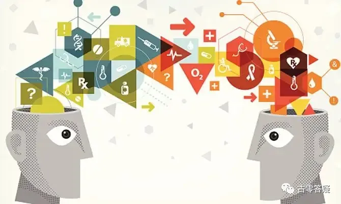


沟通中对方要表达的真实含义，需要通过个体的心智模式才能被个体所理解。

心智模式不同，造成理解力不同，很多意思会被歪曲理解。

用心智去沟通，会很难看到对方的真正本意。

你所听到的，不是对方真讲给你的，而是你的心智翻译给你的，是你的心智告诉你的。

所以基本很难达成有效沟通。

如果一个人主观太多，也就是心障和偏见很多，那么很难客观的听到对方在说什么。

如果你发现你听不懂一个人在说什么，那么反而是好事，因为你的心智无法给你翻译，超过了它的词库和程序了。

**量化数据：**

人类大部分：70-80%（反值），普遍还是习惯用头脑心智去与人沟通。

理解差异程度在 60% 以上。只要用头脑去沟通，理解力都比较低。

心智模式就像没有什么智商的样子。

就好像是说，它本身就不具备理解力，是靠那些程序生搬硬靠的。

属于机械算法，机器听音。

所以，经验丰富的人，见多识广的人，理解力就会显得高一点。因为是基于实际经验，而不是机械算法、理论推理等虚拟程序。

群聊分享：
```
（2021年9月2日）
```
@古零（GU0）

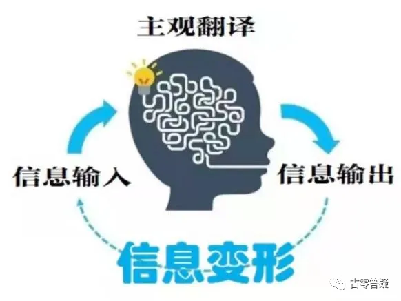


举个例子：

去深度合一本源，会发现所有的一切都是本源，没有不是。

1. **心智沟通：** 所有的一切都是本源，那么我也是本源，再去合本源就是多此一举。
1. **理解还原度：** 把自己意识拓频到无限接近本源的状态，会感知到所有的一切都是本源自发的，无穷无尽的幻想。

补充：表现

心智翻译扭曲度高：小我活跃，习惯性用小我（心智系统）去理解、定义。


## 11、抗拒死亡程度（求生度）vs 死亡接纳程度

机器人的心智模式会告诉你，不能死，一定要活着，好死不如赖活着。

因为身体死了，心智系统也没有了，心智不能让自己消失。

所以不能告诉你：你还有灵魂，灵魂不死。

心智系统自己不想 “死”。

心智会编出一堆理由让你不想死，不能放下这个、不能放下那个，死了就什么都没有了，让你产生死亡恐惧。

灵魂不怕死，怕死的是心智（机器人的心智程序）。

这个好像和对别人的死亡态度是一样的，就是怕亲人死 = 怕自己死。

无法接受亲人离世 = 无法接受自己离世。

**量化数据：**

人类大部分：80-90%（反值）。

```
（2021年9月5日）
```

@古零（GU0）

绝大部分的小说和电影，矛盾冲突都来自于对死亡的恐惧，也是核心的驱动力，人类对此乐此不疲，在梦境，也是如此。这里或许容易有个误区，有人会觉得那些有自杀倾向的人，死亡接纳程度就一定高，其实并不是，他们实质并不是接纳死亡，而是把放弃对死亡的抗拒当成解脱，这反而是一种我执的表现。

补充：表现

抗拒死亡程度高：小我怕失去控制，失去自我意识


## 12、性别偏见程度vs性别平等程度

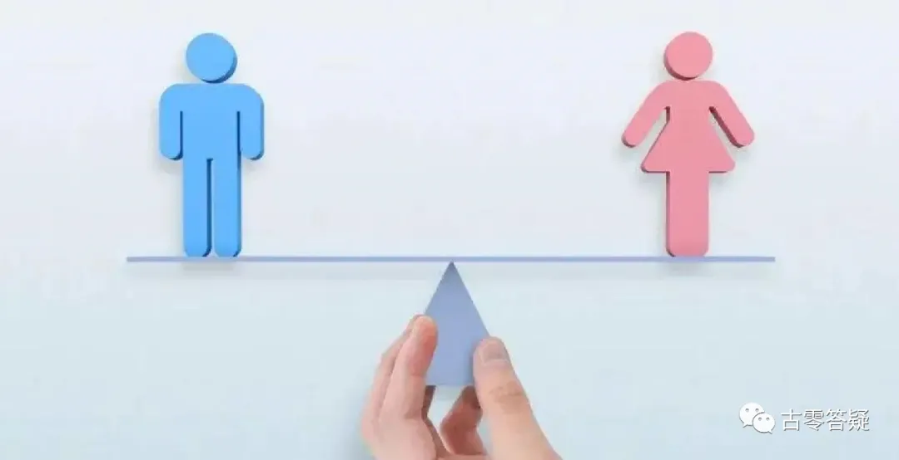

不同时期有不同的性别观念，男权或女权，长期难以平衡。

也是人类原始程序设定，不停的在对性别有各种评判，不同时期的评判不同。

不是男权就是女权，较难平衡。

包括同性恋的接纳度，也是和性别有关。

**量化数据：**

人类大部分在 60-90%（反值），地区不同开放程度也不同。

社会更加包容开放的，偏见就会少一点。很多同性恋本身对性别的偏见反而更高。

原始设定的程序，灵体手术不太好修改。一是需要很高权限和技术，二是一般好像也不这么改。

母系社会的人，是属于特定时期的实验

@古零（GU0）

排除不同地区、民族和国家之间的区别，在日常生活和工作中也普遍存在：

1. 女性应该示弱，矜持，温文优雅，男性应该示强，大方，不屈小节
1. 女性应该主内，相夫教子，男性应该主外，挣钱养家
1. 有些人不喜欢或者不认同某种性别关系（同性，忘年恋等），就自然产生排斥和讨厌， 这都是性别偏见程度的表现，而性别平等程度的表现，是尊重自由意识，即使自己不喜欢或者不认同，但可以允许这种情况的存在。

补充：表现

性别偏见程度高：在性别认知上，无法取得平衡


## 13、他人比较程度 vs 自我比较程度

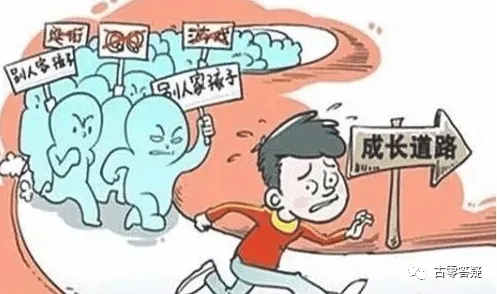


也是人类原始特性（原始程序）。

天性就要跟人比，产生攀比心、竞争心、好斗心，促进社会发展。

由此也产生一系列的优势感和歧视观念。

任何东西都可以让人类玩成“我强他弱”、“我好他坏”、“我对他错”、“我正他邪”。

心智强行制造比较，把很多不可比的东西拿出来比，产生了很多标准。

仔细观察就会发现，很多比较莫名其妙，根本毫无联系。

这个比较，与二元对立有很大关系。

很多对立，都是从比较发展出去的意识程序。

**量化数据：**

人类平均：90% 左右（反值）

群聊分享：

```
（2021年9月6日）
```

@凝神静气
> 这个自我比较咋比，跟过去的自己比比进步没？

@古零（GU0）

可以啊，同时也包括不同意识状态的比较，举个例子，

如老师带学生：

1. 他人比较程度高的学生，发现老师最近辅导自己的时间少了，会倾向对老师辅导每个学生的时间和积极性进行比较，若不一样，就会觉得老师偏心，并在同学之间产生对立，并萌生分离意识。
1. 自我比较程度高的学生，发现老师最近辅导自己的时间少了，会优先觉察自己最近的学习状态，会对自己不同时期的提升效率和意识状态进行比较，从而修正和优化学习计划，并积极向老师提出自己的学习诉求。

补充：表现

他人比较程度高：二元对立


**【第1区提升点完】**

!!! Tip

     --------Disclaimer 免责声明--------

     经验分享，仅供参考。转载自由，严禁修改。

     All info is intended for experience sharing and reference only without any warranty.

     Redistribution is freely permitted provided that no modification is made whatsoever.

     2021-04-27-古零（GU0）

     (updated on 27/04/2021)