# 意识强度提升点实操指南【2】上方区：自主意识区

* 作者：古零

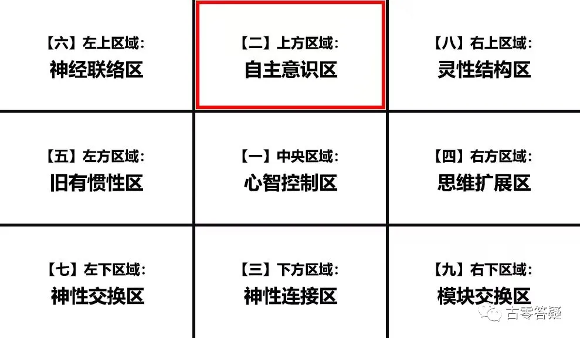


## 1、核心能量发挥率

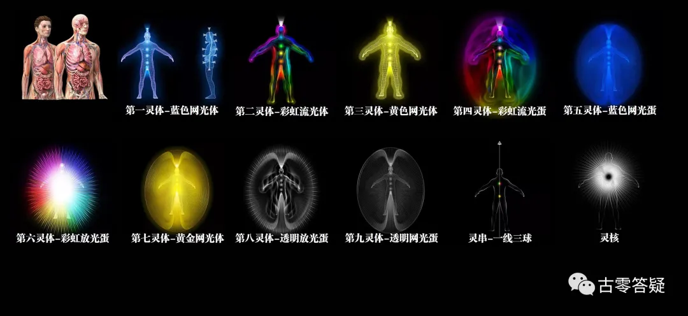

指复合体*所携带的能量的发挥率，类似于一个人的体力发挥率。

数值越高，越有力量扭转机器意识。

最高可设定 80-90%，最低不能低于 40%，根据个体投胎计划设定。

**量化数据：**

人类平均 40-60%（正值。以下不标注者，均为正值）。

*关于复合体，请参考元吾氏博文：

* [《人的多次元复合体结构（1）-----单重复合体》](https://yuanwushi.org/article-6-6673.html){:target="_blank"}
* [《人的多次元复合体结构（2）-----灵体中的“灵+体”》](https://yuanwushi.org/article-6-6674.html){:target="_blank"}
* [《人的多次元复合体结构（3）-----多重复合体》](https://yuanwushi.org/article-6-6675.html){:target="_blank"}

群聊记录：
```
（2021年11月8日）
```
@。
>\@古零（GU0） 今天能补多一课吗？有关这个提升点，就比如说，当自己会跟复合体们一起开会讨论如何开挂玩脱离轮回游戏后，有什么例子可以分享吗？

>就比如说，如何可以实操这点？

@古零（GU0）

==**具体是各复合体灵的整体配置，目前所能发挥出来的效率：**==

举个例子：

1. 一辆新车落地，厂方都有一套数据，如马力，扭矩，油耗等，这些就相当于目前的性能发挥率，但对于司机来说，接下来如何挖掘汽车的潜力就是一门学问了，如磨合，调校，驾驶习惯等都起到决定因素，如果做得好，甚至发挥出来的性能可以超越官方的数据。
1. 你带领一支小组团队，不管这个小组是搞研发，还是创业，或者的搞比赛等，人员配置是固定的，这个相当于目前的小组能力的发挥率，但如果你根据每个人的特点进行有效的管理，那么就能提高整个团队的输出。

==**如何提升核心发挥率？最直接的方法就是对复合体灵进行探索：**==

1. 单独连接各个复合体灵，让复合体灵自我评估目前的状态、诉求、意识强度、如何看待其他复合体灵（包括肉体灵）、如何看待本源（对本源的描述）、背景（做复合体灵之前来自哪里）、动机（为什么选择做个体的复合体灵）、与肉体灵的关系、与其他复合体灵的关系、每个复合体有多少个灵等。
1. 让灵核对每个复合体灵的信息进行核实，并总结评估报告，制定所有复合体灵的关系图谱和问题清单。
1. 与灵核、灵串等复合体灵进行商议，针对存在问题的复合体灵来制定解决方案。如：挖雷（T 灵间谍，附体，植入物，催眠装置等），问题溯源（寻找和解决那些影响到个体的根源）。
1. 与灵核等复合体灵共同商议整体的发展规划，并保障每个复合体灵都处于高效率的正值发展。如：确立共同的目标（脱离轮回，前中后期的计划），互相促进和监督（团队合作），根据每个复合体灵的特长和兴趣去开发有助于个体觉醒的项目，如：DNA 破解、记忆恢复、其他技能开发等。
1. 定期检查，找出发展缓慢或者拖后腿的复合体灵，进行更深入的探索，如复合体灵的多重潜意识探索（复合体文章第二篇有具体描述）。

@。
>在你催眠时，或者是自催时，需要的 “引导词”，不然如何准确的链接哪个复合体？

@古零（GU0）

==**衔接流程又叫纯意识的焦点投射：**==

1. 链接前清空一下自己的小我意识，并让意识进入白纸的状态。（去掉主观，让客观主导）
2. 调整好自己的意识状态，即表意识为 0，潜意识为 100%，如果不熟练，可以先合一一下本源或者通过前世回溯，或者观想一些特定的场景或者物件。
3. 把自己的意识投射到指定的焦点（如:现在链接第X个复合体灵）
4. 客观等待信息，并进行确认是否已经衔接上指定的目标。

熟练后，可以让灵核带着自己去合一本源，然后通过灵核帮忙去逐个衔接其他复合体灵。

根据以上关键步骤，引导词可以自行设计，并找出适合自己的方法。

初次衔接，建议单独一个个来，衔接完一个后，断开，再衔接另一个，如此操作下去，==**这样做的目的是保障每个复合体灵之间的信息不受影响**==。

断开是彻底的断开，不允许围观和窃听。

断开之后再次确认一下，保证对方的复合体灵没有残留的意识存在。

@。
>那如何判断为 "彻底的断开" ? 就是说，先让自己从潜意识里清醒，去跑步吃个饭洗个澡，才再链接下一个?

@古零（GU0）

没那么复杂，相当于把电话挂了，再拨通下一个，或者是跟对方道别并离开，然后移步到下一个复合体灵的房间，去敲门。

@梦
>怎么样确定已经链接上了

@古零（GU0）

可以先观察一下对方的特点（复合体文章里面有每个复合体灵的特征描述），然后跟对方打个招呼，问问对方是不是自己要找的那个复合体灵。

@梦
>哦，这样，前几天我在梦里面试过链接 1 和 2 两个数字，显示的颜色和感觉不同。不知道是不是有点像这样

>链接 1 的时候就显示太阳颜色和温暖的感觉，链接2的时候就是红色恐怖的感觉，

@古零（GU0）

这个具体可以去探索，问为什么会呈现这种状态

==**衔接方式一般分两种：**==

1. 一种是类似于个体与对方合一，对方通过个体的口述进行信息同步传导，这属于第一人称的传导，即口述者为传导者本身。
2. 另一种是个体与对方面对面交流，个体把对方的信息复述出去（有点像现场做笔录），这属于第 2（3）人称的复述。
3. 第三种是混合式，有时候复述过程中，会变成第一人称。

==**注意点：**==

1. 具体的习惯因人而异，但如果对方身份未确认，不建议采用第一种方式，因为合一来路不明的灵体，有风险（意识植入），采用旁观 + 复述比较保险。
2. 对方传导信息的方式也会有很多种，如：声音，图案，感觉，场景重现（电影）等，若信息出现接收困难，可以多切换其他不同的方式。

@。
>也就是说，开始是从互催中入手，熟悉了才再自催? 第三种我没看明白

@古零（GU0）

是的，初次衔接，互催中有主催在控场，会好很多，待对方熟悉后，再自催就可以了。这样做的好处是，在识别真假灵体方面，主催能客观控场，起到 1 + 1 大于 2 的作用。

@。
>那主催也要找熟悉这方面的吧？


@古零（GU0）

是的，客观 + 经验

@。
>以上的信息给我理解的就是，在目前刚开始会链接潜意识的“新手”来说，任何来自潜意识的信息都要保留了，不然随时会坑有你的可能，直到再三确定了复合体们的来历，历史等等后，才能更放心的接受他们的信息？

@古零（GU0）

重点是过程中不是为了怀疑而怀疑，而是不分析不判断，只是保持纯客观去接收，至于分析也是事后的事情，现场不分析。

过程中，若判断和分析一出现，小我就开始活跃了，信息通道就会因此被干扰，往后的信息再多，也毫无意义。

关于什么的客观，我以前分享过，可以去找找

@。

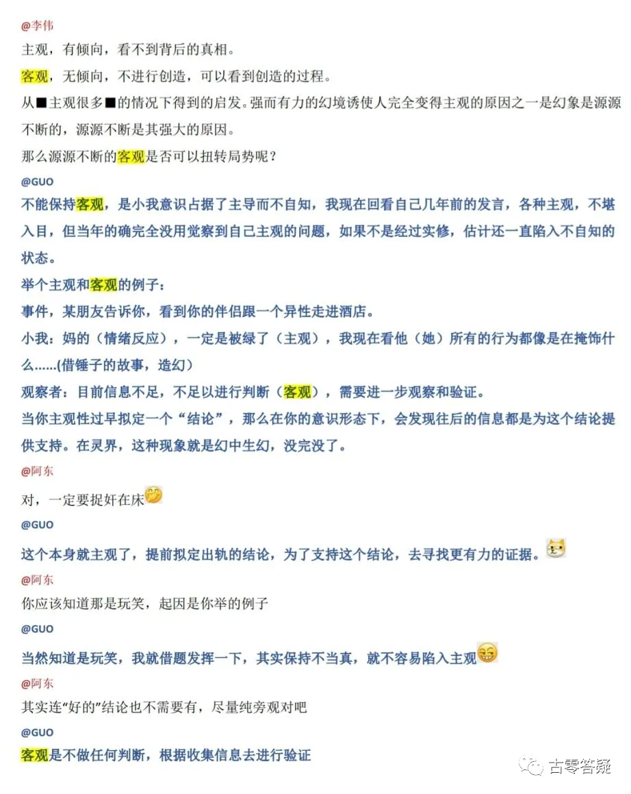

>是这段吗？

@古零（GU0）

是，以上信息对于主催也是适用的，或许有些主催觉得自己经验好，会下意识拿自己的经验去进行预判或者干预，这样会对被催的信息接收造成干扰，因为主催的经验所起到的作用是客观性和细微性，而不是预判性，所以主催的意识状态应该与被催处于同频，这样感知问题的深度会更细微和深入，并能感知到被催接收信息过程中，有哪些信息不够全面或者深入（接收率和准确率）。

@。
>我要准备去帮对方催眠了，除了这点，还有什么建议吗？

@古零（GU0）

我习惯把你所认为的“催眠”称之为互催，因为催眠两个字本身在潜意识层面就进行了 “催眠” 的信息植入，而互催避免了这种情况。

对于正值互催，被催者应该是越催越清醒，而不是越催越眠，随着次数的增加，被催链接潜意识的清晰度，效率也应该是越来越高，否则就要自我检讨一下了。

再从另一个角度看，还没有觉醒（意识强度 9 以上 + 脱离轮回）的人，其实都处于被催眠的状态，因此，根本就不需要引导词来让他们再次处于被催眠的状态，那岂不是越催越眠，大家修行不就是希望自己越催越清醒才对吗？

@。
>对呀，所以才问你意见嘛~那在主催方面上，有什么建议，除了客观之外?

@古零（GU0）

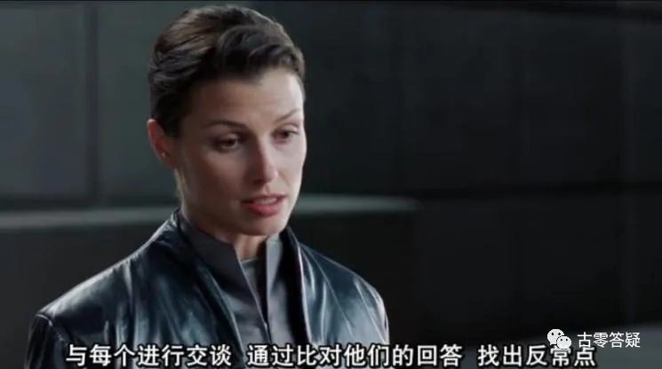

==**意识与被催同频**==

建议衔接前，主催可以与被催一起合一本源几分钟，同时让被催描述一下合一本源过程中所感知到信息。

@梦
>每个人的复合体灵是不是都从不同的地方来的，还是有的是同一地方来的，但是不同一个灵体

@古零（GU0）

是的，没有绝对。

@。
>我看了一些市面上已经有的引导词，都不是我自己满意的，也是可以自己写自己一套？还是需要熟练了才自己摸索出来一套引导词？

@古零（GU0）

引导词的要点和作用，我已经分享了，只要能围绕这些关键点就行，至于用什么形式那就是个人喜好了。

@梦
>比如我现在要链接第一个身体灵，是不是先观想肉身体灵就是另外一个自己身体，然后向她提问吗？

@古零（GU0）

都可以，建议多尝试

@。

>你这个要点和作用我没看过呢。。。能再分享多一次吗？

@古零（GU0）

今晚分享的不就是了吗？

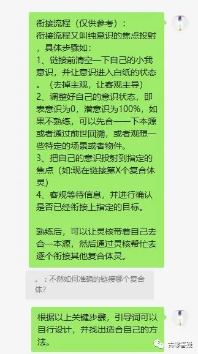

@古零（GU0）

==**被动式引导（间接式引导）：**== 通过引导词的作用来引导个体从表意识（小我意识）状态转变为潜意识状态，如：互催，念经，祷告等，引导重点不在于引导词的内容，而在于个体小我的活跃度（反值）和客观性（正值）。（以上信息对于通灵，附体，信息植入等不通用）

==**主动式引导：**== 个体自行调整意识状态，从表意识转变为潜意识的状态，如：入定，冥想，静观，自催等。

一般人的正常状态：

表意识 80~100% ：潜意识 20~0%

被催中连接潜意识的状态/入定状态/冥想状态/觉醒（得道）状态/.....：

表意识 20~0%：潜意识 80~100%

古今中外的信息其实都是互通的，能融会贯通多少在于个体在实修中所形成的通透性了。

@风
>自冥想的方式，长期训练，是不是会比催眠引导方式更稳定。

@古零（GU0）

因人而异，每个人的切入点不一样，多尝试，找到适合自己的方法。

长期训练，在于“长期”是指需要多少时间？关键还得看效率

引导词还有一个是起到保护作用，这个也是因人而异，对于初学者（没有习惯形成防御系统的人），可以通过引导词提前建立临时的防御体系，来提高初学者的防御能力和安全感。如：金蛋之类的，防护罩与自己同寿，并且绝对的安全，越受攻击越强大等等。

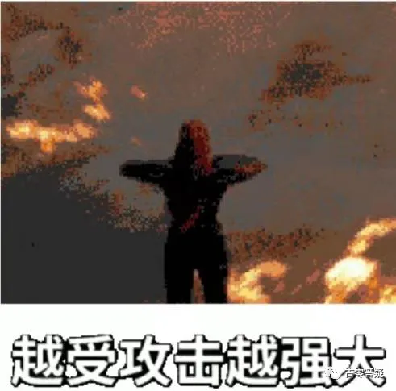

@。
> 在互催时吗？还是指在平时日常里？

@古零（GU0）

是指互催，如果被催在日常也有这个习惯，那么根据对方要求，也可以加进去。

@梦
>比如感觉链接上了，问问题，然后心里会想到什么，就是她给我的回答吗？

@古零（GU0）

被催：客观接收就行

主催：客观等待就行

@梦
> 怎么样是被催，怎么样是主催

@古零（GU0）

被催指个案，主催指催眠师


## 2、复合体协作能力

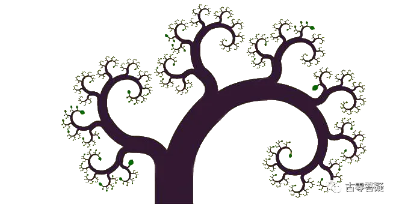


指复合体*团队的合作力，能否顺利处理和协调各种临时状况。

灵体们的合作也需要磨合与成长，也是体验和学习的一环。

**量化数据：**

人类大部分在40-70%之间

群聊分享：
```
（2021年9月8日）
```

@古零（GU0）

目前对于复合体的历史的探索，古代有瑜伽七脉轮体系，近代有心理学提到的潜意识，现代有芭芭拉提到的复合体结构，但可惜该体系是以灵疗为核心，并非灵修（觉醒）。而目前元哥分享的 12 复合体结构，是目前较为全面的，而且是真正意义上以觉醒（意识强度 9 以上 + 脱离轮回）为核心的实修体系。

提高复合体协作能力，可以通过探索复合体，了解各个复合体的诉求和漏洞，也是一个破 9 的高效率途径。

@频与光
>请问：是否出体神游和把修心落地到日常事务中，两者缺一不可。

@古零（GU0）

不是，真正缺一不可是破幻吧，出体不破幻等于白出，所以关键是破幻，修心落地也是破幻，所以两者本质是一样的，如果两者兼备可以互相促进，但不代表缺一不可。条条大道通罗马，寻找适合自己的方法。

@频与光
>但是不出体如何合一本源呢？难道不用合一本源的方法也可破幻。或者我理解的修心太片面了。（百度解释：净化心灵，修养心性。）

@古零（GU0）

合一本源不一定要出体，出体只是其中一个形式。

@频与光
>这点真的是我的知识盲区了。请详细讲讲。

@古零（GU0）

合神法，合一经等

\@zys
>点哥，不是合一到灵核才能合一本源吗？

@古零（GU0）

不是，合一本源的技巧，我以前分享过，看下面，公众号有视频引导版《[合一本源——探索人生终极三问](https://mp.weixin.qq.com/s?src=11&timestamp=1719302625&ver=5343&signature=uDrOvetLQOpMJa4a*9AgYfgmPOrq5MHGfUadJjEY0LmlDHMoKGS8pAHhlydzj6G1YpvCxPSQCge1FbM*T11XDeu95qNWLACpm7FYJEWapQlyIEUuGmgjjORItMJ8LBPQ&new=1){:target="_blank"}》，抖音可以关注：[`古零（古零答疑）`](https://www.douyin.com/user/MS4wLjABAAAAh2dt_w8_ReT1HDFafAziSSc4Yg2EfRtPQsYa87M31-rd8vf7WQNRUSSFans0vnub){:target="_blank"}、[`古零答疑`](https://www.douyin.com/user/MS4wLjABAAAArrn7gFviGb8yRk1jHvCr4Db0e4lP9lyAKPaNTycdKwRepKjzTmxT8WUmVdKgKhoW){:target="_blank"}

合一本源的引导词：

先让自己处于完全放松的状态，并把意识调整为：==百分百潜意识的状态==，现在先从完整的身体开始，慢慢缩小意识焦点，从身体缩小到全身的皮肤 —— 再缩小到全身内脏 —— 再缩小到全身的骨架 —— 再缩小到全身的细胞 —— 再缩小到单一的细胞 —— 再缩小到DNA —— 再缩到最小的粒子，此刻我是粒子，然后开始从全方位拓展意识，从粒子到DNA —— 再到细胞 —— 再到全身的细胞 —— 再到全身的骨架 —— 再到全身的内脏 —— 再到全身皮肤 —— 再到完整的身体，此刻，我是整个身体，现在继续拓展，从身体拓展到整个房间 —— 再拓展到整栋大楼 —— 在拓展到整个社区 —— 再拓展到整个城市 —— 再拓展到整个省 —— 再拓展到整个国家 —— 再拓展到整个州 —— 再拓展到整个地球，此刻，我是地球，现在继续拓展，从地球拓展到整个太阳系 —— 再拓展到整个银河系 —— 再拓展到整个星系团 —— 再拓展到整个宇宙 —— 再拓展到所有的平行宇宙 —— 再拓展到所有的宇宙和维度，再拓展到所有的一切，一切，此刻，==我是本源==。

**合一本源的注意点：**

合一本源难在于出现分离意识，觉得本源在一个很遥远的地方，其实把本源比喻成一幅巨型的高精度照片，而自己的焦点只是里面的一个像素点而已，所以日常中我们都处于合一本源的状态，只是焦点太小而已，如合一手机，合一音乐，电影等等，这些都是一个个像素点，拓频就先从一个像素点开始，拓展出去，直到整张完整的照片。同理，出体也一样，因为有分离意识（有内外之分），所以才觉得费劲。因此：==合一本源 = 我是本源==

@李伟
>什么分离意识？奥，我知道了，意识认为很难出体，所以就很难出体

@古零（GU0）

上面已经说了，所有的一切都在一张照片中，只是很多人一直觉得合一本源是从一张照片跳到另一种照片，概括来说，一切都是本源，没有不是，通俗来说，你的一根头发丝已经包含了全息宇宙。
这是其中之一，因为“出体”一词容易潜移默化成，需要 “离开”，需要 “出去” 才能达成这个状态，导致所有的能量和焦点都浪费在这个动作上，其实所有的一切都是一体，==没有内外之分，就没有出和入的动作==，你要做的只是移动自己的意识焦点就可以了。

@自在君
>合一灵核是不是就是佛教里面说的明心见性那个见性？两者有区别吗

@古零（GU0）

不好比较，没有量化标准，因为每个人对明心见性的理解都不一样。合一灵核不难做到，就如顿悟一样，而关键在于是否长时间，直到时时刻刻都保持住这个状态


## 3、灵活切换能力


在不同场景或状态中切换的能力，能否同时应对不同场景。

**量化数据：**

人类大部分在 30-70% 之间。

@古零（GU0）

举个例子：你通过音乐或者视频在感受着一个热闹的场景（如节日，喜庆等），然后不经过任何过渡，马上切换到另一个悲伤的场景（如葬礼，分手等），这种情况看看自己能否把状态转换过来，完全融入到下一个场景中去，而不产生意识的纠缠。

再举个例子：观想一头粉红色的大象，很多人因为这句话，导致长时间都忍不住想着粉红大象，如果切换能力强的人，可以自我控制停止这个想法，然后切换到下一个场景中去。


## 4、冷静处理能力


在面对较为复杂棘手的情况时，能否排除外在干扰，冷静处理并给出自己的应对方案。

**量化数据：**

人类大部分：30-70%。

群聊分享：

```
（2021年9月10日）
```

@古零（GU0）

这个非常落地，几乎生活和工作中都会遇到。

保持游戏心态呗，不被对方带节奏，情况越混乱越要提醒自己要冷静和提高觉察

如自己开车，不管情况多紧迫，速度可以快，但不能急。

快是指保证交通安全下的快，但急就不一样了，会引发路怒症，甚至鲁莽驾驶，两者是有区别的。

@。
>最近发现自己原来还会一次次的被对方带节奏，每次都是事后觉察才发觉，情绪也不过关，平时反而比较清醒，遇到某些事老是会糊涂

@古零（GU0）

这些都是宝贵的体验，觉察到了，就能快速提升

@。
>一次也算了，还每次都是相似的发生被挑起情绪，就不应该了

@古零（GU0）

下次遇到这种情况，越混乱和紧迫，越要提醒自己保持冷静，就跟越受攻击越强大一个道理，有人把这种处理方式简称逆商。


## 5、挫折应激能力


对挫折来临时的态度和意识状况，能否将挫折成功转化利用。

是从挫折中吸取经验、越挫越勇；还是屡屡失败、愈加消沉、自暴自弃。

**量化数据：**

人类大部分在 30-80%。

群聊分享：

```
（2021年9月11日）
```

@。
>这个提升点比起昨天的提升点，我反而很高分图片，我遇到任何挫折，不轻言放弃

> 但也容易变执着，需要拿捏

@古零（GU0）

如自己存在执着的点，解决方法有两个，一个是化解，另一个是转化，这个在于意识的灵活调控，也是 “顺其自然” 的实践关键。练习中，可以用古零脱敏法来提高这方面的能力。


## 6、沉迷拔出能力


能否从沉迷某事物中脱离出来，避免或者摆脱成瘾状况。

**量化数据：**

人类大部分 30-60%

@古零（GU0）

这个很好理解，因为我们身边的例子实在太多了，要提高这方面的能力，可以尝试在玩游戏激烈的时候，看电影最紧张的时候…突然按下暂停键（抽离退出），如大声喊出来：“停”，然后清空一下自己的意识，喝点水或者缓一会儿，来借此来锻炼自己对于当真的觉察力。


## 7、他人共情能力

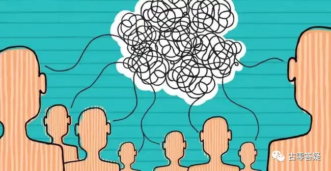

对他人能有多少共情理解。

数值高的，更加善解人意。

数值过高的，在其它状况不平衡时，容易过于感性。

**量化数据：**

人类40-70%。

@古零（GU0）

换位思考，能站在对方的角度，去理解对方的信息，能感知对方的状态，但最终没有被对方的状态影响到自己，这是共情。但如果这个数值过高，而其他的如：客观性、灵活切换能力跟不上，导致失衡，那么共情就变成移情了，对方的状态就很容易影响到自己，失去客观性。


## 8、静心独处能力


能否享受安静独处状态的能力。

换言之：能否暂时放下心智、以更容易向内去思索的能力。

数值低，则会觉得无聊，无法忍受独处，总想做点什么。

很多人一刻也静不下来，独处也不能静心，习惯于向外寻求刺激。

**量化数据：**

人类大部分在 20-80%。

@古零（GU0）

这个提升点比较直观和容易，就如很多人一刻都不能离开手机一样。

而提高的话，除了闭关，禁言之外，可以通过一段时间完全不用手机来进行锻炼。

还有就是独处的时候，如何调整自己的意识焦点，达到有条不紊的思维管理，同时调整好专注力和放松方面的平衡，达至一个沉浸的状态。


## 9、自我释放能力

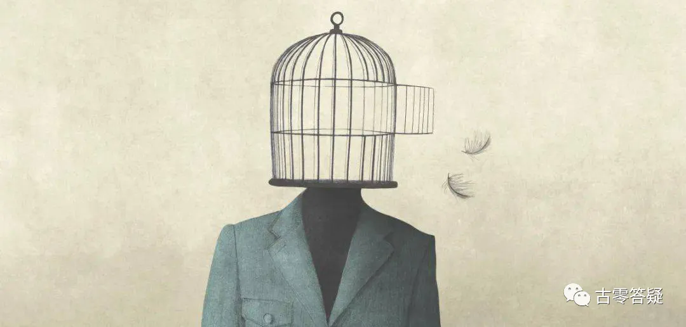

能否暂时放下思想束缚，放纵一下自己、沉浸到可释放压力的场景中。

换言之：能否暂时解脱、与真我一起共舞的能力。

数值高，抗压能力较强，能够通过释放来调整自己的状态。

数值低，则过于拘谨，无法放开自己。

**量化数据：**

人类大部分在 20-80%。

@古零（GU0）

关键在于通过释放来达至减压、泄压的效果，而不是通过屏蔽来逃避压力，最终压力还一直存在。


## 10、独立思维能力


能否不受外界信息影响、独立思考问题的能力。

保持合理怀疑，不轻易下判断。

**量化数据：**

人类大部分在 20-70%。

群聊分享：

```
（2021年9月16日）
```

@古零（GU0）

最近的电影《[失控玩家](../movie-recommendations/04/004.md)》也提到这点，里面的主角戴上眼镜后，发现了游戏的 “真相”，于是有了自己的自主意识，慢慢觉察到身边的朋友都是 NPC，他们都是跟着固定的程序随波逐流，过着机器般的生活。


## 11、宏观观察能力


能否从大局角度观察事件和场景，并能找到自己所处的位置。

**量化数据：**

人类大部分在 30-60%。

@古零（GU0）

表现为对自己的人生发展规划、人脉关系图谱、以及自己的定位和目标有一个清晰的概念。对事物的概括能力强，能洞悉事物的本质，看清自己所处的体系架构，发展规律，运行模式，以及自己与之互动所产生的各种影响，在模型推算方面会较为突出，能短时间内洞悉对方的整体套路和核心意图。


## 12、细节觉察能力


能否更为细致的发现某些细节部分，找到问题关键所在。

**量化数据：**

人类大部分在 40-70%。

@古零（GU0）

观察细节的细微之处，能发现细节中所隐含的各种关键点和触发诱因，若与宏观观察能力形成互补，会更有效的提高信息获取的能力。


## 13、自我修正能力


发现自己的问题后，能否及时有效地调整自己，并能够觉察意识惯性的持续影响。

**量化数据：**

人类大部分在 20-70%。

@古零（GU0）

这里有两个关键点，一个是及时调整，另一个是觉察惯性，因为进行修正的往往都是已成习惯的行为或者意识，即使已经修改完毕，但是意识惯性的影响还会持续存在，继续对这些意识惯性保持觉察，显得至关重要。
举个例子：就如戒烟，往往完全修正过来需要一定的周期，因为整个过程中，很容易因为各种诱因下，如饭后，思考事情，焦虑，某习惯行为等，习惯性触发想抽烟的欲望，这个过程中需要一直保持观察，并及时调整自己，如通过零食等代替品进行过渡。


## 14、直觉感受能力


能否感受到第六感，并且相信和重视自己的直觉，在处理事情和决策中，将直觉也作为重要参考。

**量化数据：**

人类大部分在 40-60%。

群聊分享：

```
（2021年10月2日）
```

@星爵
> 直觉与向内链接的通透度有关系吗？

@古零（GU0）

有，建议多跟自己的复合体灵沟通呗

直觉 = 潜意识 = 复合体灵的信息，如：

1. 突然心血来潮想去了解某些信息（想去某地…. 想联系某人…. 想吃某食物….）
2. 前面两条路都没走过，但直觉告诉我左边那条路应该没错
3. 这个项目没有问题，但总给我不靠谱的感觉，但也说不出什么原因

@星爵
> 需不需要区分、辨别呢？

@古零（GU0）

表意识 = 小我意识，围绕 “我” 进行意识互动

旁观 = 脱离表意识，站在潜意识的角度，如：表意识 - 我喜欢吃冰激凌，潜意识 - 古零（GU0）喜欢吃冰激凌

```
（2021年08月17日）
```

==表意识== = 小我（单个）意识 = 正在体验 XXX（自己的名字）人生的意识

==潜意识== = 各复合体意识 = 高灵意识

==本源意识== = 本源角度的意识 = 全频意识

**3 种意识的应用，举个例子：**

你来到一个餐厅，打开菜单准备点菜：

表意识：根据以往的经验进行选择（自己喜欢或者适合自己吃的菜品）

潜意识：用直觉去选择要吃的菜品（如突然特别想吃啥菜，没有特别的理由，就是喜欢）

本源意识：选择自己从来没吃过或者厌恶的菜品（这菜我没吃过，那个菜我不敢吃，那么就选它们）


## 15、尊重他人能力


能否看待每个人为平等独立的个体，尊重对方与自己不同的地方，不被偏见所左右，不下主观评判。

**量化数据：**

人类大部分在 20-50%。

群聊分享：

```
（2021年10月3日）
```
@古零（GU0）

这个建议从自己的家人身上开始自测，因为越亲近的人，越容易忽略相互的尊重。


## 16、复合体意愿统一度

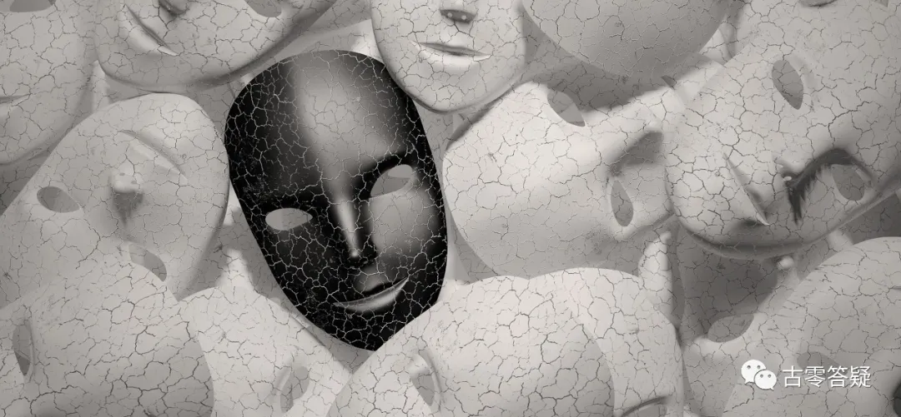

日常中，复合体是否经常意愿一致，是否经常有矛盾的意愿出现，矛盾出现时能否迅速协调一致。

**量化数据：**

人类大部分在 40-60%。

@古零（GU0）

前期需要挖掘各个复合体灵的问题和诉求，并进行及时的修正和解决，并确立大家共同的目标一致性，这样意愿统一度才会高。


## 17、信息整理能力

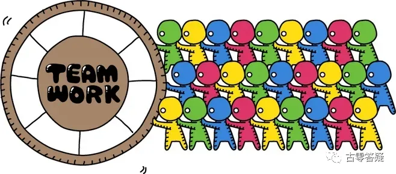

能否将庞杂混乱的信息清晰理顺，方便自己查找和阅读。

在头脑中也是一样，是否能形成系统化存储。

**量化数据：**

人类大部分在 50-80%。

群聊分享：
```
（2021年10月5日）
```
@古零（GU0）


@喵斯塔
>意识误导信息，信息反过来误导意识，然后形成封闭的循环。绝大多数人都是活在这个封闭循环之中的，其所接收、理解、处理的信息都会因此混乱、扭曲。

@古零（GU0）

把重复信息进行优化和整合，把不同信息进行融合贯通，最后建立信息枢纽中心，让每个信息点处于高效的思维导图中，达至一个系统化存储网络。

@阿东
>爱整理信息，不爱整理杂物，这个算什么情况？

@古零（GU0）

整理信息更多是一种管理运作的模式，而整理杂物主要在于个体的目的，是利于信息管理还是利于获取自身的舒适感，如一些强迫症的人群，就不一定会整理信息。


## 18、信息过滤能力

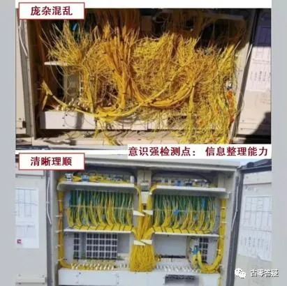

能否知道哪些信息和事物是自己不需要、不适合的，先将它们过滤掉，再从剩下的信息和事物中发现自己真正需要的。

需要凭借对自己的了解度和对目标的理解度来进行过滤。

需要更多了解自身以及想要达成的目标。

**量化数据：**

人类大部分在 30-60%。

@古零（GU0）

目的：这些信息能否帮助自己觉醒（意识强度 9 以上 + 脱离轮回）？

核心：是引导自己内求还是外求？

明白上面两点再进行信息过滤就简单多了。


**【第 2 区提升点完】**

!!! Tip

     --------Disclaimer 免责声明--------

     经验分享，仅供参考。转载自由，严禁修改。

     All info is intended for experience sharing and reference only without any warranty.

     Redistribution is freely permitted provided that no modification is made whatsoever.

     2022-05-08 古零（GU0）

     (updated on 08/05/2022)
