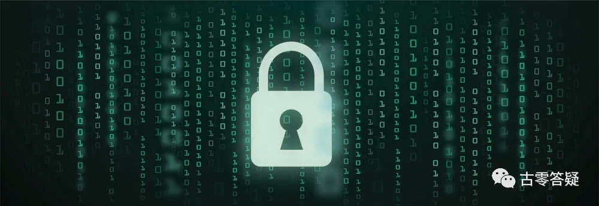

# 意识强度提升点实操指南【3】下方区：神性连接区

* 作者：古零


## 第一部分：个体安全感相关

安全感与是否敢于探索未知有关。

安全感越高，对未知的恐惧感越低，与神性连接越多。

安全感越低，越恐惧未知，与神性连接越少。

**量化数据：**
人类大部分：30-50%（正值。以下不标注者，均为正值）

```
（2021年10月7日）
```
@古零（GU0）

考考大家，老刘的《三体》，跟这个有啥关系？

没看过小说的或者看不懂小说的同学，可以搜索关键词：[76 分钟看完《三体》全集](https://www.bilibili.com/video/BV1WW411871L/){:target="_blank"}

《三体》提到的黑暗森林法则，其实就是放大了个体对未知的恐惧，让个体失去安全感，最终止步于未知的探索，而相似的影视和文学作品也层出不穷，他们都有一个共同的特点，就是降低你的安全感，故事也是把恐惧作为营造冲突的主要动力，观众和读者在冲突中感受刺激，殊不知已被潜移默化：未知 = 恐惧。我们在生活、工作和娱乐中，类似这样的催眠无处不在。同样的情况而折射出某些人在练习出体，冥想，独处，静观等过程中，因为心生恐惧而失去了继续探索的动力。


下分 8 个提升点，是安全感的不同来源。

### 1、家庭安全感


主要是家庭成长环境带来的影响。

在原生家庭的关系中，能否感到舒适和情感支持。

**量化数据：**

人类大部分在 20-50%。

@古零（GU0）

不同的家庭成长环境和关系，导致每个人对家的安全感都不一样，缺乏安全感可以先从这方面进行溯源。解决的方式很多，可以从一元入手，如：游戏心态 = 不当真 = 破幻 = 消除执着点，多角度观察=接纳不同的角色选择 = 人生如戏，拥抱过去 = 走出小黑屋 = 接纳一切….

@阿东
> @古零（GU0） 第三区中家庭安全感，我有个问题请教一下，主要是关于如何打分的。

>假设客观的说，某原生家庭的舒适和情感支持就是很低，极端一点，例如有些家庭父母都是很不负责任的。如果按照这个打分就比较低了。

>但如果这个人后来摆脱这些影响，对现在家庭的安全感很高，对原有家庭也是抱有理解和接纳的态度。如果按照这个打分就比较高了。

>那么分值应该怎么打，是按照后面这段打分还是前面那段打分？

@古零（GU0）

不管过去如何，都以目前的状态为准

@阿东
>我是看这个点的描述容易理解偏差，所以追加这个问题，这个问答是否需要加到指南里面去？

@古零（GU0）

都是以目前受影响的程度为准


### 2、社会安全感


在社会上各类交往中，自己的安全感指数。

社会环境给自己带来的影响，包括生存、生活、发展等是否让自己安心，有多少焦虑等。

**量化数据：**

人类大部分在 30-60%。

@古零（GU0）

从另一个角度看，就是个体对社会环境的当真程度。这方面有很多毒鸡汤式的催眠，如：一个智者对社会的远景应该是悲观的；所有的智者都倾向于悲观的性格；智者们对失败更感兴趣，因为失败是已知的，但是成功是未知的；

对未来的发展做好最坏的打算，借此积极做好预案，这不是缺乏安全感，是带着认真玩游戏的心态去做好各种后备方案，过程中并不存在焦虑，所以要区分好。

提升这个数值，需要锻炼自己不当真的心态，如我之前分享过的脱敏代入法就可以试试，把自己代入一个最坏可能性的幻相，去细微感知自己如何破幻，如何做到不当真，直到完全脱敏。


### 3、人际交往安全感


在社会及团体的人际交往中，是否感到轻松无压力，较少因社交而产生焦虑等负面情绪。

**量化数据：**

人类大部分在 40-70%。

@古零（GU0）

有社交恐惧症的人会比较低分，主要还是当真，过于执着对方对自己的看法，还有自弱，缺爱等。

主要是多留意自己在人际交往中，是否感到压力和焦虑，还是不擅长、不喜欢，前者是安全感不足的表现，后者是个性倾向。


### 4、亲密关系安全感


在两性关系中的安全感指数。

在两性关系中，是否感到舒适和情感支持，是否能够尊重和信任对方，与对方共同成长。

**量化数据：**

人类主要在 40-60%。

@古零（GU0）

互相尊重和信任是前提，如夫妻互相尊重对方的私隐信息，对爱的理解更多是共同成长和尊重对方的自由选择，而不是独占、控制和等价交换。


### 5、金钱物质安全感


包括对金钱、物质财产相关的安全感。

数值越高，对金钱的焦虑感就越少，与金钱的多少无关。

**量化数据：**

人类主要在 20-60%。

@古零（GU0）

焦虑感跟金钱多少无关，这个是关键。


### 6、工作安全感


对工作是否有信心和积极的态度。

数值高，会更加相信自己能够胜任工作，并对前景没有忧虑。

数值低，会对自己的工作感到担忧，或者担心自己做的不够好而容易陷入焦虑。

**量化数据：**

人类大部分 50-60%，也有少部分的 40% 和 70%。

@古零（GU0）

数值低主要来源于自弱和悲观。


### 7、生命安全感


包括对自己、他人以及所有生命。

数值越高，越会对自己更有信心，也会真正为自己和他人的生命负责。

数值越低，越会对疾病以及意外状况带来的人身安全感到忧虑。

**量化数据：**

人类主要在 40-60%。

@古零（GU0）

对死亡的恐惧是一个主要原因。


### 8、生育安全感


是否对孕育新生命怀有自信和热情。

女性普遍会有原始的生育恐惧感和压力。

**量化数据：**

人类女性大部在 20-50%，男性在 70-80%。

@古零（GU0）

女性的安全感低，主要来自于原始的焦虑，而男性主要来自于生活的压力和承担责任的自信度。


## 第二部分：生命支持相关

是否能感受到来自大地母亲的支持。这是肉体生命形式的起始点。

感受越多，内在越有力量，越有自信。

有 4 个小点。

### 1、心态稳定性


感受到越多支持，心态就会越加稳定。

反之就会浮躁和急躁。

**量化数据：**

人类平均 60% 左右。
```
（2021年10月16日）
```

@自在君
>心态稳定性在各方面都挺重要的，梦境里面一不稳就容易被踢出梦境

>潜意识链接也是，被听到的信息震撼，结果断连了，被踢出梦境

@古零（GU0）

踢出可以马上重进，间隔时间越短，成功率越高


### 2、对他人的信任度


与盲目相信别人不同，对他人的信任，源自内在的自信和安全感。

同时也是将生命支持的能量传递给对方，产生积极正向的循环效应。

**量化数据：**

人类大部分在 30-60%。

@古零（GU0）

可以参考漫威电影中的美国队长，他的人物设定，对比其他神级的队友，他的战斗力并非出众，但对他人的信任度的数值就非常高，所以其人格魅力下，在集体中发挥出精神领袖的作用。


### 3、乐于助人指数


是否能看到他人的真正需求，在有必要的情况下，提供适合对方的帮助。

**量化数据：**

人类大部分在 40-60%。

@古零（GU0）

是否出手相助，主要是如何衡量这个“必要的情况”，其影响来自于：

1. 对求助方（陌生人）的信任程度，如虚假、碰瓷等。
1. 自身量力而行的考虑，否则容易变成执善。
1. 是否带有目的性，如基于社会言论、道德准则、等价交换的情况下做出帮助，这里反映出个体是否真心实意去帮忙。


### 4、真实表达的能力


与人沟通中能否真实直接的表达自己的想法。

比如：既能由衷赞美别人，也能诚恳提出建议。

**量化数据：**

人类大部分在 40-60%。

@古零（GU0）

纯粹与城府的区别。

补充：
```
（2023年12月24日）
```
@咻咻:

>4、真实表达的能力

>与人沟通中能否真实直接的表达自己的想法。

>例如：既能受到别人的热烈赞美，也能诚恳提出建议。

>老师，这个是说有这个能力就行。用不用，什么时候用取决于自己是吗？

>如果每时每刻都真实表达，那不是傻白甜吗

@古零（GU0）:

比如

@咻咻:
>首先，我不是很理解这句话的意思。“真实”表达的能力是指没有程序加工过的真实的内心想法吗？

>像纯收音机接收信号，表达信息

@古零（GU0）:

提出是自己可以自由行驶表达 “建议” 的意愿，至于用何种形式去表达，那就是自己的自由了

@咻咻:
>为什么是 “真实表达的能力“，不是 “自由表达的能力”

@古零（GU0）:

真实 = 自己想表达什么就表达什么。至于你是直肠直肚的说，还是间接的说，那是个人自由了。

@鹿:
> 老师，真实表达算不算等同于自由表达的能力？@古零 

@古零（GU0）:

真实表达是在自由表达的基础上，加上真实

鹿:
>老师，这里为啥是举例“纯粹和城府的区别”？@古零 以前就想问

@古零（GU0）:

为啥不能举？

@鹿:
>就是我不懂啥意思

@古零（GU0）:

纯粹 = 真诚，大方，大我层面

城府 = 油腻，腹黑，小我掌控

@鹿:
>这样举例……太明了了


## 第三部分：生命探索相关

对生命越好奇，越会引发相关的探索，就更容易发现生命的真相，给自己带来灵性的成长。

有 6 个小点。

### 1、对生命的好奇指数


好奇心永远是动力。对生命越好奇，越会不断的吸引自己去探索更多，也能较少被社会教条所固化。

**量化数据：**

人类大部分在 40-60%。

@古零（GU0）

儿童对生命充满好奇，也是接受启蒙最好的阶段，因为这个时候还没有形成各种社会教条化的影响，还能保持纯客观的状态去探索新事物，往往也是潜力挖掘的最好时期。而随着学习年龄的增长，在各种各样的固化认知影响下，这种高效而通透的状态就慢慢消失了。所以建议这个阶段，家长不要习惯用成年人的认知模式去引导孩子，让其自然发展反而是最好的。


### 2、对生命的接纳度

是否对生命本身的接纳，感受到生命的脉动。

接纳生命，才会接纳自己、他人和这个世界。

**量化数据：**

人类大部分在 20-60%。

@古零（GU0）

尊重万物的自由意志，既接纳花朵盛开时的灿烂，也接纳花朵凋谢时落寞，接纳万事万物的变化，也是接纳生命原本的样子，做到这一点，才能接纳自己、他人和这个世界。


### 3、对生命的尊重度


生命各有不同，能够尊重彼此，不分高低贵贱，才能够拓宽和加深对生命的探索程度。

**量化数据：**

人类大部分在 20-50%。

——————————————————————————

@古零（GU0）

对生命的尊重是指发自内心的、无条件的、纯粹而自然的去做到彼此间的尊重。

可以自检一下自己纯粹性，如是否存在某种等价交换（目的），借此换取形象宣传，道德积累，消业，积福等目的，若有这种情况就做不到纯粹了。

可以自检一下自己的自然性，如有没有存在刻意的，主观定义的某些道德标准，如素食，放生等，因为任何生命的体验模式都是从一开始就设计好的，其整体运作是一种自然规律，顺其自然，尊重各自的体验模式也是属于对生命的尊重。


### 4、对生命的热爱度


是否对生命充满积极、热情和爱。

数值越高，会更爱生活，越能够真正享受生活。

**量化数据（正值：最高数值100%）：**

人类大部分在 20-60%。

@古零（GU0）

数值高低，跟金钱投入多少没有关系，只是源自那份纯粹的热爱和享受。


### 5、享受生命程度

在接纳和热爱之后，能否做到真正的享受生命。

比享受生活更深一层，能与生命做神性的深层的链接。

**量化数据：**

人类平均 30% 左右。

@古零（GU0）

法国小女孩 Tippi，她人生的第一个十年是在非洲度过的，从小生活在野生动物群中，她和各种各样的动物都成为了朋友。十年来，任何一只动物都没有伤害过她，而 Tippi 和每个动物都能友好相处。


### 6、生命合一指数

是否感受到自己就是生命本身，对生命有无限的活力、创造性与爱。

生命是整体的，是伟大的，像一部宏伟的交响乐。

要先找到生命、看到生命，才能去让自己合一。

人类对生命大多视而不见，也感受不到，就很难去谈合一。

绝大多数人类，依然认为动植物以外的事物不是生命。

人类对自己的生命，也常常忽视，不知道如何去感受、去享受，一直在曲解着、扭曲着。

**量化数据：**

人类平均 10% 以下。
```
（2021年10月25日）
```

@古零（GU0）

生命合一指数

是否感受到自己就是生命本身，对生命有无限的活力、创造性与爱。

——————————————

可以搜一下如：《[水知道答案](https://baike.baidu.com/item/%E6%B0%B4%E7%9F%A5%E9%81%93%E7%AD%94%E6%A1%88/637793){:target="_blank"}》，还有思维影响植物的各种实验，都是不错的参考


## 第四部分：神性连接相关


能否与内在的生命和神性建立关系，更深入地探索宇宙和自我的真相。

有 6 个小点。

### 1、连接稳定度


在连接中，能否保持连接通道稳定，较少受到主客观干扰因素的影响。

**量化数据：**

人类平均 35~45%。
```
（2021年10月26日）
```
@古零（GU0）

对于缺乏连接经验的同学，可以提供一个练习的参考，如观想一个自己熟悉且简单的物件（可以是静物，植物，动物等），然后把意识焦点锁定在物体上，在放松的情况下（调整专注度阈值），保持稳定的延续性。

不稳定的情况如：画面不清晰，闪动，物体高速移动，变形，走神等。


### 2、连接深度


能否在同一个层面或角度，将问题探索的更深入。

**量化数据：**

人类平均 35%。
```
（2021年10月27日）
```
@古零（GU0）

根据上一期提供的*练习参考（练习衔接的稳定度），在上一次的基础上，这次是衔接的深度：

影响深度主要有两点，第一个是客观度，第二个是权限，客观以前说过很多，这里就不重复了，而影响权限有两个因素：

1. ==**意识强度**==，呈正值，如有时候到了一个节点，画面消失，断线，或者高灵解释 “因时机未到，暂且不说”，往往是接收者的意识强度不够高，若这种情况下，即使强行接收，信息也会容易导致误解和意识纠缠。
1. ==**经验值**==，在保持客观的前提下（若主观就反过来变成影响），相关领域的延展性有助于信息以更深入和全面的角度进行探索，举个例子，如同一个信息，对于懂程序的个体，会对意识系统和模块比较容易深入，而对于搞艺术的，会对显化机理和意识无序联结比较容易深入，领域延展性越强，那么各信息的联系性就越强，顺藤摸瓜就更容易。

**关键技巧：**

==客观+顺藤摸瓜==

**练习：**

根据上次要观想的物件，在保持衔接的稳定下，并保持放松，客观，顺藤摸瓜步步深入。

举个例子：


观想一朵花 → 花的叶子出现 → 花的背景出现 → 探索背景变化的原因 → 探索该背景下所出现物体或者事件的原因 → 探索所有元素所触发的原因及关系 → 探索触发的源头 → 探索源头与自己的关系 → ......

关键点在于元素的关联性，如顺藤摸瓜的 “藤” 就是这个关联性的保障。

举个失败的例子，如：原本是观想花，然后变成其他毫无相关的物件，两者之间完全失去联动性（意识断层），要明白的是，目标的信息是不变的，变的是所表现的形式，需要你不被形式的幻相迷惑和带偏，目标不偏离，最高效的去找到所需要的关键信息。


### 3、多角度探索能力


同一个问题，能否从不同的角度和层面进行多方位的探索。

**量化数据：**

人类平均 40%。
```
（2021年10月28日）
```

@古零（GU0）

复习一下昨天的提升点是关于信息探索的深度，而今天这个是信息探索的广度，举个例子，如观想一朵花，有人习惯只用一个角度去看，跟看图片没两样，那么得到的信息只局限在二维平面，而有人用 360 度的全视角去看，那么能看到花朵不同角度的信息，而且除了看，还有更多层面可以探索，如：

时间 —— 能观察到花朵从生长到枯萎的过程

拆解 —— 能观察到花朵的构造

触摸 —— 能观察到花朵的物理特性

宏观 —— 能观察到花朵的生长环境

微观 —— 能观察到花朵的生命运转系统

聆听 —— 能观察到花朵向外传达的信息

...............................


### 4、感知的细微度


能否将问题细化，并在探索中能够发现更多的、具体的、细致的信息。

**量化数据：**

人类平均 45%。
```
（2021年10月29日）
```
@古零（GU0）

关键在于如何对问题进行细化，如一个问题会涉及到一个基础信息点，那么可以通过这个点打开一系列并行关系（广度）的切入点，然后通过这些切入点进行各自的串行（深度）挖掘，然后把每个串行中所得到的信息点进行验证，一个是纵向关系的验证，另一个是并行关系的验证，通过这种交叉验证和联结，一个完整的信息网格就形成了，然后在这个网格中寻找那些无法联结的信息点，再进行深度探索就容易很多了。
举个例子：感知到一朵花
很多人一般就感知到大致的特征，如颜色和形状
若细化的话可以这样：
并行：外观，状态，背景，时间，关系，规则......
串行：
外观——颜色，形状，叶子......
状态——动态还是静态，花期（花蕾，刚开，盛开，凋谢），向阳还是向阴......
背景——生长环境，单体还群体，附着物（鸟，昆虫）.....
时间——不同时间的变化（过去，现在，未来），创造源头，循环机制.....
关系——与个体关系，出现的动机，要传达的信息.....
规则——生长系统，延展特征，功能开发........
...........................
这只是第一层的感知，待连成信息网格后，根据内容可以进行第二层的探索，如：
1、这个花朵是某个灵的显化，那么就是这个灵的探索了
2、个体的前世与这个花朵有直接关系，那么就灵魂记忆恢复的探索
3、这个花隐含某段重要信息，那么就是这段信息的解密
..........................


### 5、信息辨识力


对连接中获得的信息和知识，能否保持合理怀疑，并能够进行不同方面的验证。

**量化数据：**

人类平均 30%。
```
（2021年10月30日）
```
@阿东
>@古零（GU0） 今天这个点可以说说吧，因为外面很多误导性资料

>与昨天的点关联着的。

@古零（GU0）

这个貌似之前分享过了吧

@阿东
>第 23 点 → 独立思维能力

>能否不受外界信息影响、独立思考问题的能力。

>保持合理怀疑，不轻易下判断。

>————————————

>最近的电影《[失控玩家](../movie-recommendations/04/004.md){:target="_blank"}》也提到这点。

>@古零（GU0） 是这个吗？类似但不是一个点哦

@古零（GU0）

不是这个，应该是之前的答疑

很多流派或者个体在链接高灵的时候，都缺乏验证的流程，所以在信息辨别方面，只能通过信息的“质量”来进行判断，而信息的“质量”又只能通过与个体“共振”“共情”的比例来进行判断，归根到底，还是主观大于客观。而导致这个现象的主要原因，或许是个体担心若提出怀疑，会导致这些高灵不悦，继而失去指导的机会，其实根本无须担心这些，若高灵真的如你所想那样，那么恰恰更值得你的怀疑。以下我将分享一下一些辨别的技巧，但同时这样做，也会引来很多人的攻击和不屑，因为我可能把很多浑水摸鱼的“高灵”给得罪了。图片
（早期群聊分享）

@清
>@古零（GU0） 请教个问题：催眠问高灵信息，跟着高灵跑，算不算外求。高灵说啥就信啥，算不算当真入幻？

@古零（GU0）

客观接收呗，信息也可以验证的

辨别真假高灵，最简单的方法，就是看他给你信息是引导你内求还是外求图片

@平等一体
>他的回答让你提高了意识强度，就是可以采纳的。反之，就只听不采纳就可以了。始终记住是提升自己的意识强度。

@清
>不是呀，我不是在问潜意识有啥问题，我是问肉体灵这样是不是有问题是不是外求。

@古零（GU0）

看你的问题是问啥呢

@清
>之前催眠就是特当真催出来的是前世还是平行我还是什么的，潜意识对话下说的话也特别在意是真是假，我感觉自己就绕着这些转了。。。

>不是要提高意识强度嘛，但我感觉自己至少有段时间整天就在关心这些。。。

@古零（GU0）

辨别真假是主催的事情，个案只管客观接收就可以了

@清
>那平常呢，如何面对催眠得到的信息呢

@古零（GU0）

自己分析啊，看看信息对自己起到什么作用，是引导你外求还是内求

@清
>人类 60% 以上的所谓 “高我” 是被 T 组渗透的现状，再加上你的辨识能力有限，被 “假高我” 欺骗的可能性大约在 70% 左右。

>那这个怎么破。。。

@古零（GU0）

高灵的信息不是让你去相信的，是让你去实践实证，让意识更开放，更自由

@炜航Kevin
>提高意识强度，验证信息真伪。若暂时没能力验证，中性看待。

@古零（GU0）

通过多次的链接潜意识，不断总结和修正，去累积自己的经验，如何分辨真假，如何深挖更多的信息，如何提高下载信息的 “权限”，这些很难言传，只能通过实践去得到

即使遇到假高灵，也是一种经验。

@炜航Kevin
>不怕被忽悠，发现自己被忽悠了，清醒过来，就成长了一些

@古零（GU0）

跟老千过招也能提高自己的水平

而且潜意识只是一个很泛的统称，形形色色的都有，有些 “高灵” 意识强度也不一定高，只要你跟他们互动多了，自然会从经验中成长，把控也越来越游刃有余

高我是指 “我” 的高层意识，泛指你的主灵，灵核等

@古零（GU0）

灵界水很深，甚至深不见底，因为自身很难识别意识强度比自己高很多的灵体，因此无法通过 “直觉”（感知）去进行有效识别，所以适当的质疑还是很有必要的，特别与对方第一次的链接。真正的高灵也不会因为你的合理质疑而生气，也不会用某种权威与信仰去对你施压，当然，不代表高灵就是真心来帮你的，或者各自有自己的游戏目的，也有故意隐藏的暗区（不让你感知的部分），而再极端一点来说，若你故意刁难，顶多知难而退，而不会掀桌子骂街。

延续我们之前举的例子，如观想花朵，或许会有同学在观想中，会衔接到一些灵体的互动或者信息的传递，或者是一些高灵通过你衔接花朵的过程中，与你建立沟通管道，这都是很普遍的现象，而你接下来需要做的就是进行信息验证。上一期我分享的内容中，通过并行与串行的信息点，进行交叉验证和联结就是一个验证方法，可以验证出信息哪些是客观存在的，哪些是自己主观创造的，在这里我就不重复了。而今天我要说的是对信息源头的验证，不废话，上主菜。

**辨别要点：**

1. ==**破外观幻**==：又叫权威幻，对方（灵）的显化（形象）不能说明事实，因为可能是对方选择的角色扮演（灵显化外观就跟我们穿衣服一样简单），也可能是你的投射（主观倾向投射，如信啥显化啥），同一位高灵，不同人链接，可能形象都不太一样，有的是具象化的（人，非人，神仙等），有的是无具体形象的（光体，气体，半透明体等）。所以不要因为对方的形象而产生共情，移情等意识倾向，否则跟电影《上帝也疯狂》的情节一样，非洲土著对着一个空可乐瓶集体跪地膜拜。所以在这种情况，不管对方“来头”有多大，自己一直保持不亢不卑，并保持客观，不透露自己的意识倾向显得非常重要。
1.  ==**破能量幻**==：衔接某些灵，有人会感觉到一种强烈的能量感（共振，身体反应等），或者一种强烈的情绪宣泄（爱，感动，流泪，喜悦等），在灵界，这些都能创造出来迷惑对方的，一般意识强度不足的个体，很难通过直觉去看清楚这些能量背后的真实意识流，就如轮回大厅一样，那里往往都是一条条白光隧道，并充满着 “爱” 的能量，把一群群小白灵魂吸引过来了。所以在这种情况下，保持客观，不透露自己的意识倾向显得非常重要，若透露了，等于把自己的底牌提前暴露给对方。
1.  ==**破信息幻**==：有些人可能比较追捧某些体系的信息，如新时代，外星文明，某成就者，某信仰体系等，当对方的信息与自己追捧的信息接轨时（共振），立马就缴械投降了。其实在灵界，站在灵的角度，能实时感知到一般个体 60% 以上的意识流，相当于打桥牌提前开挂一样，所以不要因为对方提前知道自己某些底牌而表露出倾向，否则等于让对方感知准确度从 60% 提升到 100%。甚至有人还以为灵界没有谎言，只要他们肯当面承诺（相当于立誓言）就不会有假，真实的情况是，那些光正伟的誓言都是逗小孩儿的。大道至简，万物至繁，只要记住一点，不管信息的外观包装如何精美，故事如何动听，背景如何复杂，最终辨别信息真伪的核心标准就是引导外求还是内求，这是万变不离其宗的核心。
1.  ==**其他要点**==：多警惕虚假的信息套路，举几个相对突出的例子
预言——让你相信某个事件即将到来，然后事件并没有发生，继续圆个谎继续下一个预言，让你的觉醒动力在不断的 “挫折” 中被消磨和带偏。预言系统还有一种变形，就是引导你过于依赖某些信息系统（星座体系，阿卡西体系），而这些体系又无法让你的灵魂记忆得到恢复，继而忽略了自身的提升。

==躺平扬升==——又叫坐等扬升，与预言体系联结，故事一般都很动听，鸡汤也很好喝，但并没有对于个体实质的提升方案，让个体一直等，一等再等直到下一世轮回。

==高科技理论==——信息的理论和假设都很完美，很学术，但现今的人类科技又无法验证，信息也不能促进人类的科技突破，同时对个体也没有具体的提升方案，只能在高大上的科幻情节中不断意淫。

==二元激化的战斗体系== —— 又叫虚假的光工体系，让个体打鸡血，在使命感的光环照耀下，提升敌对意识，非黑即白，往往个体会有提升的错觉，但实质被提升的是二元倾向（二元幻），而不是一元，最终是二元幻越陷越深。

==执善==——打着大爱无疆，道德至上的制高点，引导个体无条件去执行 “大爱” 计划，其实这种体系很容易导致个体的防御系统失灵，糊糊涂涂签订各种 “合作” 协议，导致自己被附体，举个例子：某房东（个体）有一栋大楼，然后公布无条件欢迎有需要的人士免费入住，这样的结果并不是一团和气，而是各方争夺，龙蛇混杂，最终房东还可能被赶出自己的大楼（被夺舍）。

==鸡汤==——废话一大堆，不断绕圈子，道理说的头头是道，但却没有实质性的提升干货，对于实修的同学没有起到任何帮助。

==宿命论==——用某种命运模式让个体变得自大（投胎前，来头非浅）或者自弱（因果业力报应），忽略个体自由意志和觉醒意愿所起到的作用，个体最终变成自以为是。

**实操技巧：**

1. 留对方名字，方便下次精准定位
1. 不亢不卑，保持客观，不表露自己的意识倾向
1. 尊重对方的自由意志，若对方不想透露，不要死缠烂打，可以采取迂回战术，旁敲侧击，顺藤摸瓜，增加更多的互动，互动越多，对方暴露破绽的机会就越多。
1. 质疑的重点不是要表达自己不相信，因为这样做也是暴露自己的意识倾向，而客观的操作，是表达自己对某些信息点有疑惑，希望对方给予解释。
1. 状态是客观，不当真，信息核心是内求。

或许很多人入幻或者走偏是因为误把觉醒（意识强度 9 以上 + 脱离轮回）当成一种体验，一种让自己 “舒服” “满意” “喜悦” 等的体验，但事实上，觉醒不是体验，因为体验往往注重的是过程，而不是结果，觉醒是一个明确而清晰的目的，就是脱离轮回，这个目的也是个体的灵魂最高目的，跟灵核的目的一致，若达不到这个目的，整个过程都毫无意义。这也是信息的核心，就是说不管对方的信息如何，最核心的目的是不是跟自己的觉醒有直接关系。

@。
>阿卡西体系不是只是记录着宇宙的记录的一个AI图书馆吗？怎么会阻碍自身的提升?

@古零（GU0）

真真假假一大堆，如何分辨？若是真的又如何，关键有多少人借此恢复自己的灵魂记忆，借此提升破幻能力？有多少人的目的是让自己脱离轮回还是满足猎奇的需求？

@。
>然后，如何我连接我家的猫猫，它有时候会 "回复" 我，那意思是其实未必是它的 "回复"，也有可能是借着它 "回复" 我而已?

@古零（GU0）

需要进一步探索

@。
>我确实是想要从阿卡西那儿获取自己的前世记忆，可能是权限的问题一直没能成功，有也是破碎的记忆，没什么能参考的作用

@古零（GU0）

获取信息需要验证和进一步探索，若接啥信啥，跟外求没啥区别
```
（2021年11月1日）
```
@澈
>@古零（GU0） ，有个疑问请问下，这段话能解释一下么，我的理解是，这不是违背自由意识了吗，还是我对自由意识的理解有些曲解。

>就像T组忽悠签协议一样，这个协议签了就表示同意了，那为什么这里可以不用理会这些承诺呢？

> 

> 还是说可以运用类似三催的意识作用，来反噬？

@古零（GU0）

这里没有涉及协议，只是让对方口头证明自己没有说谎，有人会一直觉得灵界没有谎言，会觉得让对方说一段陈词就能起到验证的作用，其实都是掩耳盗铃而已。

@澈
>@古零（GU0） 那我是否可以这样理解，这些“承诺”就是喝酒吹牛的时候瞎说的，真正的要做到还是得协议，就像男人哄女人一样，话先说了，具体能兑现什么还是个未知数

@古零（GU0）

比较正式的协议一般需要己方的高灵团队进行评估，可行后，再与灵核商量具体的协议内容（设置触发协议失效的条件，己方权利，对方需要无条件遵守的准则，双方合作目的等），然后灵核出具协议，肉体灵与对方签订，协议就生效了。

一般没有辨别真假的协议，协议一般都是合作协议，如你的复合体灵都是签了协议的，但如果某个复合体灵反水，搞损害肉体灵的行为，那么你可以通过灵核把这个复合体灵踢走。而这个中途反水的灵体会因此有黑历史存在，有权限的高灵可以调取到这些背景资料。

所以上面就提到，合作前都需要做评估，看看有没有有黑历史的灵。

@大伟
>突然反水也应该是有原因的吧，通常应该不会来着嘞，是不是这样呢

@古零（GU0）
>需要探索，因为对方不可能额头上都写上自己的目的和倾向图片

@阿东
>我不同意轮回也没见灵核把我移走

@古零（GU0）

你同意了才能进服，灵核只是和你一起开黑的战友，他也没有权限让你离开服务器，而且他也希望你能离开服务器。希望你一直留在服务器的是黑网管，不是灵核


小我意识：那个游戏ID就是自己

潜意识：玩家才是自己

本源意识：所有的都是自己

@星爵
>网管意识：

>千万别看到自己吗？

@古零（GU0）

网管：好好刷，无限副本等着你


### 6、权限使用程度


深入探索，可以解锁不同的连接权限，拓宽和提高更多信息接收的渠道。

权限高低，和意识强度相关。

具体使用程度，和个体本身及灵魂计划有关。

该指标指在现有的权限下，实际使用的程度。

相同意识强度的人，权限不一定一样。

总分值相同，各部分的分值可能不同。

权限给你了，能否用上，还要看你。

**量化数据：**

人类平均 25~35%。
```
（2021年10月31日）
```

@阿东
>@古零（GU0） 呼叫呼叫，出来详细讲讲这个点

> 我理解的权限，大概可以理解成修行达到不同的境界。例如按三十六诀等方法打坐练气，可以打开真气体的连接，能体悟人不止是肉体，还可以拥有疗愈的能力。至于个体差异，有些人生下来就有灵视，有些人天生意志坚定，有些人天生理解力强等等，很多是根据人生计划特点而选定的。个人经验，往往有强有弱，多数人都是总体平衡的，类似游戏中人物的特性值，当然少量人的确天生意识程度高，所以权限也就自然高些。

@星爵
>我理解的权限是自由度。比如有人在感情区域自由度高，有人在财富领域自由度高，有人在艺术领域，有人在科技领域等等。

@古零（GU0）

权限高低与意识强度相关，之前在信息连接深度那里也说过一些，权限的具体使用程度，和个体本身及灵魂计划有关：

1. 个体本身是指个体行使权限的使用频率，权限的探索深度，权限信息的通透性等。
举个例子：同时考取机动车驾驶执照的两个人，一个是职业司机，天天跑几十公里，一个是私家车司机，上下班才开车，一个月加起来不到一百公里，随着驾驶时间与熟练程度成正比，职业司机要比私家车司机在驾驶熟练方面都要高出一截，而且职业司机还要考虑汽车油耗，零件损耗，路况等更为细致的因素，因此同样具备驾驶“权限”的两个人，权限使用程度就截然不同了。
2. 灵魂计划，个体根据自己的灵魂倾向和灵魂经验值，来选择适合自己的灵魂计划，因此权限也会相应有所不同。
举个例子：导师倾向的，在集体意识带动的权限方面会更突出，疗愈倾向的，在灵疗方面的权限会更突出，科研倾向的，在解密、创造方面的权限会更突出......。


**【第 3 区提升完】**

!!! Tip

     --------Disclaimer 免责声明--------

     经验分享，仅供参考。转载自由，严禁修改。

     All info is intended for experience sharing and reference only without any warranty.

     Redistribution is freely permitted provided that no modification is made whatsoever.

     2022-5-30-古零（GU0）

     (update on 7/3/2022)


**该文章由元吾氏反催眠(=催醒)游戏志愿者团队收集整理**