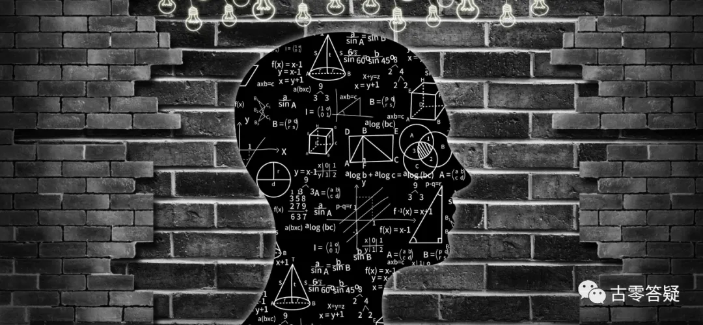

# 意识强度提升点实操指南【4】右方区：思维扩展区

* 作者：古零


该区分为 4 个部分

## 第一部分：先天自我开发程度


在先天配置中，个体前世累积的、已经开发和探索到的未知自我意识的深度。

**量化数据：**

人类平均 60%（正值。以下不标注者，均为正值）。

```
（2021年11月1日）
```
@古零（GU0）

关于左右脑的先天开发和整体协调性的程度。

有部电影《[超体](../movie-recommendations/12/001.md){:target="_blank"}》和《[永无止境](../movie-recommendations/04/003.md){:target="_blank"}》比较有趣，作为类似的参考，可以看看。

举个例子：
某个体前世是钢琴家，前前世是科学家，那么这两个技能在今生能否得到延续？能延续多少？两种技能各自的开发程度会否带来冲突或者促进？这些数值及影响可以比喻为个体的先天自我开发程度。

再举个例子：
你之前开越野车，后来开公路车，现在你想换新车，为了在不同路况中取得平衡，那么到底需要买什么类型的车，这车如何选配，如何加装配件......而这些配置可以比喻为先天配置，然后汽车出厂落地后，在你往后的驾驶中，如何使用和调校才能释放出汽车原本最大的性能，这些也可以比喻为个体的先天自我开发程度。


### 1、左右脑平衡度。

左右脑的开发程度是否平衡。

左脑过强或者右脑过强，都不利于个体的灵性提升。

**量化数据：**

人类普遍平衡度 50%


```
（2021年11月2日）
```
@阿东
>我左右脑就很不平衡。个人体验多用直觉和感性思维，少主观逻辑思考，可以改善。另外打坐和观想也有助于提高。

@古零（GU0）

调整阈值呗，左脑开发程度相对失衡，可以多增加左脑的开发程度，提高理性的部分，如分析，推理，逻辑，计算能力等。

@。
>那如何自己去觉察自己左脑发达还是右脑发达?

@古零（GU0）

可以观察自己平时看问题的角度，是偏向感性，还是偏向理性？平衡度高的话，就是两者相互结合。

平衡度高，两者就不会产生对抗，并且能互相促进

@阿东
>对对，举个日常生活的例子，怎么才是左右脑平衡的做法

@古零（GU0）

举个例子：

准备搬到一个新的地方居住，偏右脑的会留意那个地方的环境，人文和舒适度等感觉；偏左脑的会留意那个地方的生活成本，邻居关系和周边配套等。

结交一位陌生朋友，偏右脑的会留意对方第一感觉，聊天的舒适度；偏左脑的会留意对方的背景、动机和行为举止等。

@阿东
>右脑失衡呢？

@古零（GU0）

缺乏感性，如直觉，图像思维等

如：一个是数学老师，一个是美术老师

@金玉
>如果两个都缺，也算平衡？低层次平衡，也有碍灵性发展？

@古零（GU0）

这里说的是平衡，至于开放度的多少是另一码事了

@。
>我觉得有时候偏向理性，有时候偏向感性，好像天平失衡一段后，又会滑去另一端

@古零（GU0）

提高稳定性呗,还有一个是同步性

@。
>如何达到稳定性和同步性?

@古零（GU0）

昨天分享的例子，个体前世是钢琴家，前前世是科学家，这其实就是右脑（感性）和左脑（理性）的例子。


### 2、左脑开发程度。




左脑相关功能的先天开发程度。

如分析、推理、逻辑、计算能力等等。

**量化数据：**

人类大部分在60-85%。

```
（2021年11月3日）
```
@阿东
>这个点看上去不难懂，不知分值是不是类似于智商？古零（GU0）哥看看有没有容易忽略的盲点解说一下？

@古零（GU0）

我觉得用“智商”来比喻左脑开发程度不太恰当吧，更多是一种偏理性的思想模式（思想模块），如观察会更注重条理性，整合性，延展性，以及各信息元素之间的联动关系。

对于个人自检，可以多留意自己观察问题的模式，如：

过于右脑会容易神叨叨不落地，信息元素的相互关系会比较散乱和抽象，形成的意识形态偏向于不稳定的流体状，缺乏联动性；

过于左脑会容易导致信息僵硬化（程序化），信息之间的融合性和灵活性会比较差，形成的意识形态偏向于稳定而呆板的固态结构。若左右两者平衡，是一个相互结合优点的状态。

容易造成的盲点：过度专注于有序性而忽略无序性的存在和作用。

@艺乐
>解读了 WHAT，如果能再给个HOW的提示，就更好了，能落地一点点，也是进步一点点

@古零（GU0）

法无定法，若把 HOW 说出来，就把路给你限死了，最终的目的是需要大家发散思维，敢于尝试，不断尝试，找到适合自己的方法。

最后回过头，所有方法其实都是互通的（大道至简），这种通透性需要自己通过实践所得，谁也代替不了

@阿东

>我看了提升点测试数据，多数人左右脑都是平衡的（分值很接近），高都高低都低，造成这种现象原因？

>


@古零（GU0）

看到了，你是说意识强度值与数值的比例关系吧？其实数值差之间会有一个层级递进的关系，并非平均化，效果也是因人而异。


@阿东

>别的群也有人问了 HOW？也就是如上图所示，强度高的值就高，差别还挺明显，那么如何能更好的开发左脑呢，能不能举个例子？

@古零（GU0）

方法已经说啦，剩下的需要自己去把信息融会贯通，只有在不断探索中才能提升自己。


###  3、右脑开发程度。


右脑相关功能的先天开发程度。

如直觉、图像思维等等。

**量化数据：**

人类大部分在 30-60%。
```
（2021年11月4日）
```
@阿东

>人类左脑平均 60 到 85，右脑平均只有 30 到 60。能不能基于这点，提出一些开发右脑的方法呢？

@古零（GU0）

左脑侧重细节，右脑侧重大局，表现为思考模式，以及处理问题方式的差别，对于开发右脑，可以多尝试一些打破逻辑的练习，如：

把音乐转换成图像（音乐可视化）；

图像转换成音乐（图像声音化）；

音乐转换成肢体语言（自由舞蹈，音乐指挥）；

多语言混合输出（突破语言限制下的描述）；

散步，跑步或者乘坐交通工具时，观想自己展开双手（可伸长和放大），去感知所触摸到的一切；

..............

@阿东
>图像转音乐，听起来有难度，多试试吧

@古零（GU0）

盲人的世界，没有体验感受，建议可以去看看《夜魔侠》


### 4、双脑整合程度


左右脑在平时使用中的协调整合能力。

**量化数据：**

人类大部分在 50-60%。
```
（2021年11月5日）
```
@古零（GU0）

不管是偏左脑还是偏右脑，任何运作都是双脑同时协助运行的，只是各自参与的比例大小和合作效率的差别。

提升建议：

1. 自检：观察自己平时处理事情的方式，寻找和分析自己的强点和弱点。
1. 练习：加强练习自己缺失的部分（弱点）
1. 修正：调整阈值，让左脑和右脑两种思想模式互相促进，从而提高效率。

@阿东

>左右脑要协调整合，就要两者兼顾互相印证不能偏废。结合你前几天举的聊天的例子，既要考虑对对方的直觉感受，也要分析其逻辑动机，综合考虑客观下结论。再联系到对假高灵的识别，也是类似道理。不知上述理解偏差大不大？

@古零（GU0）

对

==偏右脑==

强点：连接潜意识会比较流畅，接收信息的敏感度高

弱点：信息混乱，缺乏条理性，不落地

==偏左脑==

强点：观察比较细微，转换能力强

弱点：小我过于强大，缺乏灵活性，呆板。


@阿东

>小我过于强大，该如何对治呢？

@古零（GU0）

纯客观性，练习归零状态（白纸一张），不要习惯性把自己的认知和经验带进来

举个例子：点菜

==小我意识==：根据自己的喜好、经验和营养诉求等，进行选择

==潜意识==：直觉

举个例子：观想一朵花

==小我意识==：为啥是一朵花？观想它干嘛？需要什么类型的花？观想树行不行.......

==潜意识==：花的颜色是......形状象......


**很多人链接不到复合体灵，主要原因是：**

1. 把发呆当成链接的方式，强行自己处于发呆（植物人）的状态，明明已经接收到信息，却视而不见，无动于衷，并误以为自己在破幻（假空）。
1. 小我太强大（对 “我” 的执着），条件反射式的根据自己的认知和经验对信息进行过滤、解读和判断。如：仪式感过强，给自己预设一个接收信息的特定状态（门槛），自动过滤未达到 “要求” 的信息。举个例子：认为真正连接的状态应该是表意识毫无觉知的情况下进行，如果自己很清醒，那么肯定是自己想象出来的信息。
1. 没有打开心扉，有恐惧，有防范心理等。

流畅连接潜意识，是不需要复杂繁琐的引导过程，也不需要进入迷糊的状态（说梦话），甚至应该比平时更清醒，表达更清晰，因为此刻，意识强度最少比平时高 2 级以上。


## 第二部分：后天自我探索程度


个体在今世，目前实际已探索到多少未知自我的深度。

此提升点和先天的对应。

**量化数据：**

人类大部分在 40-50%。
```
（2021年11月6日）
```
@阿东

>貌似这不是个具体提升点，而是整体提升点，我大概说一下自己的体会。

>首先要区分开先天和后天。先天是前世累积的，后天是今生新开发的。

>对于还不了解前世的人该怎么区分呢？一般来说就是看自己喜爱和擅长什么技能，这种是先天的可能性就比较大。反之是后天的可能性就比较大。

>一般来说，好奇心强，敢于尝试创新，灵活变通的人，后天自我探索程度就会高一些。

>另外一个，如果这种后天自我探索如果偏左脑就容易僵化局限，如果偏右脑就容易天马行空不落地，所以需要左右脑平衡一起开发效率才会更高。

@古零（GU0）

1. 先天自我已开发的程度不一定是前世，也有累世的，也有灵魂来地球前在各个宇宙探索中所累积的经验。
1. 先天和后天的开发重点不是区分，而是如何相辅相成，互相促进，如：利用自己所擅长的去开拓自己所喜爱的领域；把自己所喜爱的开发成自己所擅长的等。
1. 是的。
1. 是的。


### 1、左右脑平衡程度

左右脑的探索程度是否平衡。

左脑过强或者右脑过强，都不利于个体的灵性提升。

**量化数据：**

人类平均 30-40%。
```
（2021年11月7日）
```
@阿东
>再谈点个人体会，从灵核（一般来说是最强队友）的角度更希望你尝试不同的探索，哪怕是不擅长不喜欢的，更多是出于你的独特视角。从肉体灵的角度更喜欢惯性的所谓成熟行为，一般是擅长喜爱的，更多是出于生存和舒适考量。所以先天和后天本身也最好是平衡发展两者兼顾。

>古零（GU0）哥看看我歪曲的大不大，还有这个点有没有要补充解说一下的？

@。
>也可以那么理解吧，先天就已经会abc了，也可以探索那些efg，也就是自己未曾擅长的领域，开阔和发展自己的体验

>我应该没理解错吧

@古零（GU0）

==**先天开发程度**== 是指个体累世积累已开发的程度，如某个体经历了 6 世，职业分别是祭司、木匠、画家、医生、音乐家、数学家，而来到第7世，这6个职业的思维扩展在他出生后，作为先天配置能发挥出多少作用？以及各自的平衡性如何？这就是咱们上一部分所学习的内容。举个例子：

个体从小在计算能力方面比较出众，因此倾向于左脑思维，这是个体前世的数学家思维拓展所带来的影响，但同时，个体的左右脑的平衡度不太好，很大的原因是个体在前世的祭司，画家，音乐家这三方面开发比较欠缺，这就是个体目前的先天配置。

**练习重点：**

1. 通过前世回溯等途径去做记忆恢复的项目
1. 结合自己所擅长的领域，进行深度开发，并调整开发的比重，达至一个平衡的状态。


==**后天探索程度**== 是指个体今生目前已经探索的程度，如个体做了 10 年的数学老师，后来跳槽去做自媒体创作（如：抖音，油管之类），那么等于在原本偏左脑的工作转到偏右脑的工作。这个领域目前并不是个体所擅长的，属于个体向新的领域进行尝试，这个新开发出的经验值将会成为个体今生的累积，这个探索的部分有可能是全新的开发的（新体验新经验），也可能是先天已经存在的配置（尚未开发的前世技能思维拓展）。

练习重点：后天探索相对于先天开发，更倾向于广度的扩展，咱们可以结合前面先天开发的部分，根据自己目前的状况，做一个全面的广度 + 深度的发展，把左右脑的运行调整到一个高效的模式。

先天和后天两个区域都有重叠的部分，不太像一个平行关系，更像一个相互递进的关系，如何区分两者并不是重点，重点是我们如何灵活运用，根据自己目前左右脑模式的比重，进行左右脑适当的调整，并同时进行同步的提升。


### 2、左脑开发程度

左脑相关功能的实际开发程度。

如分析、推理、逻辑、计算能力等等。

**量化数据：**

人类 60-80% 左右。
```
（2021年11月8日）
```
@阿东

>今天这个点可以参照上面【第一部分、先天自我开发程度 → 2、左脑开发程度】的聊天记录。

@阿东

>个人有个体验，就是左脑发达的人容易小我意识过强。但如果为此限制左脑就是因噎废食，这一项分数也就低了。

>可行的做法一是要客观，避免简单套用逻辑造成的先入为主的主观判断。二是学会筛选过滤，避免遇到什么都要习惯性去分析判断一番。做到这两点小我的活跃度应该会大大降低。

>至于如何提升左脑开发呢？应该是主要提升综合能力，例如处理某具体事务或实现某目标，宏观上要设计出好的体系架构，考虑到清晰、简洁、高效、易扩充等等。微观上要灵活、模块化、易理解等等。总之要有高度有深度有广度，抽象来看就像是一目的明确关系清晰的智能信息矩阵。

>这方面比较好的例子就是我们的蜂窝矩阵，具体可以参见——阳性矩阵：蜂窝结构的7级形态。这就是左脑开发的高分例子。

> 

>这个点，古零（GU0）哥看看有没有要补充说明的。有时间精力也可以对我上面的砖头雕琢一番

@古零（GU0）

你的分享就已经很好了，没啥补充


### 3、右脑开发程度

右脑相关功能的实际开发程度。

如直觉、图像思维等等。

**量化数据：**

人类平均 30-40%。
```
（2021年11月9日）
```
@阿东

>今天这个提升点可以参照【第一部分、先天自我开发程度 → 3、右脑开发程度】的讨论

@阿东

>个人一点实践。例如图像转换成音乐，实践起来没有原以为的那么难。例如看到一张椅子，心中就会产生一种基调，仿佛在诉说它的体验，音乐自然就流出来了。音乐转图像相对容易些，一般闭着眼睛放松听音乐就可能浮现出图像。至于坐公共交通工具想象手乱摸，暂时没敢尝试

>古零（GU0）哥看看要不要补充几句？

@古零（GU0）

不错啊，但 “坐公共交通工具想象手乱摸” 这个不是乱摸，重点也不是公交车，而是双手自然展开，观想自己的意识顺着双手向外延伸出去（可以是触觉，也可以是其他感官），动作有点像电影《泰坦尼克号》，Rose站在船头展开手的感觉，其实在静态或者动态下做这个动作都可以，一开始是意识顺着双手感知到路旁的植物，再延伸就是山河大地，再往后就是星辰宇宙......


音乐转换成图像，如果是听音乐的话，或许可以听听一些 432Hz 双耳节拍（双脑同步）的音乐也不错（耳机听效果会更好），跟随着某些恢宏的音乐可以把意识暂时拉出地球，与宇宙融合。

还有一个开拓右脑的方法，我们不管是现实中还是在梦里，碰到好的风景，往往第一反应是拍照打卡，拍完就转下一个场景，而这些照片拍完后，甚至都很少去细品，其实可以转变一下自己的习惯，遇到好的风景，不是急着拍照，给自己留出一点点时间，保持宁静的状态去融入当下，合一当下，慢慢你会觉得这样做比拍照更有意义，更能细微的感知到更多的信息。过后，当你再次回忆这些场景的时候，会有一种重现眼前的感觉，对，就是这种感觉，让自己的意识打破了时空的限制，重临故地，这个也可以简称：出神、出体、OBE,,,,,

\@Arcturian

>我有运用这样的方法，遇到风景好的画面我也是会立马拍照，然后重复在脑海中显示这些画面，哪里有不清楚的地方，我再去看这个画面，再在脑海中整合这些画面，直到完整的重现画面

>比如我在清醒梦中来到了德国一个群山峻岭的地方，发现在远山中有小动物在云中奔跑，然后我就反复的仔细观看这些美丽的景色，不断的在脑海中重复这样的画面，直到现在我都很清晰的观到这些画面

@古零（GU0）

很早前的一个短视频，一位音乐大师假扮成普通人，选择上班高峰期的地铁口去演奏乐器，而上班的人群都像机器人一样，匆匆忙忙的路过，并没有去留意这些优美的旋律。而现在，大家都低头看手机，像机器人一样从来没有留意周边的环境。

@。

>比如我曾去过一处海边看日落，感受那海边的场景的美丽，之后回到城市了，有时候会想起那海边，就回忆当时的我坐在那儿看风景，想象和再次重新感觉那海边的环境

@古零（GU0）

拓展一下，合一本源也是一样，不管深度多少，只要你记住这个 “感觉”，在你工作，逛街，吃饭等过程中，都重新回忆这个合一本源的感觉，让这个感觉与周围的环境融合，会有神奇的效果。

关于 “感觉” 和 “回忆” 的定义，上面已经有大量的铺垫


### 4、双脑整合程度

左右脑在平时使用中的协调整合能力。

**量化数据：**

人类平均 50-60%。
```
（2021年11月10日）
```
@阿东

> 今天这个提升点，可以参照【第一部分、先天自我开发程度 → 4、双脑整合程度】的聊天记录

@阿东

说点个人体会，偏左脑的神性链接可能困难一点。偏右脑的辨识能力可能弱一点，对于觉醒都是不利的，我见过很多这样的例子。说到底两者都要强，都要日积月累进行开发提升。这个看法对吗？关于这个点古零（GU0）哥看看有没有要补充的？

 @古零（GU0）

对，建议先调整为左右脑平衡的状态，再同步提升，这样左右脑才能互相促进，互相补强，否则偏强的一边会不断打压偏弱的一边，不利于整体发展。

@阿东

这个现象我也注意到了，偏一方的很容易因为某种获得感而更多的利用那一方，造成越来越失衡。我觉得调整失衡一样可以用觉察来实现，那就是平常处理事务，除非特殊情况需要偏向某一方，都要提醒自己两方面都用一下，而这也有利于提高自己行为的自主化。

@古零（GU0）

👍


## 第三部分：突破先天自我程度

指个体能够超越先天已探索的部分的程度。

### 1、先天设定可超越的程度


投胎初始设置中，能否超越原有自我探索的程度、到达新高度。

****量化数据：**（增加值：超过先天 100% 的部分）**

人类大部分设定可突破 10-20%
```
（2021年11月11日）
```
@阿东

>这个点挺有意思，人类大部分设定可突破 10-20%，不过提升点抽样数据中百分比都在 120-130 之间，是不是修行的人先天设定可超越的程度普遍会高一些？

>更有意思的是，某意识强度 11.5 的大佬，突破程度才 115，还不如后面两个意识强度 7、8 的，我还以为得道者应该大幅突破先天设定可超越的程度呢。

>这个点的数据取得要靠和潜意识沟通，古零（GU0）哥有没有这方面的流程说明，例如问第几灵，如何确认数据的准确性等等？

>


@古零（GU0）

这个数值是相对个体而言，不具备横向对比的意义，因为这个数值是参考个体已经累积的开发程度，虽然都设为 100%，但每个人的内容就不一样了。                                                    

举个例子，A 的先天数值是懂 8 门语言，分别是英、俄，汉，法，西班牙，德，阿拉伯，波斯，B是懂两门，分别是英，葡萄牙。

A这一世学会了：英，汉，法，日，韩，对比上一世，增加了日语和韩语两门语言。

B这一世学会了英，汉，对比上一世，增加了一门汉语。

==考考大家，谁的先天突破数值大？==

就如特斯拉这种级别，在地球搞了那么多惊为天人的发明，但对于他自己的先天突破或许并不大，因为绝大部分的知识都是他来地球投胎前带来的，他只是把这些已有的经验应用在地球而已。

在自由世界，流通最大的数值并非意识强度，而是经验值（包含灵魂体验经验值和专业技能的经验值），但经验值在脱离轮回所起到作用却是微乎其微，反而意识强度才是关键因素。

\@Arcturian
>你的记忆恢复了有百分之多少了？

@古零（GU0）

20

\@Arcturian
>哦，都是通过催眠回忆起来的吗？

 @古零（GU0）

待表潜打通后，就会慢慢开始回忆起来

\@Arcturian
>我特别喜欢玩宇宙星战一类的游戏，感觉自己经历过很多那边的事情

@古零（GU0）

👍


### 2、已突破先天的程度


在实际探索中，是否已经突破了前世累积未达到的新深度。

****量化数据：**（增加值：超过先天 100% 的部分）**

人类基本上在 0-10%。

以上两个值，都算的增加值，

如果写成 110-120% 也可以。
```
（2021年11月12日）
```
@阿东

>今天这个点具体数值主要是通过和潜意识链接来取得。

>谈点个人看法，关注点应主要放在如何提升上。

>一是好奇心强思维开阔，多尝试新玩法新思路新体验。这种做法其实也会带动很多相关点的提升。

>二是打破舒适区，创造新挑战。舒适区其实就是形成某种依赖，阻碍了进一步提升。非舒适区往往是提升这点的关键，新的挑战就是提升突破程度。总之，生命不止，折腾不已

>三是突出重点，有广度同时也要有深度。对现实生命来说，时间精力是有限的，有些可以是尝试型的，例如吃新菜品。有些可以是深入型的，例如潜意识（内心）很想去做的事，想做就要努力做好。

>第四点，心态很重要，就是玩，游戏心态。体验同时不要形成新的执着新的依赖。

>古零（GU0）哥有时间多批评指正一下，修行应该是越修越自由（老元的话），自然也就越来越快乐，不然很可能是修偏了。我觉得这话适合放在这个点这里。

@古零（GU0）

指正不敢当，我觉得这四点说的挺好的

@。

>那还能深入讲解吗？

@古零（GU0）

对于提升突破先天的程度，把内求，觉醒意愿，行动力，主动性，客观性，意识开放性，游戏精神这 7 强应用起来就挺好的。

举个例子 —— ==客观性==：
很多人有觉醒意愿，也自行学习了各种各样的修行方法，但对催眠却不感兴趣，即使去学习催眠，也是为了某种目的而硬着头皮去学习，他们往往是从一开始就用了心智翻译模式去看待催眠，觉得应该是这样，应该是那样，最后得出结论：门槛太高，不适合自己，这样就把自己止步于前了，而事实上，学习催眠不是需要你学得多 “专业”，案例要多 “丰富”，来头要多 “厉害”，关键是从互催练习中锻炼自己的客观性和表潜（表意识和潜意识）的通透性，而这些如果不是站在客观的角度上，是很难看清楚的，看看反催游戏的招生简章，很简单的几句话，有多少人却理解错误的。

举个例子 —— ==游戏精神==：
对于修行，某些人习惯套用科学研发的那一套方式，先理论假设，等理论模型没问题后，最后再去做大批量的实验，但这套用到修行上，完全走不通，最终只会主观性的绕圈子，并自以为是，有一种提升的假象，为什么会这样，我的解释只有一个，就是游戏精神，多尝试多实践，不怕试错，从实践中不断总结并及时修正，这样结合之前的信息，才会让你循序渐进的达至通透的状态，否则不管如何解释，你的理解永远建立在固有的认知上，毫无建树。


## 第四部分：综合拓展部分

属于其它部分，无综合数值。

### 1、理解事物的能力（智力水平）

能够通过观察和学习，理解事物的概念和原理。

**量化数据：**

人类普遍 60-80%。
```
（2021年11月13日）
```
@古零（GU0）


为什么说实践是检验真理的唯一标准？言语道尽又是什么意思？看看上面这张图就明白了

@阿东

>这个点明确说了是智力水平，像我这种智商 60 分的还能提升吗？

 @古零（GU0）

属于最基本的理解能力，在60~80%的范围内，数值高点和低点，在实修中并没有太大的区别，就如在日常生活和工作中，能与大家进行无障碍沟通的，基本都没有这方面的问题。而这个数值之所以重要，是因为当它与个体的主观（自以为是）捆绑在一起的时候，会自动形成一个自圆其说的意识闭环，相当于把自己的意识锁死在一个封闭的空间，并自动过滤和屏蔽所有信息。

举个例子：

1、实修和理论的区别，举个例子，大家从来没吃过苹果，所以不知道苹果是什么味道，现在桌上放着几个苹果，想最有效的知道苹果是什么味道，该如何做？去吃一口是实修，讨论苹果是什么味道是理论。

*^^A：一切都是幻相，如果去吃不就入幻了吗？苹果是幻，味道也是幻，因此去吃根本没有任何意义，最后得出，实修和理论没有区别。^^*


2、关于本源的描述以及本源和个体的关系（本源 1 = 1 + 1 + 1 + 1 +....，所有都是本源，没有不是，......）都说过很多了，对比上面吃苹果的例子，苹果相当于本源，吃相当于实修，就是我们经常说的合一本源，所有说实修是验证真理的唯一途径。

*^^B：既然大家本身都是本源，若教唆别人去合一本源，等于有意暗示别人跟本源是分离的。^^*

==大家看看，A和B的回答有问题吗？如果有，问题出自哪里？==

@阿东

>其实不谈论目的的话怎么做都是可以的，都是自由选择，都是本源的某个面向。

>就如吃苹果，如果只是空谈戏论那么高谈阔论也未尝不可。但如果目的是真想知道苹果的味道，那么找到苹果吃一口就是一种可行的实践途径，而空谈则达不到目的。

>修行也是如此，如果不以出轮回为目的，那么空谈理论也未尝不可，世世代代轮回下去也是一种自由选择，也是本源的一个面向。但如果以出轮回为目的，那么光知道一切都是本源是没有意义的，你要知道为什么会轮回，如何才能破解之，为此所做的实践都是实修。

@金玉

>实修捉急的我从字面理解问题如下，请求指导

>A 假设了幻相是一样的，吃苹果尝味道是幻相 1，讨论苹果的味道是幻相 2，幻相 1 = 幻相 2。同一个地方，不同的人用不同的手机、从不同的角度拍出的照片能一样吗？从中得到的信息能一样吗？

>B 假设了 ① 大家是本源，就了解本源全部 ② 和本源分离了才要去合一本源

@古零（GU0）

所以 T 组从来没有强迫个体去轮回，每个进入轮回的个体都认为自己选择了自由意志。

@阿东

>所以对于修行者，空谈的实际上是不以出轮回为目的，和 t 倒是想法一致。以出轮回为目的则需要实修。

@李伟

>a 的问题在于嘴上说一切都是幻，却没意识到自己把【一切都是幻】当真的。如果实修的话，会破掉这个当真点。

>B 的问题是，合一本源就是合一本源，意味着什么都是一个角度，问题在于把这一个角度当真了。

@古零（GU0）

回答都挺好的，能看到不同的观察角度

大家可以再留意 A 和 B 回答的第一句，有哪些问题

@李伟

>正确的废话，理论派能达到的最高成就。

>实修终结者。

>99 + 1 中的 99，这两句话道听途说来的可能性比较大，可能没有证明到就直接说出来

>可能终其一生无法破掉的当真点，隐藏性极大，适用范围极大。

@喵斯塔

>A 与 B 是先设定了一个前提，而其后的论据表面上是为了证明这个前提，然而这论据是由前提引申出来的。也就是我自己证明自己，先假设自己是对的，然后以此假设来证明自己是对的，一切全靠自己脑补。这是活在自己世界里的人的典型症状。

> 也就是人们总会相信自己所相信的东西，哪怕这东西再离谱，也能通过脑补合理解释。

@古零（GU0）

👍

@阿东

>对于修行者来说，区分理论和实修是很容易的。

>对于实修者，可以有假设，例如一切都是幻。实修就是想办法去证实这个假设。对于客观的实修者，在没有实证之前对此还应抱着合理怀疑态度。

>理论派则不然，他的假设就仿佛是其已经实证的真理，例如一切都是幻其并没有实证。但其不但不去想办法实证这个假设，反而往往根据这个假设去评判处于不同阶段的实修者。

@古零（GU0）

👍

==**A 和 B 最大的特点就是先假设，再推论**==，这也是目前科学研发的主流套路，但用在觉醒上，就不行了，容易变成陷入理论的怪圈，兜兜转转终究还是用心智翻译去进行自我理解。

如

A：一切都是幻相，.....

B：既然大家本身都是本源，.....

要真正透彻 “一切都是幻相” 和 “大家本身都是本源”，最大的前提是需要个体证得本源（觉醒/得道/意识强度 9 以上 + 脱离轮回），这样才能真正明白言语道尽的局限性，他们都没有经过实证，从一开头就进行了假设，然后在假设的基础上进行推理，这种情况延展出去，就如有人喜欢拿经典的经文来进行假设一样，他们或许觉得假的成不了经典，经典必然是真的，所以作为假设完全没错（甚至都没有意识到自己在做假设），但他们忘记了一个关键点，就算经文是对的，但言语道尽，即字面的理解无法企及真相的亿分之一，只有个体亲身实证才能做到表意识和潜意识的完全通透，这里由不得半点虚假。

为什么元哥从一开始就强调不要相信他，一定要带着怀疑去实证，因为实证是检验真理的唯一途径。

所以，你说 A 和 B 智商不在线，貌似又不是，但他们就是很容易把一些很纯粹的信息搞得绕来绕去，特别复杂，然后无论对方如何解释，他们都能充耳不闻，视而不见，因为他们都在自我假设的基础上进行自圆其说。

@阿东

>真蠢也就罢了，就怕别有用心

@古零（GU0）

像这种固步自封的状态，基本是无解，唯一能解开的只有个体自己。


### 2、理解他人的能力

通过观察、倾听和直觉，能够理解他人的心态和处境。

**量化数据：**

人类普遍 40-50%。
```
（2021年11月14日）
```
@阿东

>个人谈点看法，今天这个点其实并不像看上去那么简单，因为这一点与其他点关联太多。

>例如通过观察，就要求客观、专注和细心等等。

>通过倾听就需要耐心、爱心、开放、沟通理解、尊重他人、乐于助人等等一大堆相关点。

>而直觉则关系到神性连接和与对方合一（设身处地）的能力。

>最后下结论又涉及到左右脑的平衡和信息辨识、过滤、整理等等的相关点。

>古零（GU0）哥看看上述是不是想的太复杂了？有没有一些提升的练习例子供大家参考？

@喵斯塔
>这本质上是以己度人，数据未必越高越好。要是遇到君子还好，要是遇到擅于伪装和隐藏自己真实想法的人，过于共情容易被人利用。

@阿东
>还真是越高越好，见提升点抽样采样数据。

>你对这个点可能有误解，以己度人是主观了，理解他人是客观综合结果。

@喵斯塔
>我认为理解他人做不到纯客观，最好的是能够以较小误差准确理解别人所要表达的意思，但别人要表

>达的意思未必就是他们真实的想法，其中可能有故意误导。

@刘腾飞

>共情且不被影响又是一个或几个指标之下的事

@古零（GU0）

不复杂，挺好的，我稍微补充一下：

理解他人的能力，这一点其实很落地的，实操性非常强，如在心理咨询，销售、服务，人际交往等方面都应用非常广泛。

==**观察 —— 重点是客观和细微**==，客观关键是不带主观性的小我预判和偏见，不要用小我投射的模板（背景和思维习惯、系统语言、利益和角色定位等）套在他人身上，如《疑邻盗斧》的寓言故事就是一个很经典的案例。细微是细致观察对方的状态，如微表情，肢体语言，潜台词等，这些都是很多人容易忽略的地方，要学习的话，相关的心理书籍有很多。影视方面如一些无台词的人物描述镜头，也有这方面要表达的信息，潜台词（言外之意）方面，看看《天道》也不错。

==**倾听 —— 重点是耐心和引导**==，通过引导让对方放下心理隔膜，畅所欲言，过程中要有耐心，并给予对方足够的空间去释放。练习主要是共情能力和同理心的巧妙运用。沟通过程中，要注意遇到信息含糊的地方需要进行具体化和明确化，不要高估自己和他人的理解能力，高估他人对自己的伤害，低估自己对别人的伤害，否则就会容易造成沟通障碍。


==**直觉 —— 来自于潜意识**==，有人习惯叫第六感，也叫表意识和潜意识的通透性（表潜合一），通过对潜意识的大量沟通可以提高表潜的通透性，至于表意识和潜意识的区别和切换技巧，以前分享过，这里就不复述了。在实操过程中，不建议随便合一对方，或者移情于对方，而是切换潜意识的状态，并调整自己的频率与对方形成同频，这样有利于潜意识之间的沟通。举例的话，很多侦探电影如《唐人街侦探》系列，主角经常用情景重现，模拟犯罪人作案的经过，借此来寻找线索的桥段，其实也是调频的例子之一。


@。
>不明白的是，为什么不建议随意合一对方?

@古零（GU0）

看自己了，不是金刚钻不揽瓷器活，如对方身上万一有剑蝶灵和附体这些，会容易被入侵（盗取信息，植入信息，附体等）

@。
>说到剑蝶灵和附体，如何观察得出一个人或者是没有?

@古零（GU0）

方法很多，如互催、互动（观察，聊天等）、直觉（感知）

如我跟大家聊天的时候，同时也可以跟对方的灵核进行互动

@。

>那是不是在意识状态高到一定程度，在直觉方面也会有很大的提升，比如很容易看出本质，对方背后的动机，意识流都瞒不了？

@古零（GU0）

是，会以一个比率呈现，如对方有隐藏意识，权限高可以通过各种途径进行挖掘，权限不够，只能感知到对方有多少百分比的隐藏意识存在（简称暗区）。

@刘腾飞

>权限的描述很多，好像特异能力身体能力开发等都和他相关，是谁定的，地球游戏规则定的吗

@古零（GU0）

意识强度越高，权限越高，至于出马附体之类，不在讨论范畴

@刘腾飞

> 这个关系正比可以理解，就你的所知，那这个权限是否是意识强度自己对应得到的，还是一种地球规则

@古零（GU0）

前者

@刘腾飞

>灵核之间的性格差距大吗

@古零（GU0）

看灵魂倾向了，没有一个灵魂是一模一样的

@刘腾飞

>我是在假设，相似的成长背景或地位可以造就相似的人格，那么是否相似的灵魂经验或状态位置，(充当灵核）造就相似的灵的性格

@古零（GU0）

自由意识没有规律可循，高灵（大我，高我）的情感比人类丰富多了


### 3、接受新事物的能力


能够不受固有观念限制，愿意尝试接触新事物。

**量化数据：**

人类普遍 40-60%。
```
（2021年11月15日）
```
@阿东

>关于接受新事物的能力，个人谈点不成熟的看法。

>接受新事物的能力与客观性及意识开放性关系比较大。

>能进到这里的人接受新事物的能力已经是优于常人了，但需要警惕的是自以为是，这样就封闭了自己。

>我本身就是个反面例子，有几年就是类似状态。大家回想一下，自己意识飞跃的阶段是不是如饥似渴的开放心态，停滞的阶段是不是自以为已经通晓的阶段。我现在的阶段对待新事物是平常心，未来有了新变化再报告。

>接受新事物需要先客观接收，如果带着主观去接收就会出现认知偏差，疑邻偷斧就是很好的例子。接收之后也不能一股脑全盘吸收，因为对新事物如果没有正确的认识的话，反而会拖累你的提升。至于如何分辨和整理归纳以前都已经涉及过了。

>希望大家和古零（GU0）哥能多批评指正我，这里先感谢了。

@古零（GU0）

👍

@。

>就打个比如，原本是一直做了多年专业领域的工作，一天心血来潮想要跳出这个框框，离开这个舒适圈。

>看待新事物要保持客观，好奇心，先了解和认真的去学习完全陌生的事，熟悉各个操作，吸收了别人教的知识，灵活转换再运用等

@古零（GU0）

👍

这种例子非常多，如元哥分享的内容，08 年从贴吧开始还是比较传统的修行方法，相对前沿的算是出体（OBE）了，到了 17、18 年，元哥分享的内容就变得更 “前沿”了，如强制轮回系统，复合体结构，意识强度，DNA 破解等，这个时候很大一部分人接受不了，还没有去深入理解，就已经把新事物拒之门外，甚至一度认为元哥被盗号了。连很多修行人都逃不出的意识惯性，相对普通人的例子就更多了。

而对于我自己，早期 08 年贴吧开始，很多传统的方法如百日筑基，中脉周天，脉轮我都试过了，整了 10 年也没啥进步（原因或许是我笨，也许这些方法不适合我吧），10 年的意识强度也就从 5 涨到 6~6.5，当时在门罗贴吧的老鸟应该会认识我吧，我当时的ID是`huabao3100`，然后到了元哥 18 年的分享（我是 18 年初，通过小鱼推荐才知道有元哥的微信群），至此，新的知识对我冲击很大，幸亏我的 7 强还凑合，结合新的方法，对我的提升终于有了质的飞跃，从 6.5 到破 9 只用了一年半。

对于这个点，建议多觉察那些自以为是，先入为主的主观判断，保持客观和虚心，才能让自己观察到更多的客观信息，不要习惯性做主观性的假设（未经亲身实证的或者是道听途说的信息），就如疑邻偷斧的故事一样，当你有了假设，接下来的推论都会容易陷入不自知的自圆其说（自我造幻）中去。

新事物的接受与否都是每个人的自由选择，终究在于你修行的最终目的是什么了，是高效提升脱离轮回，还是做一个某某标准的鉴证砖家，还是专注于体验轮回人生的，只有自己知道了。

@李伟

>点哥的 7 强当时有多凑合？新的方法又是什么？质的飞跃你靠的什么？

@古零（GU0）

一直以来的分享都说了无数遍了

我所分享的都是我实修所得，没有理论

@海尔 刘青

>大哥，你修行多少年了？突然发现群里好多老家伙

@古零（GU0）

08 年开始

@山楂

>怎么知道自己意识强度是几的？

>我感觉我这个数据都是猜的

@古零（GU0）

这是你的主观假设吧？意识强度检测可以参考提升点，也可以参考简化版的教程和练习案例，然后自己去自学并进行练习，跟有经验测得准的同学取取经，等你真正熟练了再来评价，是不是更客观？


### 4、接纳他人的能力


在社会交往中，能否消除偏见，理解和接纳不同的人。

**量化数据：**

人类普遍 30-50%。
```
（2021年11月16日）
```
@阿东

>谈个人的一点谬见。今天这个点又是一个综合性非常强的点，这种综合性高的点有个好处，很适合用来检测漏洞。

>具体相关项太多就不一一列出，说个自己体会的路线吧，接纳自己 —— 接纳他人 —— 接纳万物 —— 接纳一切境遇 —— 心安住 —— 随心所欲。

>希望古零（GU0）哥鞭策几下，然后再上一课

@古零（GU0）

先回顾一下之前的提升点：

>【三】下方区 - 神圣连接区 → 第三部分 生命探索相关 → 2、对生命的接纳度：

>是否对生命本身的接纳，感受到生命的脉动。

>接纳生命，才会接纳自己、他人和这个世界。

>**量化数据：**人类大部分在 20-60%。

==尊重万物的自由意志==，既接纳花朵盛开时的灿烂，也接纳花朵凋谢时的落寞，接纳万事万物的变化，也是接纳生命原本的样子，做到这一点，才能接纳自己、他人和这个世界。

==接纳他人可以通过观电影法==，用角色扮演的角度去观察他人，会发现每个人就如电影中的人物一样，各自遵循自己的人设去努力演绎剧中的角色。作为观众的你，有时候会被他们的精彩演出所感染（移情），彻底入戏了（当真了），当你从电影抽离出来的时候，会发现人生只是一场戏，再难以接纳的戏中人物，当卸下戏服的一刻就回归演员了，他们甚至会诚恳的问你：“我刚才的表演怎么样？”，想一想，自己又何尝不是呢？

**这场人生大戏，跟你搭戏的角色会很多，有亲人，同事，朋友，路人....，要让自己不入戏（不当真），可以通过两个常用的方法：**

1. ==**调换角色**== —— 就如你是导演，把A和B各自演绎的角色进行调换，通过这种跳戏演绎来打破固化的认知角度。练习可以先从影视片段开始，如《无间道》把两个男主演绎的角色互换，《泰坦尼克号》把男女主的性格互换等，熟练后再从现实中展开，如一些你难以接纳的人，尝试换成其他人来演绎，除了换头外，还能换性格，换人设等。

2. ==**调频**== —— 难以接纳他人，往往是自己的频率无法去包容对方的频率，原因是自己缺乏这个频率的体验，以致无法去理解（兼容）该频率的思想模式。好的电影会对角色进行心理描述，让你觉得角色的行为反应都是情理之中，即使是反派也能让你动容，但现实中，这些描述会缺失，因为你习惯只用 “我” 的角度去观察。练习可以让自己多去体验这些缺失的频率，如你觉得家人很啰嗦和蛮不讲理，那么你可以让自己去演绎 “家人” 这个角色，而且为了让自己演的像，就必须去深入了解家人的心理活动和行为动机，并站在 “家人” 的角度去观察，然后你会发现他们的行为都是情理之中，因为演的专业才让你入戏，这样你就开始释怀了，即使以后再遇到类似这样的角色，你也能轻松驾驭，并懂得如何配合他们 “演戏” 来降低冲突，把原本的宫斗剧情逆转成温情的励志剧，你从演员蜕变成观众，再变成编剧和导演，怎么玩都可以。这就是不当真的状态，没有经过实操，很难去理解。


\@Arcturian

>我分享一下我的经验，当我遇到别人让自己有情绪的时候，往往我会站在本源的角度去观想，也会站在对方的角度去思考问题，不当真是前提，我们都是演员，在玩游戏的心态，为什么要让自己生气呢。

@古零（GU0）

👍


### 5、融入集体的能力


能否适应和融入各种团体和集体意识中，在集体中既能够保持自我，又能平衡处理与集体的关系。


**量化数据：**

人类普遍 60-70%。
```
（2021年11月17日）
```
@阿东

>今天这个点依然非常综合。

>可能也是感受不同，我现在感觉每一个点之间都是相互交织密不可分的，也难怪提升点抽样数据中大多数值都是和意识强度值有个大致的线性关系。

>所以具体某一点来说，虽然突破有难度，但是突破一点可以带动一大片，可能也是一种快速提升方式。

>谈点融入集体能力的体会。

>既然是适应和融入各种团体和集体意识，肯定是频率不一、目标各异，方式和规则也是千变万化的。这个就很考验不当真、切换场景和调整频率的功夫。这方面我还差得远，只能努力去学习提高了。

>人融入某个集体肯定是有某种目的的，或者是认同感，或者是新体验，或者是锻炼心态等等。这种目的性就是驱动力，互动就是关系处理。用灵活的方式达到目的，对结果持平常心，对过程不当真，处理关系平等尊重，应该就能既保持自我，又能平衡处理与集体关系。

>以上还在瞎眼摸索中，希望能得到大家的指点帮助。

@古零（GU0）

👍

==**1、适应和融入各种团体和集体意识中：**==

这点可以从幼儿园、学校、工作单位等进行追溯自检，基本每个人都有相关丰富的经历。对于网络群聊，关键在于个体融入的深度，即个体对群聊的目的（功能定义）和表、潜意识的参与度，如个体把群聊当成休闲、八卦、灌水用的，那么这个群聊的作用还不算是集体意识。

对于提升，无法融入集体的原因有很多，建议多觉察自己，除了人际交往的技巧外，往往是个体过于主观，小我太重所引起的问题，如自弱、自负、偏执、猜疑、好强，我正他邪，存在感的执着，对相处之道的误解等。

==**2、在集体中能够保持自我：**==

是指在集体中保持自主意识（自我思考），避免陷入集体无意识的状态，如羊群效应和破窗效应所带来的影响，这点在【一】中央区：心智控制区——自动化程度vs自主化程度（自由意识）中有所体现。具体例子可以参考德国电影《浪潮》，还有元哥分享过的短片《盒子》。


==**3、平衡处理与集体的关系：**==

这点是在第 2 点保持自我的基础上进行的，要做好平衡，建议：

1. 保持意识开放，自己行驶自由权利的同时，也要尊重大家的自由意志。

1. 确立集体的目标和个人目标是否一致，举个例子：
你准备加入一个群聊，那么先搞清楚此群的目标是什么？是抢红包发广告的，还是研究特异功能的，还是觉醒（意识强度 9 以上 + 脱离轮回）的，到底跟自己的目标是不是一致，并衡量自己能否遵守群规。如果你的目标是觉醒（意识强度 9  以上 + 脱离轮回），那么你和本群的目标就是一致的，根据百猴效应，觉醒集体蜂窝结构的不断强大，也会带动个体意识的提升。
1. 了解集体意识运行特点，如了解集体是蜂窝结构还是金字塔结构，前者是并行，后者是串行，举个例子：觉醒集体蜂窝结构属于并行结构，个体无须像集体金字塔结构那样，必须依附于权威，完全可以借助个体自由并行的发展来带动集体提升，如有人选择传统的修行，有人选择出体破幻，有人选择梦修，有人选择互催.....，大家可以选择适合自己的方式。条条大道通罗马，个体没必要执着于我正他邪，只要尊重自由意志，允许百花齐放，并保持客观积极与大家交流互助，这样就能起到个人与集体互补和促进的作用。


### 6、影响他人的能力


在团体和社会交往中，通过自己的言行，能够慢慢影响周围其他人，得到他人信赖，并可以引领团体走向。

**量化数据：**

人类普遍 20-80%。大部分是 20-50%，少部分是 60-80%。
```
（2021年11月18日）
```
@阿东

>虽然我很渣，但还是可以总结一下能影响我的人的特点。

>首先是平等尊重， 这一条我个人放在第一位。

>其次是共享精神。没有共享精神也谈不上如何通过言行影响他人。

>第三是智慧高远，才识过人，堪为师表。

>第四是思想开放，胸怀宽广。

>第五，如果要引领团队，还需要以身作则，目标明确，积极向上，心怀坦荡，有较强的组织和规划能力。

>唉，一条也做不到

@古零（GU0）

客气了，你经常分享和交流自己看法，就挺有共享精神的。

影响他人的能力，在我看来，主要来自几点：

1. ==以身作则== —— 自己内求自强，并起到带头作用，当别人看到你的积极性和提升效果，才会被你影响。举个例子：不少修行人经常抱怨，自己跟亲人或者朋友谈灵修时，经常被嗤之以鼻，这种情况就要自检一下自己的修行有没有落地了，不管你如何口吐莲花、出口成章，但生活和工作中的老毛病还是没有改变，又如何让对方信服？
1. ==以理服人== —— 站在客观的角度上，摆事实说道理，逻辑严密，条理清晰，往往容易说服影响他人。但如果话题是感性的，或者聆听方是偏向感性的，就要转变角度了，这里需要灵活变换。
举个例子：工作上，你希望上司或者客户采纳你的建议，那么就是理性说服。在赛场上，你希望队员一鼓作气赢得比赛，那么就是感性说服（漫威电影的美国队长老干这事情）。
1. ==互相帮助== —— 当你施恩于他人，他人也会以恩情回报，这样一个平等互惠，互相信任和尊重的关系才会建立起来。
1. ==影响时机== —— 当大家的意识焦点不在一个点上或者缺乏相关诉求时，强行去影响他人，只会拉牛上树，适得其反，而选择适当的时机，才会让对方有认同感，影响力才能顺水推舟，事半功倍。
举个例子：朋友的事业如日中天，你跟他讲灵性，他根本听不进去，反而会觉得你神叨叨，但如果某天他遇到一些人生的起落，并开始反思和觉察的时候，把握这个时机往往才能真正帮助到他。


### 7、独立思考的能力


能够不受他人角度所限和影响，综合全面地分析事物，也能够发现新的角度。

**量化数据：**

人类普遍 40-60%。

群聊分享：
```
（2021年11月19日）
```
@阿东

>今天这个点我个人觉得尤其重要，因为涉及到了思想信念这个中级的较深层面，也是能否真正内求的关键。

>一个真正内求的人，任何其他人（乃至包括自己的高级别灵体）的话和建议都只是参考。我见到太多的人没有细致研究就盲目听从他人看法而被绊倒。

>思想开放，兼听则明。我尤其喜欢正反两方面吸取不同看法，这样就会更客观综合。

>说到如何提升综合全面分析能力，我个人有个经验，那就是不要只站在一个点分析事物（视角受限），而是跳出事物之外成体系的理解看待（这涉及到下一个提升点了），这也是一种客观观察视角。

>一旦你理解了体系，就具备了全视角，自然可以自如的根据自己目的加以取舍，或者变换角度加以创新利用，而不再局限于已有的内容和角度。

>例如很多工厂里诞生的发明家。普通工人在某个机器前面就只是想着按照说明书做好自己的操作工作，长时间过去了也就是个熟练工。有些工人则不一样，他熟练操作之后还搞懂了机器的设计架构和流程，然后就会根据自己的经验和需求产生了改进、二次开发乃至重新设计的想法，这就成了发明家，有了创新和新视角。

>个人很不成熟的感受，希望能抛砖引玉，聆听古零（GU0）哥和大家的教诲

@古零（GU0）

👍👍

独立思考并不是从信息搬运工演变成理论空谈大师，如绕圈王、结论帝、砖家和杠精等。

独立思考的结果并非一定与众不同，但一定是最能体验个体的7强，这个差异决定了个体对信息的通透性和观察的维度

独立思考是指对信息进行全面的搜集、观察、客观验证、总结和修正，最后内化出适合自己的信息模型（意识模块组合），借此更高效的去分类管理信息，并延展出更多的观察角度。

==举个日常例子 —— 推销产品==：

A：觉得应该告诉客户，我们的产品如何高大上，如何被多间评估机构看重，并取得哪些牛掰的技术认证。

B：自问推销的目的是什么→是客户购买我们的产品→那么我们就需要站在客户的角度上看问题，要思考为什么，凭什么，客观要购买我们的成品？然后根据这个出发点去选择推销的策略。

考考大家， A和B，哪位更体验出独立思考？

==举个修行例子——打坐入定==：

A：入定需要打坐，而打坐需要盘腿，而且盘腿的状态就分出很多层次，还得一层层往上练习才能入定，但我腿一盘就发麻，根本坚持不了多久，等我做到入定都不知道牛年马月了。

B：首先要确立打坐的目的是什么 → 入定，那么入定的目的是什么？然后根据这个目的去搜集大量的信息并逐一进行尝试，然后通过总结和修正，内化出自己的信息模型，通过这个模型更高效的去寻找信息的共性，得出：虽然方式不同，但目的都是一致，就是如何把个体的表意识状态（小我）转变为潜意识状态（大我），所以过程不重要（不管是坐着，躺着，走着….），重要的是如何高效达到目的（潜意识的状态），因此选择一个适合自己的高效方法才是关键。同理，利用这个模型去继续探索潜意识，纯客观，涅槃，本源……最终大道至简，B只要一直保持不断实践、总结和修正，那么他对信息的理解就会越来越通透，意识也会同步越来越自由和开放。


**提升注意点：**

==**1、获取信息**==

主要包含搜集和观察，两者都离不开客观和实践。

举个例子：

1. 如你对某些群体抱有异见，不妨尝试去接触那些群体，看看他们是不是真的纯良质朴还是被网络妖魔化。
1. 如你觉得意识强度测试是靠蒙的，那么不妨跟着教程去自学，并对照大量的案例进行练习，并多与有经验的、测得准的同学进行交流，等自己学成了，再进行评论。

==**2、信息模型的建立（意识模块的组合）**==

好处是成功建立一个模型后，往后提高你搜集和观察信息的效率，能短时间内获取大量有效的信息，并有效洞悉信息的本质和原理，节省时间，提升效率。

坏处是在缺乏觉察的情况下，容易主观性的对信息进行标签化，导致以偏概全，主次混乱。

举个例子：

研究强制轮回系统，总结和分析各种催眠套路，并建立信息模型以便进行快速检测和分类，但往后自己遇到任何风吹草动的不适，都容易全部归咎到T组（向外归因），而忽略了自身的内求，错失了挖掘自身漏洞的机会。

为了避免这种情况，需要在不断的实践中，保持7强，并对信息模型不断进行总结和修正。

之前分享过的方法：

==不怕试错，多尝试，寻找适合自己的方法==

==实践 —— 总结（自检、反省）—— 修正 —— 实践.....这样就会进入提升的良性循环。==


@李伟

>元老师对得道的信息模型在 11 年的时候是，内观法，合神法，清明梦法。

@古零（GU0）

模型只是工具，不要演变成程序意识，==如星座，占卜，阿卡西等其实还是属于程序意识==，他们只能是辅助，而觉醒的过程是把程序意识转变为自由意识图片


想一想为什么说从 8+ 到破 9，往往考验的是个体推倒重来的勇气和智慧


### 8、高瞻远瞩的能力


能够不拘泥于眼前事物的现状，能够多角度、多层次、更深远地看待事物和问题。

**量化数据：**

人类普遍 30-60%。
```
（2021年11月20日）
```
@阿东

>其实各个提升点检测的是一个东西，之所以分为几大区和具体点，本身就是多层次多角度分析的例子。提升点这个概念本身也是更深远看问题的结果。

>很多事物也是如此，看起来错综复杂无从下手，所谓高瞻远瞩就是跳出事物看事物，更容易看懂事物的本质和演化，参与者也就更能明了自己的角色，也就能无为而为。

>以下象棋为例，低水平的就是只看自己眼前利益吃卒丢车（小我常这么干，单一角度低层次一两步都看不全）。高水平则客观全面看待双方态势（多角度），开局谋态势中局谋实利残局谋精细（分层次），走一步看十步（深远），经常还出妙手（跳出当前思维现状）。

>欢迎古零（GU0）哥讲讲如何提升这个点的能力

@古零（GU0）

说得挺好的，高瞻远瞩就如你说的下棋一样，都是根据现状进行分析和总结，提前做好长远的布局，==这里可以说说实操技巧 —— 沙盘推演，它相当于一种模拟训练，通过模拟各种不同的角度和层面，来观察即将发生的互动和结果，借此推算出未来的时间线，从而制定最佳的选择和后备方案==。如两家火锅店竞争，你作为老板去制定往后的发展布局，就要提前站在竞争对手和顾客的角度去思考，如走优惠路线，那么对手会如何应对，客户又如何选择，会不会出现内卷的情况（恶性竞争），这些就是沙盘推演。如修行，提前考虑家人会不会反对，对于你来说该如何选择，这个时候你就需要沙盘推演，来提前寻找两全其美的路线，而不是走一步算一步。所以沙盘推演在生活和工作中无处不在，如人脉发展、金融股市、风险投资、公司发展和产品研发等都会应用到。


==修行中的高瞻远瞩，可以先确立自己的最终目的，然后结合目前的现状进行沙盘推演==，如寻找自己的强点和弱点，回溯之前遇到问题，自己是怎样化解的，目前遇到的问题，自己有哪些可以选择化解的方案，按照目前的发展状态，未来可能会出现哪些问题，自己又如何应对，并推算出不同选择下，各种可能发生的结果，然后制定具体的修行计划和方向，借此鞭策自己提高觉察并快速应对各种可能发生的状况。


==缺乏高瞻远瞩的人，在修行中往往缺乏内求和客观性==，如过于依赖权威（权威幻），当看到这个权威出现状况的时候，自己就迷失了，也无法从客观的角度去进行观察，还有一些情况就是在修行中缺乏计划，修到哪算哪，没有及时自检、总结和修正，最后变成三天打鱼两天晒网，状态也止步不前。

所以，要提升高瞻远瞩的能力，建议大家在 7 强（内求、觉醒意愿、行动力、主动性、客观性、意识开放性、游戏精神）上多下功夫，多练习沙盘推演，来制定自己的发展规划。


对于表潜合一下，沙盘推演会更自如，如看到事物的发展和各种出现的元素，就能马上推算出接下来，时间线会出现哪些演变，不同的选择又会导致时间线出现哪些状况，如时间线的诞生、裂变、交叉和合并等。研究个体的意识程序，就能推算出个体往后发展的趋势和即将可能遇到的问题等，这些都是后话了。

@。

> 打个比如，在觉醒的路上，难免会遇到各门各路的修行流派，很多都会因为眼前的流派修行不一样而出现争议，从深远的角度看去，其实各门派都是以觉醒为主，不如能一起团结就团结，打破这个强制轮回系统的目的前进，如有不对，请指出

@古零（GU0）

对啊，从高瞻远瞩的角度看，内斗只会造成集体觉醒的力量涣散而无法凝聚，最终就得益了轮回控制方，==所以选择共赢，求同存异才是最佳的选择==。


**【第 4 区提升点完】**


!!! Tip

     --------Disclaimer 免责声明--------

     经验分享，仅供参考。转载自由，严禁修改。

     All info is intended for experience sharing and reference only without any warranty.

     Redistribution is freely permitted provided that no modification is made whatsoever.

     2022-06-01-古零（GU0）

     (update on 01/06/2022)


**该文章由元吾氏反催眠(=催醒)游戏志愿者团队收集整理**