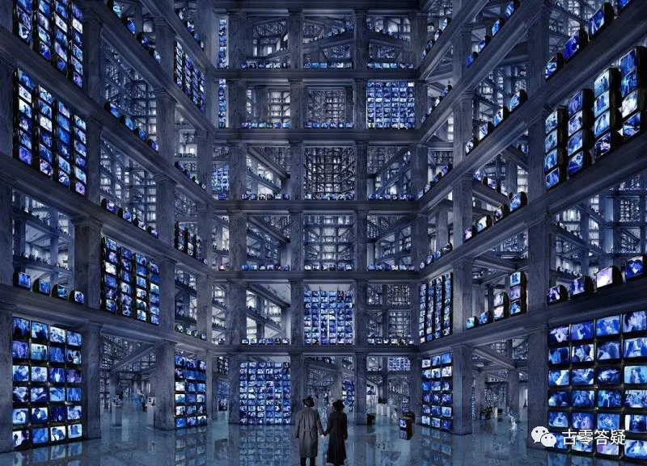
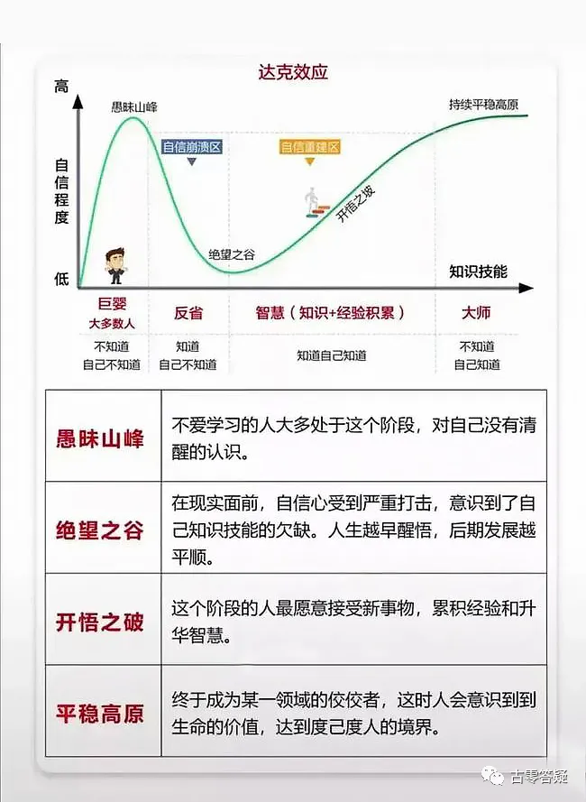

# 意识强度提升点实操指南【5】左方区 旧有惯性区

* 作者：古零


分为两大部分：

一、[心智](../practical-guide-to-enhancing-consciousness-intensity/01/index.md){:target="_blank"}惯性部分。

二、[潜意识](https://mp.weixin.qq.com/s?__biz=MzAxMzg5MDI2MA==&mid=2247493983&idx=1&sn=1ec44f53292d7850a084e5b3998d1ff4&chksm=9b990ee4acee87f27d88d3be748fe9fbbc4e887f8df245c41506969996edeea3e4e1bedabcf2&scene=21#wechat_redirect){:target="_blank"}惯性部分。

## 第一部分：心智惯性部分

今生程序设定以及环境影响带来的心智程序中，对自己产生意识惯性的部分。

分为三个小部分：
一、思维惯性。
二、行为反应惯性。
三、情绪反应惯性。


### 一、思维惯性

个体在思考过程中的倾向和惯性。

人类的思维模式都和观念有关，总是遵循一些特定的观点和信念。

**量化数据：**

心智模式对人类思维惯性的影响，普遍在 60% 左右。

下分 6 个小点。

#### 1、传统观念的影响


由国 家、民族、地区等历史传承下来的传统观念，会对个体产生广泛和深远的思维惯性和主观标准。

**量化数据：**

人类大概在 60-80%。
```
（2021年11月21日）
```
@阿东

>今天这个点很实际很实用。

>对我个人来说，传统观念影响至今，只不过很多都能觉察到，然后提醒自己不当真去破解，还没有真正认真去除潜意识惯性。

>这方面的例子随手可得，例如择偶标准，买卖原则，审美观点等等，可以说影响简直无处不在。

>个人体会，提升这些点思想要开放，包容性强，好奇心强，喜欢尝试，尤其是提升觉察力和自主化程度，去除这些潜意识程序并不难。

>我个人对这个点以前可能有些轻视，需要警醒自己。

>择偶标准：以对女方要求来说，有些地方就是门当户对。有些地方要女方身体强壮能干活，有些地方要女方能生养等等。

>审美观点：夸张点比较，瓷国人的美女审美和非洲部落的美女审美，记得非洲有个部落脖子要很长。

@檀雅

>择偶标准和审美观随着年龄的增长，或者是社会里有新的标准出来后，也会随着变得不一样

>审美观：以前的张敏，现在的网红脸，完全不一样

@古零（GU0）

在思维惯性的影响下，被传统观念所造成的束缚还是挺普遍的，主要表现为生育观念、婚姻观念、道德观念、家国观念，教育观念，审美观念、生产观念等。

在觉醒（意识强度9以上+脱离轮回）中，我们也会不知不觉间被一些传统观念所影响，如：

* ==**道德幻**== —— 如：执着于修德，甚至作为判断得道的标准，如德高望重，品格高尚，显著的社会贡献（济世度人，建立门户，受世人敬仰的程度等）。
* ==**正义幻**== —— 如：执着于善恶、正邪等二元倾向，并延展出执善。
* ==**角色幻**== —— 如：执着于轮回角色扮演的关系：亲人、族群、团体等
* ==**上师幻**== —— 如：我得益于上师的指导，若没有上师，我很难觉醒，我离不开这些帮助。发现上师人设崩塌，原来我的所有问题都是上师造成的。
* ==**权威幻**== —— 如：信息来源很重要，必 须 源自经典、权威、名人。修行 必 须 师承，甚至是名门名派，否则容易走偏。我修得比你好，层次比你高，所以你一 定是错的，同时也没有资格质疑我。
* ==**模式化**== —— 如：觉醒 必 须 经历苦难，是一条漫长的艰辛之路。我今天状态不好，一 定是被攻击了，一 定是谁谁谁（对号入座）干的。
* ==**能量幻**== —— 如：状态不好，一 定是能量不足，同理：因为能量不足，所以我需要不断练功来收集能量，否则会......；霍金斯能量等级表，能量高=意识频率高。
* ==**自弱**== —— 如：自己根性差，因此对很多信息都理解不了，同理：信息理解不了，一 定是自己根性差。老师不搭理我，应该是我根性（等级，资历，信任程度等）不够。


随着时间的推进，原有的传统观念适应不了现有的环境，相对应的适应现有的新观念顺势而生，两个观念就有了异同和冲突，对于修行，建议无须执着于这个冲突，而是观察和化解这些观念所带来的思维惯性。

@阿东

> 👍 其实思维惯性我最近感触颇深，有些甚至用了几十年的，自以为还挺受用的思维方式都是建立在错误的结构之上。

>思维惯性有点像一种房屋结构，结构有问题就承受不了更多的发展。

>情感这种动态体，相对是容易觉察和修补漏洞的，而对于思维惯性这貌似稳定的结构，察觉就难一些。而且察觉后还要有推倒重来的决心，需要有更大的觉察力度和行动勇气。

@古零（GU0）

是的


#### 2、社会舆论的影响


当前社会下的形势和舆论导向，会创建适应当前社会的新观念、新标准，被个体吸收或归纳到原有思维体系中去，成为新的意识惯性。

其实，是换汤不换药，和传统观念没多大区别，只是更新一部分标准，继续束缚人类而已。

和社会洗脑体系是一体的：让人类以为社会在发展，观念在更新在进步的假象。

这个也是 T 组*催眠策略之一：之前的标准，人类受不了了，就进行更新，推出新的升级版，宣传这是更科学、更合理、更人性化的标准，这是社会进步的标志……等等。

在历史上，T 组会根据人类新的觉醒趋势，随时更新出 “新标准”。

目前，新标准很快就要推出，已经有一些类似的在传播了。

新的整套标准非常棒，听起来十分振奋人心，简直是人类里程碑般的发展。

新标准的升级，目前还没有完全成型，还在逐步完善中。

**量化数据：**

人类平均 60% 左右。

破解方法：觉察自己把哪些灵性的东西拿去衡量别人、评判别人、绑架别人。

*关于 T 组，请参考元吾氏博文《[轮回是否存在（儿童不宜）](https://yuanwushi.org/article-6-6638.html){:target="_blank"}》。
```
（2021年11月22日）
```
@古零（GU0）

对于大多数人，习惯用传统的观念来作为衡量标准，并形成思维惯性，这个在上一期就分享过了，而社会舆论往往会作为适应新形势下所诞生的新标准，来代替旧有的传统观念，因为隐蔽性较强，往往不容易发现。如用捐款数量来衡量明星的人品，用点赞量和回帖量来衡量对方对你的关注度，用支持国 货来衡量是否爱国等。

对于修行，某些人往往习惯用灵性的观念来代替旧有的世俗观念，如：用素食或者戒律来衡量灵性，用道德标准或者神通来衡量对方的修行水平，用前世的成就来衡量对方的根性，用能量感去衡量所接收信息的真伪等。

建议多觉察自己把哪些灵性的东西去衡量他人、评判他人、绑架他人。

**练习题：**

==**1、对于个人，多觉察自己的程序意识，然后把这些程序意识转变为自由意识。**==

什么是程序意识？

遵循某种逻辑模型或者信息体系来进行导向的意识，也是容易形成惯性的意识，我之前举的很多反面例子都是程序意识，大家可以参考一下，有疑惑的同学可以多交流多分享，把自己盲点找出来。


==**2、对于集体，多觉察集体的控制意识，然后把这些控制意识转变为自由意识。**==

什么是控制意识？

以金字塔结构为主体，并以层层控制为目的的意识，如T组的阴性矩阵就是以控制意识为核心的，我们生活在强制轮回内，也是一直受阴性矩阵所影响，这也是程序意识的根源，而与之对立的是阳性矩阵（集体觉醒蜂窝结构），其核心就是自由意识。


==**3、把个人意识转换到集体意识，通过阳性矩阵（集体觉醒蜂窝意识）的发展来促进个人的提升。**==

对于个人，首先是做好自己，然后与他人共享互助，这是个体意识转换到集体意识的链接点，如我们每天在大群里积极的进行学习、交流、分享，就是一种集体意识的行为，大家借此可以起到相互促进的作用。


*下面这个图，上面是阳性矩阵，下面是阴性矩阵，阳性矩阵以自由意识为主，阴性矩阵为控制意识为主。觉醒就是把控制意识转化为自由意识。

 


#### 3、学校教育的影响


学校会宣扬或倡导某些理想化观念和行为规范，提倡学生们去遵守和执行。

大部分学校的教导都会在社会中慢慢淡化，基本上只有 20-40% 左右的核心内容，能被学生们所真正消化和纳入思想体系中。

其实这样的比例，对于教育洗脑来说，已经足够了。

**量化数据：**

人类普遍 20-40%，也有国 家差异，发达国家 40% 左右。

发达国 家注重素质教育，学生被灌输的标准和理念很多。
```
（2021年11月23日）
```
@活在小丑之城

>现在学校的教育不止在洗脑学生，也在洗脑家长，在初中以前，学校和家长的联系越来越紧密，甚至有部分作业是督促家长去监督完成，还有打开软件，完成比重，列位排名，标准化程序化越来越严格。但是现在实行双减了，因为没有小孩，也看不懂双减的背后到底是什么意思。

@喵斯塔

>虽然学校里洗脑，但起码在教育上还是起正面作用的，这点拿正常学生和小混混相比就能明显对比出来。相较于学校，资本才是最不择手段的洗脑工具，现在的女权主义、环保主义、消费主义都是动摇社会根基的东西。

>西方素质教育带来的结果是有钱人后代进私立，出来后还是有钱人。普通人进公立，学校什么都不管，结果出来还是当个普通社畜。那些精英光鲜正面的地下是被他们踩在脚下的普通民众，教育帮助阶级固化，最后还是服务于掌握资本的那些人。

@古零（GU0）

这里有一个很有趣的现象，就是发达国 家的教 育影响反而是最高的，大家知道为什么吗？

如常青藤和蓝翔，常青藤影响反而更高，为什么？

@星爵

>这里好多因素吧？教育本身就是洗脑。越发达国家教育越科学高效，深入细致，等于洗脑效果越好。加上发达国家学生本身的优越感，对权威性的认同感的加持，集体意识的催眠。

@古零（GU0）

👍

1. 常青藤有认同感的加持，有文化底蕴的优越感，反而容易成为个体觉察的盲点。
1. 相对于蓝翔，常青藤的教育体系更完美，标准化更具权威性，导致产生的程序意识更精密、更隐蔽（细而深），不同于蓝翔，程序意识的灌输虽然量大，但粗糙和表面化，后期容易被个体觉察和修正。
1. 觉醒就是把程序意识转化为自由意识


我发现这个图，阴形矩阵很讲逻辑，因果。

阳性矩阵每个点之间好像没什么逻辑。

@古零（GU0）

因为阳性矩阵是蜂窝结构，是并行发展的

==阳性矩阵的特点是自由意识，阴性矩阵的特点是控制意识==


我们身处阴性矩阵之中，如何不受影响并尽快觉醒，在个体上，就需要觉察自己的程序意识，并转化为自由意识，在个体意识与集体意识的衔接上，就需要大家把集体的控制意识转化为自由意识。这样阴性矩阵就会慢慢转化为阳性矩阵，自身也在集体觉醒的意识中得到同步提升。




@。
>这张图有莫名的熟悉感

@古零（GU0）

以 T 组工作人员的视角进入轮回大厅，差不多是这个感觉


#### 4、家庭环境的影响


家庭的成长环境，父母或者养育者的个性和观念，都会对个体产生一定程度的影响。

**量化数据：**

人类普遍 40-60%。
```
（2021年11月24日）
```
@古零（GU0）

很多人都难免经历过 ==原生家庭环境的 “被动式” 塑造== ，而这个塑造至今还会对自己的意识状态带来潜移默化的影响，建议通过溯源，观察一下自己个性、观念和意识卡点有没有来自于这方面的影响。如童年的家庭比较温馨，父母对自己的表现能给予合适的反馈，其安全感就会提升，并更愿意去真实表达自己的情感，在工作中会更信任领导和同事，表现出积极和乐观，遇到问题懂得去借助集体的帮助。若童年经历过家暴，或者无法接受父母对自己的沟通方式，会形成压抑和忽略自己的情感，并延展出缺爱和自弱，在工作中对于领导和同事缺乏信任感，遇到问题往往选择自己死扛。

化解的方式有很多，建议多尝试，去选择适合自己的方法，如：

1. ==观电影法== —— 以观察者的角度去阅读发生在个体身上的剧本，洞悉故事的主题，理顺剧情的冲突，解构各个人物的内心变化，最终把自己意识卡点给观破。参考电影《荒野生存》
1. ==古零脱敏法== —— 通过模拟观想，设置炼狱关卡，重新把自己代入到当时的冲突点，用双焦点（观察者 + 体验者）去观察自己那一刻的情绪是如何被触发和放大，如何无意识的随波逐流，如何延展出各种主观的解读，借此来测试自己能否通关，并不断加强通关的难度来提高自己不当真的强度。
1. ==复合体灵探索== —— 通过互催，自催，出神，合一等去围绕第 2、3、4 复合体灵进行探索，把情感、思想、关系作为前期重点化解的对象。
1. ==合一本源== —— 通过互催，自催，出神，合一等去深度合一本源，用更宽的频率，更 高的维度，更广更深的观察.....把这个幻破掉。

以上方法仅供参考，至于更具体的方法与步骤之前都分享过的。


#### 5、人生新阶段的变化影响


个体在成长过程中，会有一些人生的新阶段，如工作、结婚、生子、养老等等，心态也会产生变化，会自动搜集新的标准和程序来武装自己。

这些标准大部分都不是更新的，而是额外增加的，会给个体心态带来一 定的负担和压力。

**量化数据：**

人类平均影响在 60% 左右。
```
（2021年11月25日）
```
@古零（GU0）

==当个体进入新环境、新阶段的时候，在缺乏安全感的作用下，会触发自我保护的机制，并延展出新的思想模块（逻辑模型）去试图尽快解读和掌控新场域。==

建议保持客观去觉察每个新阶段的变化中所诞生的程序意识，如不少人在新阶段尚未熟悉的情况下，主观性的把旧经验加上新理解，糅合出一套新的标准和概念，借此建立一个新的意识模块，往往这种模式也可以称之为个人程序化的元宇宙。

如进入新的工作阶段，对发展前景过于焦虑，容易以偏概全，用一套处人处事的标准把纯粹的事情妖魔化、程序化。可以参考《借锤子》的故事。

如进入结婚生孩的新阶段，对前景会变得过于不安和担忧，延展出一套保护程序，表现为情绪化，作茧自缚。

如养老阶段，会对自身的健康过于杞人忧天，延展出一套养生标准。


修行中其实存在这种现象：

如不少人通过信息揭露（如强制轮回系统、地球发展史，地外文明等），旧有的认知系统受到全新的冲击，但有些人却习惯建立双标的意识程序来观察信息，举个例子：

1. 在新的觉醒阶段，某些人并没有借此带着觉醒的目的去提升自己，反而把意识焦点投向到消极的思想模式中，并不断散发负面的意识去加强幻相（如天天哀嚎不是电击就是韭菜），而对近在咫尺的实修信息和破幻方法却视而不见。
1. 坚守尚未实证的旧有信息，主观性的把新信息一律视为造幻，却忽略新信息所带来的积极作用，不去客观分析和实践验证，用双标的意识程序去进行各种理论和假设。


#### 6、个体突发转折事件的影响


个体在成长过程中突发的一些意外挫折，造成人生较大的转折事件，给个体心态造成一 定冲击，也会影响先前固有的思维方式和观念。

转折之后，个体会抛弃一部分旧有观念，去寻求一些适合自己状况的新观念，进行补充。

**量化数据：**

人类平均在 40% 左右。
```
（2021年11月26日）
```
@活在小丑之城

>其实重大事件不是突发的，在发生之前已经有所苗头了，觉察认识不够，就看不见。我之前会在家道败落中出不来，受尽人情冷暖，现在明白这是必然发生的，体会人情冷暖、看清人性、认识自己，挺好的。在人生得意时，飞扬跋扈而不自知，别人不喜欢自己也不在乎，其实根本不会为人处事，但别人都让道，还错觉自己人际关系挺好的。跌落后这些问题都暴露了出来，改变了我的认知。

@炜航Kevin

>抱着内求的心态，都挺好的，出问题了就查漏补缺。暴露越多，反思越多。就是需要能觉察到。

@活在小丑之城

>挺感恩的，是在我年轻的时候发生这些，而且加上现在网络普及，我可以学习觉察，加油加油

@古零（GU0）

遇到挫折受到打击，这个跌落的过程让你开始反思，开始愿意去提升自己





@古零（GU0）

突发转折点所带来的影响，往往考验个人的内求和客观性，这也决定了觉察的深广度和修正能力，也决定了新观念能否将程序意识转变为自由意识，还是在变得更程序化

@刘腾飞

>这句话似是而非，能否垂怜解释一下

>这句话没有展开一下的价值吗？我理解得道以后“知道”的主体已经不存在了，是吗

>我可以是任何知道或不知道的视角？

@阿东

>个人理解，得道前啥都知道，得道后啥都不知道有几重意思的。

>一重是因为无我（无小我）。得道者小我意识比例非常低，小我知道自己单一视角和能力的限制，更多顺从于高我的意志（随心所欲），也就是得道者的小我知道自己啥都不知道。

>二重是得道者合一道，知道即使是高我的视角也难企及道的亿万分之一，不是更加明白自己啥都不知道是什么？

>三重是从本源角度，老元刚刚说过，本源已知的永远低于1%，那么你对一个了解程度不高于 1% 的情况如何评价？那就是不知道呗。

>上述还只是从视角去分析。

@刘腾飞

>嗯三个视角的解释比较说得通，就是不知道郭老的意思是不是这些个角度\@GU0 

@古零（GU0）

是的

为什么说把已有的经验和认知放下，让自己处于白纸状态，才能更客观的去接收信息?

为什么说从 8+ 到破 9，需要有推倒重来的决心?

@李伟

>因为破 9 就是白纸状态，是时候把实修的痕迹擦掉了

@古零（GU0）

可以觉察一下自己为什么会有这样的结论？

本身就是很纯粹的事情，时刻保持客观性，不要被表意识（小我）带偏

@观

>也许这就是有些人修到 8+ 后去讲经说法的原因，搞所谓的度人修德

>难道市面上公开传法的都是 8+ 的？

@古零（GU0）

这是以偏概全了，只是在这个状态中，容易有已经得道的错觉，容易自以为是，自圆其说

@星爵

>GU0 哥 8+ 的时候会这样吗？

@古零（GU0）

有过啊，所以那个时候我一直保持低调，不断去觉察自己

@刘腾飞

> 8+ 到 9 中间是有一个垂直的台阶吗? 意识强度不是线性评分的吗，比如 8.9999 到 9，按我的理解突破可能 0.0001 就到了，但是似乎这个突破需要重大的不破不立？

@古零（GU0）

我所经历的是一点一滴的积累，而不是突然间的


### 二、行为反应惯性

个体遇到事件时，受心智程序所影响的惯性行为反应。

这种是个体从自己的观念体系出发，认为自己应当如何应对事件，基本上较为理性，是属于从自己角度看起来正确的应对方式。

**量化数据：**

人类普遍在 60-80%。

下分 4 个小点

#### 1、常规事件反应模式


是人类普遍会遇到的，个体已有思想准备和应对方式的一些普遍典型的常规事件。

**量化数据：**

人类普遍 60-80% 左右。

```
（2021年11月27日）
```

@李伟

>常规事件反应模式

>1.路遇熟人，打招呼模式会打招呼，社恐模式会逃避。

>2.看到违反群规的言论我是这么反应的，这个人又说敏感话题了，他是真的闲着没事干吗？应该去做点有意义的事情啊。我希望对方按我的标准来。

>3.看到社会新闻，我是这样反应的。这些新闻真是无聊透顶，人们对新闻的反应总是那么极端，真是没眼看。

>4.玩儿游戏逆风的时候，我会责怪队友的无能，向外归责。如果玩儿之前就想好了只是玩儿一玩儿锻炼觉察力程序反应会少很多。

>不只是外界常规事件，内在的常规事件也有很多。

>比如常规的压抑，常规的混乱，常规的自弱，常规的自以为是，常规的无聊，对于这些情绪的反应的觉察也是一门学问。虽然跑题了，但是情绪也会影响行为。

@古零（GU0）

👍

@李伟

>这个提升点的提高应该和自主化程度有关，主动被动此消彼长呗，自主的程度我估计和表潜通畅度有关，其实我对表潜通畅度没啥概念。

@古零（GU0）

==这个数值主要看程序化的比例，若个体对常规事件的行为反应惯性越高，数值就越高== ，如：

老人坐公交车遇到不主动让座的年轻人，就习惯认为对方的道德有问题；遇到送餐员送餐晚了，就习惯给差评；遇到商品打折或者手机新型号上市，不管自己是否需要，就习惯买买买.....

==对于修行的群体，也存在同样的情况==，如：

1. 在网聊中，站在自身的角度，若感觉有人对自己的评价存在曲解，个体第 一 反应就是怼回去，而不是先自省一下，或者继续深入了解情况以获取更多的信息再做判断。
1. 宣扬自己观点的过程中，遇到不认同的声音，习惯性认为对方的悟性低或者认为对方在刻意抬杠。
1. 不认同对方思想品格或者爱好倾向，就习惯判断对方的信息也同样存在问题。

归纳一下，个体在信息互动过程中，遇到自我观察到的下列情况：

1. 对方的信息与自己的认知体系或者心智系统相违背
1. 对方某个点存在扭曲，或者与自己实践所得有所区别
1. 对方意识频率、修行层次、辈分、阅历和年龄等比不上自己
1. 对方不认同自己的观点或者与自己处于对立的位置
1. 对方的人格、身份、阵型（门派）、能量感应和过往历史等不在自己所认同的“标准”范围内

........

这种情况下，个体往往会缺乏思考和深度觉察，自动进入判断模式，继而陷入以偏概全，断章取义的[惯性](https://mp.weixin.qq.com/s?__biz=MzAxMzg5MDI2MA==&mid=2247493101&idx=1&sn=8cfaabd078a2c44f441ecf14c4915dcd&chksm=9b990256acee8b407909eb52884ff88ecfe7b5a5c760237b29d8d75897d1f99c6add08981e55&scene=21#wechat_redirect){:target="_blank"}。这些[惯性](https://mp.weixin.qq.com/s?__biz=MzAxMzg5MDI2MA==&mid=2247493101&idx=1&sn=8cfaabd078a2c44f441ecf14c4915dcd&chksm=9b990256acee8b407909eb52884ff88ecfe7b5a5c760237b29d8d75897d1f99c6add08981e55&scene=21#wechat_redirect){:target="_blank"}的触发点在个体的角度上，往往是理所当然，不容置疑，习以为常。

建议多觉察和自检，去寻找自己的那些行为反应惯性的触发点，那些用来过滤信息和个人的[程序意识](https://mp.weixin.qq.com/s?__biz=MzAxMzg5MDI2MA==&mid=2247487532&idx=1&sn=7606b5c4938e311490a322ffead20a55&chksm=9b9af797aced7e81a90cd869671062af56f92b8769db4110dbccbaed0142e42bba1bfb16b8b2&scene=21#wechat_redirect){:target="_blank"}模块。

从观电影法的角度，可以多回看自己以往的聊天记录，不管是昨天的，还是多年前的，用客观的角度去认真回看，就会发现自己那些隐藏的惯性行为，也可以去看看几十年前的电影或者不同国 家的电影，集中在剧中人物互动的情节，看看他们当时的行为模式，与现在的电影进行比较，就会发现很多不同的行为反应习惯。

自主化程度是一方面，客观性也非常重要，表潜畅通的其中一个表现，就是客观性高，不容易被心智系统干扰。


#### 2、意外事件反应模式


指个体遇到的非常规事件或意外事件，自己需要重新思考，该如何对事件作出反应。

**量化数据：**

人类平均 60% 左右。
```
（2021年11月28日）
```
@。

>这个打个比如，当在外遇到车祸这意外，一般的反应是紧张，害怕，其实可以很快反应过来面对和冷静处理，照着流程解决问题，再继续去忙

@古零（GU0）

这个点应该比较好理解，就是遇到意外（突发）事情，自己所采取的行为反应惯性。

举个例子：

旅游大巴车半路抛锚，有人会先通过发泄情绪来寻找心理上的平衡；有人会先通过追究责任来撇清关系，甚至借此追讨自己的损失；有人会先解决抛锚的问题，来让行程尽快恢复。这些都是程序化的行为反应惯性，在个体自身的角度上都认为这样做是 唯 一正确的应对方式，在梦境中，这种意外情况也会经常出现，个体的行为反应更多表现为随波逐流、缺乏思考和觉察，这种行为反应的程序化越明显，该项的数值就越高。

对于数值低的个体，往往能保持客观和内求，表现为明确的目的和时刻觉察，并根据情况做出灵活的选择。如上面旅游大巴车抛锚的例子，个体会根据自己的目的，对当下的情况进行评估，并选择最优的解决方案。如个体赶着去目的地，那么他会评估汽车能修好的可能性和时间成本，及时选择是把汽车修好还是转乘其他交通工具，如果个体不赶时间，那么他可以与责任方商讨补偿的方案，如果个体此行是陪伴亲人为目的（情侣游玩，亲子活动等），那么他可以先去安抚他们的情绪，让大家不要因此影响出行的心情。在梦境中，个体会表现为自由性和灵活性，能将计就计逆转意外事件所带来的影响。

在修行方面，这样的例子也挺多的，如“地 震”过程中，有人会因为心中的人设“标准”遭遇崩塌而选择倒戈或者退出；有人会迷失方向，失去主见，变得随波逐流和断章取义；而大部分的同学会保持客观和内求，去审视自己的修行目的：是追星族？是网络鉴证师？是情感发泄？……还是觉醒（脱离轮回）？如果是觉醒，那么需要自己探索的是信息本身还是道德捆绑？所做的行为是让意识越来越自由和开放，还是越来越束缚和程序化？

每个人根据自己的目的都可以自由选择，觉察和不当真都不断的考验着自己，这就是实操，无处不在。


@阿东

>如果我现在遇到旅游大巴抛锚，先客观了解情况，如果不长时间能解决，环境许可的话我就下去先就地玩会儿，环境不许可我就静坐去了

>昨晚运动突遇跳闸停电，先问了工作人员情况，然后去安抚小伙伴情绪，再然后愉快的聊聊天开开玩笑，再然后电来了愉快的运动。

@古零（GU0）


#### 3、创新型反应模式


指个体在原有观念不变的情况下，为了自身利益，而去改变自己的应对方式。

产生新的应对方式后，个体会感觉自己像是改变了，变得更加成熟。

这种模式很具有迷惑性，其实也是换汤不换药。

这个也是T组催眠策略之一：把人类的关注点，放在通过不同的 “行为模式”，去达成自己的目的。

这方面的洗脑文章非常多，教导人们用各种技巧和手段，来维护自己固有的观念，达成相应的目的。

这个催眠策略是尽量覆盖多角度，从多角度围攻的模式。

这种催眠模式也在心理学领域中存在影响：让人们以为自己突破了固化观念，发展了创新，其实只是学习了更多自我催眠的方法和技巧，本质上还是换汤不换药。

也像一个人整天换新衣服，却不洗澡。

**量化数据：**

人类平均在 40% 左右。
```
（2021年11月29日）
```
@炜航Kevin

>举个例子，假如以前遇到烦心事，借酒消愁，后面升级了一下，遇到烦心事，换种方式，去打球、听音乐缓解，但不去直接面对这个事情本身，挖掘心烦的根源。这样看似应对方式更 高级了，不过没治本。

>还有比较典型的，一直宣扬各种扬升，但没落实到切实的一点一滴的实践中，破幻。一直感觉自己好像每天都升级，实际上原地踏步。

@古零（GU0）

👍

==换皮法== ：用不同的行为模式去试图掩盖或者逃避问题的根源，如被对方无缘无故抽一嘴巴，个体选择逃跑，投降或者去买止疼药....

==自圆其说== ：用理论或者模型来自我催眠，如被对方无缘无故抽一嘴巴，个体自我催眠自己：不疼，都是空，都是幻觉，都是我，自己抽自己而已.....

换的是行为模式，本质还是旧的核心，如个体目的是觉醒，强点是行动力强，但弱点是外求，最早的旧模式是依赖外灵辅助，导致招来附体，后来意识到问题后，改成追求预言体系，变身为躺等扬升一族，后来发现预言都是了了无期，于是求变，紧接着学习互催探索潜意识，无意中发现有业力法庭，于是依赖业力法庭去解决轮回的问题，其实变来变去都是花式外求，其核心始终没有改变，只是换了 “皮” 而已。


#### 4、绝望型反应模式


指个体遇到某些事件，无法采取任何主动的应对措施来改变状况，只能被动接受，在绝望状态下采取的反应行为。

该反应和心智模式相关，也是属于个体观念系统中的，认为在此情况下，自己应该如何做。

例如：患绝症，一些人的观念会认为，这时候应该享受生活。

另一些人的观念会认为，这时候应该继续医治，死马当活马医。

还有一些的观念会认为，这时候要报复社会...等等。

其它情况也有很多，比如离别、破产、打官司或者环境影响等等。

事件越重大，头脑心智对个体的影响就越小。

不那么严重的时候，个体多半还会采取头脑处理模式。

**量化数据：**

人类大概在 30-60%。
```
（2021年11月30日）
```
@金玉

>如果设定目标，没有达成会触发绝望反应模式吗?

>比如，设定某年内破九，经过努力，没有达成。会对这事或对自己绝望吗？

>自身状态好的时候，和状态不好加外境刺激的时候，反应会不同吧？能做预案吗?

@古零（GU0）

除非你把目标设定为临终前，然后这个过程也没有做周期性的自检（觉察，自测意识强度，总结，修正），失败也是经验，错的都试了，剩下就是对的了，若没有达成，就要总结离觉醒的差距还有多少？失败的原因是什么？是方法不适合自己？还是自己在 8 强方面做的不够？然后及时修正，改变策略。

绝望型反应模式的出现，是个体（表意识）认为此刻自己已经没有主动选择和改变的余地。

举个例子：

先自检自己的意识强度，自己的强点和弱点，目前已知的卡点（当真点），并制定具体的计划和目标（小目标，大目标，终极目标）。

1. 提醒自己时时刻刻保持觉察的状态（事前、中、后觉），若发现有当真的情况，记下来。
1. 每天睡前客观的总结一下，自己在这天里有没有出现当真（入幻）的情况，如果有，就马上记录下来，然后当天就去总结原因，如当真的触发点，运行机制（如何被触发，如何被放大和扭曲，如何被转介，如何被平息....），最好通过压力脱敏的练习，直到这个当真点彻底化解。
1. 每周或者每个月去客观总结自己的8强状态，自己的弱点有没有被修正，以及目前卡点化解的情况，自己的落地状态（破幻/不当真/时刻觉察）有没有提升。
1. 每半年或者一年，测一下自己意识强度（自测+他人测）有没有提升，若没有提升，就要总结一下，这段时间有没有存在自己忽略的地方，及时做出修正。

@。

>有关第四点，打个比如，如果在意识强度上在三个月内在最高点涨了 1，但在最低点只有涨了 0.5，这个总结如何？

>总结是最低点是 4 左右，最高点是 6+

@古零（GU0）

按照个人习惯吧，我一般是按照整体提升来计算，就是常规测试的数值

@。

>也就是说意识强度计算模板算出来？

@古零（GU0）

都可以

@。

>那 "按照整体提升来计算"，这是如何整出来?

@古零（GU0）

综合数值

@阿东

>先保持觉察，然后时时刻刻在事上驗，过不去的找深层原因，发现了也就过去了。

@古零（GU0）

是的，一开始做不到不要紧，先从事后觉开始（发生后马上总结 + 每天晚上睡前总结），只要迈出第一步，坚持下去，从 1 秒... 1 分钟... 1 小时... 1 天..... 24 x 7 x 365

化解绝望型反应模式，可以先从压力脱敏的练习去进行自测，看看自己在模拟出现种种重大事件下，自己如何应变，如何化解。

（之前古零（GU0）分享的脱敏疗法，具体可以搜索公众号：古零答疑，输入关键字：[古零脱敏法](https://mp.weixin.qq.com/s?__biz=MzAxMzg5MDI2MA==&mid=2247489799&idx=1&sn=43bd27aa3de7ccd3954d87da4ae1c6d2&scene=21#wechat_redirect){:target="_blank"})

事后觉——每天养成总结的习惯，对自己这天所发生的当真点进行反思和重演（脱敏疗法），通过不断的事后觉，慢慢提升到事中觉，到事前觉，大道至简，关键在于持之以恒，不断积累，最终逆转催眠意识的惯性。

针对自己的当真点（卡点），用意识创造一个炼狱场，相当于情景重现，再次回归到那个让自己当真的情景，再次感受那一刻的意识波动：

1. 双意识焦点模拟重现当时的状态，一个意识负责重现，一个意识负责观察，过程中观察自己的意识如何产生波动（如何被绊倒），并寻找和记录导致意识波动的触发机制。
1. 同上，观察自己的意识如何成功破幻，并记录具体的破解过程。
1. 根据上述进行总结和修正，接下来提高通关难度（设置更严重，更苛刻，更变态的情况），再次代入模拟情景进行练习，并重复上述的操作。


如此类推，循序渐进，过程中，还原度越高，观察越细微，那么提升的效果就越好，直到自己在可想象的各种最坏情况下，意识都能顺利通关为止。这个模拟过程是非线性的，可以突破时空限制，借此不断重复冲击当真点的阈值，从而达到高效率的提升。这个 “[炼狱场](https://mp.weixin.qq.com/s?__biz=MzAxMzg5MDI2MA==&mid=2247485197&idx=1&sn=c109ce75815a101104e57e68cd00b648&chksm=9b9ae0b6aced69a0784b11f29baca29c6dea61e4d99945dbc38f2426f92def9cd2fca952cd34&scene=21#wechat_redirect){:target="_blank"}” 配套事后觉察，可以有效提升多方位的觉察力。

@玄德

> 8 强是什么意思

@古零（GU0）

效率第一、觉醒意愿强、行动力强、主动性强、内求强、客观性强、游戏精神强、意识开放性强。


### 三、情绪反应惯性


指个体在事件中认为自己应该有的正当情绪。

比如：有人说自己坏话，自己就应该愤怒。有人要离开，自己应该不舍。看到别人受苦，自己应该难受等等。

人的情绪，有时候也会被心智操控，确实产生了自己认为应该有的情绪。

主要原理是靠头脑去识别、判定事件的性质，来激发自身相应的情绪模式。

例如：将一件事情识别为是对自己的冒犯，那么自己就会愤怒。

人类很多情绪，都是受这种头脑虚假识别所带来的。

这种也是属于催眠策略之一。

有一些在挑拨人与人之间的关系。

比如：会有很多文章不停的教你，对方的这种行为的真实含义是什么，是在暗示什么，是在表达什么。一些行为你没有意识到，其实你被冒犯了，被越界了等等，个体看到后会感觉恍然大悟。其实，不说的话，自己也丝毫没有察觉。

现在甚至连一个表情，一个词语，你都被告知真实含义都是对方不爱理你等等。

这是一种有效的催眠策略，一种灌输方式，并且随着时代变化在不断更新升级。

（这里面大有文章。有兴趣的人，可以专门做一个研究课题。）

**量化数据：**

人类大部分在 60-80%。
```
（2021年12月1日）
```
@古零（GU0）

情绪中心是人类最大的漏洞，个体的心智系统会自动代入各种模式反应，在无意识状态下，觉得自己属于怎么样的模式就应该具备怎么样的情绪反应。如：

消费者模式，路怒症，家人模式，性别模式，阶级模式，长者模式，受害者模式，陌生人模式，个性化模式，假想敌模式，善恶模式，鄙视链模式....

@Susan

>今天这个关于情绪惯性的提升点在我与家人关系中就是我的卡点。请求你开示，帮我解这个卡点。万分感谢。比如看到青春期女儿因某些事陷入恐慌愤怒或者难受的情绪中，我的情绪不由自主的开始波动，有心疼难受，总想去把女儿成长路上的绊脚石都帮她踢开。我也知道这些所谓的绊脚石都是她这一生游戏的体验。恐惧，愤怒，害怕，开心快乐，喜悦。她体验她在这场游戏中该体验的。我也用了其他方法想要解决这个情绪卡点，心不随境转，不当真。可是当看到女儿陷入她的情绪中难受的时候，我的情绪就有波动，总想帮她摆脱情绪的困扰。请求开示：我该如何做不受女儿情绪的影响？我该如何做能帮助女儿让她放下对一些人事物的分别和执着？非常谢谢！其实，女儿于我，也是一个执着点，我也放不下，所以在情绪上总是不自在。可是要怎样才能放下这个执着呢？谢谢

>我也知道别当真，当真就入幻，可真是不受控制啊

@古零（GU0）

1. 自己先觉醒才能真正帮助到对方。
1. 天助自助者，任何人若不主动自助（觉察到自己的问题 + 改变的意愿 + 内求），你帮了也是拔苗助长，治标不治本，唯有尊重对方的自由选择，等待时机。
1. 建议利用模拟压力脱敏练习，来化解自己的当真点。
1. 不当真破一 切幻。

就跟学走路一样，你无法代替对方去学习，对方在学习过程中的碰碰跌跌也是成长的一部分。

你目前所纠结的这些，本身也是你的学习过程，若化解了就是你一个提升的机会。


**下分 8 个小点。**

#### 1、愤怒模式

最常见的模式，人类的愤怒情绪多半都由心智程序所引发。

**量化数据：**

人类平均在 80% 左右。
```
（2021年12月2日）
```
@古零（GU0）

一想就来气 → 越想越气 → 别惹我


#### 2、内疚、自责模式

传统观念和社会标准中，已经让人们把一些特定事件识别为自己应该自责和内疚的，都是自己的错。

当发生一些事件而个体未能处理得当，便会引发内疚和自责的情绪。

**量化数据：**

人类平均 60% 左右。
```
（2021年12月3日）
```
@古零（GU0）

这是一张纪实照片，名为《饥饿的苏丹》，拍摄者为凯文·卡特，一个南非自由摄影记者。这张照片拍摄于 1993 年。


@古零（GU0）

很多人对摄影师产生质疑，他们认为摄影师作为目击者，首先应该去对小女孩救助，而不是不顾她的安危，继续拍摄。各种谩骂和指责蜂拥而至，让摄影师无法忍受这种痛苦，最后选择了自杀，相隔只是一年。

或者是自己不被外界所理解，或者来自内疚（不应该拍摄这张照片或者公开这张照片）

@大伟

>嗯，语言和思维是具备能量的，那么可以这样理解不，摄影师的肉体Si亡本质上就是被外界攻击的

>催眠波也是攻击，现在成为者也是灵，它也会攻击，可能它并不知道自己有在攻击，跑题了

@古零（GU0）

就如家人之间的责骂，往往责骂方潜移默化希望被骂方内疚和自责，如果被骂方有自责的倾向，很容易就被放大了。

@大伟

>这个我体会过，小时候犯错了的时候希望家人责骂，自己会产生内疚，然后就会被责骂，然后就满足了内疚，还有挨打

@古零（GU0）

根源来自把游戏当真了，自然就陷进去了。

关键在于不要把自省（向内归因）演变成自责和内疚，自省是通过寻找和分析自身的漏洞，并进行修正，最终达到提升的目的，而自责和内疚是情绪体验，对自省不但没有起到帮助，反而还容易陷入当真，至于如何化解这个情绪，在于你如何破幻（观电影法），在高我层面，每个人都在依照自己的剧本进行体验，一 切都是自由的选择，快乐是体验，痛苦是体验，自责和内疚也是体验，体验本身就是游戏，至于这个体验能否促进你的目的，就要自己保持觉察了。

@大伟

>嗯，本质上我们现在的修练破幻的选择也是当初自己设计好的剧本之一对不对

>我一直觉得T组是不会让你选择这个剧本的

>我感觉选择自由的能力一直在，但是剧本我有时候会理解不了，修练脱离轮回，这算是另外一条路，剧本可以有很多个选择还是一个固有的结果呢

@古零（GU0）

觉醒是灵魂发展的蓝图（高我层面），人生体验是今生的轮回剧本（所谓的 "命运"），以觉醒（意识强度  9 以上  + 脱离轮回）为目的修行是自主改变自己的 "命运"。


#### 3、嫉妒模式

由于比较，自己无法达到社会平均标准，对达标或者高于社会标准的个体，会产生敌视感。

这种情绪构成很复杂，但激发却很简单。是情绪操控中常用的手段之一。

该情绪属于容易陷进去，不容易拔出来。

并且可以长期稳定地存在于个体中，持续对人造成影响。

类似定时炸弹，是引发连锁负面情绪很好用的导火线。

**量化数据：**

人类平均 60%。

@古零（GU0）

缺爱和分离意识与情感中心形成了纠缠，产生互相影响的效果，建议多合一本源，在本源的角度去看待事情。


#### 4、羞愧模式

在一些场合中认为自己表现不当，让人感到尴尬和困窘，会让自己难以忘怀，感觉丢人。

这种情绪会降低自信心，造成人际关系的问题。

**量化数据：**

人类平均 60%。
```
（2022年2月3日）
```
@古零（GU0）

被自弱 + 保守（程序意识）反过来控制自己，把自己封闭在固定的舒适区里面，一旦离开就感到不适（当真），建议多练习打开天性和游戏心态（不当真）。

@檀雅

> 

>请问打开天性这点是啥意思?

@古零（GU0）

就是 “肆无忌惮”  的去扮演不同的角色（包括动物），演员表演课有这个科目，可以搜一下看看

@檀雅

>


> https://zhuanlan.zhihu.com/p/150666374?utm_source=wechat_session&utm_medium=social&utm_oi=1375206626123681792&utm_campaign=shareopn

>表演课学习心得体会
>https://www.yjbys.com/xuexi/xinde/1981722.html

>所以说，其实我们也是 "演员"，无时无刻都在表演?

\@Arcturian

>当真了你就不是演员了

@闪亮天空

>当真了，是演员入戏太深


#### 5、恐惧、害怕模式

受一些观念所影响，认为某些场景应该是很让人害怕的，所以自己会预先产生恐惧的心理。

比如怕黑、怕鬼、怕人借钱等等。

**量化数据：**

人类普遍 40-60%。

@古零（GU0）

被程序意识所控制，提前代入固定的程序意识，建议采用顺藤摸瓜结合虚拟脱敏法进行探索，寻找根源，如：为啥怕黑？鬼是啥？我为什么要怕？怕能解决什么问题？我不怕对方又能怎样…


#### 6、焦虑、担忧模式

受社会环境影响，人为制造不安全感的概念，让人为自己的未来感到焦虑和担忧。

**量化数据：**

人类平均 80%。

@古零（GU0）

对那个结果感到害怕，不知道如何处理，那么就用虚拟脱敏法，提前让自己进入那个 “结果”，感受一下那种代入感，体验 “即使这样，又能奈我如何” 的游戏，并不断加压（冲击承受阈值），直到脱敏为止。


#### 7、自卑、悲观模式

对人事物的看法较为消极，多数和自卑有关，对自我评价较低。

人类基本都有感到自卑的地方。因为人无完人，这一点也是心智容易控制的地方。

控制模式：不断去通过各种比较，来强化个体的 “弱点”，让人不自信，觉得自己不行，以此打击个体。

**量化数据：**

人类普遍 60-80%。

自卑对人类的影响很大。大多数人都看起来开朗自信，其实自卑感都藏在心里，不表露于人，自己也尽量去逃避。

数值在 80% 左右的，就已经可以明显影响到自己的整体心态，给生活带来阻碍。

@古零（GU0）

把所有的情绪当做是一种游戏体验，可以多尝试站在游戏玩家的角度，自省一下这些体验是自主选择还是被动选择?体验的目的是什么？如何让这些体验对觉醒起到促进?

@金玉

> “体验的目的是什么？如何让这些体验对觉醒起到促进?” 能指点一下吗？

>我不想体验的为什么本源要让我体验，经常有种感觉，好像题目没做完，总是换着法儿的让我做类似题目

@古零（GU0）

潜意识：玩家角度，有明确的目的，如缺啥就体验啥，借此来补充缺失的频率，直到通关为止（满足诉求，得到所需要的提升）。

表意识：NPC角度，没有目的，把情绪体验认同为身体的一部分，跟吃喝拉撒一样的条件反射。（可以用模拟压力脱敏法去满足潜意识的诉求）

促进——观电影法：

作为演员 —— 演得时候可以投入，但不会当真，因为我只是在演戏

作为导演 —— 情绪都是套路，推动情节而已，我想怎么演就怎么演

作为观众 —— 关我啥事，我是来看电影的

@静观

>现在有种厌烦情绪，看了很多别人的修行经验，当时觉得很神奇很牛，现在越来越无感了，自己证到才有意思，生活上也是，别人活的再精彩也不是自己的，没意思

>有种对自己的无奈，世界如此精彩，自己却因心障困在一亩三分地中。

@古零（GU0）

看你如何看待信息了，如借助信息去让自己拓频，让意识更自由，更开放，不管信息是什么，你都能从中受益。

但如果你把信息当成猎奇，外求（信仰），攀比，以幻造幻，理论依据等，那么不管信息是什么，对你的促进都会很有限。

举个例子：

同样的信息，有人会因此开始觉醒，开始通过实修实证去提升自己，有人会如哀嚎哥那样，把自己的意识集中在幻相上进行情绪宣泄，因此自身的潜意识也在不断强化幻相，而忽略最重要的一点：通过内求去破幻。假如某天T组突然消失或者把哀嚎哥送到地球监狱矩阵外的自由世界，他的惯性意识也会被其他矩阵监狱吸引和捕获，或者自行创造一个监狱来困住自己，来满足自己体验哀嚎的诉求。

被困的都是自己的意识，而不是 “身体”：

无神论者即使处于 “中阴身”，也会让自己进入假Si状态，来满足自己一直所坚持的 “信仰”

假空者会让自己进入Si寂，来满足自己一 切唯空的 “信仰”，或者无所谓去哪都一样（包括轮回）

\@Iu

不是说我是你的潜意识，你是我的潜意识吗?这么看潜意识不是也在造幻吗?

@古零（GU0）

“我是你的潜意识，你是我的潜意识” —— 这里指你中有我我中有你

“表意识 = 主观 = 体验幻 + 造幻 = 顺向 = 体验万物至繁（无限的可能性）

潜意识 = 客观 = 破幻 = 逆向 = 体验大道至简（溯源）= 看到真相（造幻的源头）= 证得本源” —— 这里的 “潜意识” 是指个体所切换的状态。

具体可以看看《[人的多次元复合体结构](https://yuanwushi.org/article-6-6673.html)》系列文章。

\@Iu

>这个切换状态是指合一复合体意识或者合一本源吗，可如果复合体意识还在造幻咋办，本源也一直在造幻吧。

@古零（GU0）

本源一直在造幻啊，举个例子：你通过设置某些条件（造幻）来影响猩猩的行为方式，那么你是猩猩的潜意识，但猩猩没有意识到来自你的影响，一直认为都是自己的选择，这是猩猩的表意识。

举个例子：

你的某个复合体灵（潜意识）还残留着某星际战争所带来的创伤，观念上有某些当真点，那么这会导致你的肉体意识也会受到一 定程度的影响，如人际关系，处理事情的方式等，但你的表意识是不知道的，即使自己努力去改变，还是反反复复，事倍功半，因为一直都处于治标不治本的状态，当你把表意识切换到潜意识状态，才能找到这个源头，才能从根本上化解这个幻。


#### 8、自负、傲慢模式

与自卑属于一对数值，互相同时影响个体。

当个体自卑的时候就想通过自负去进行心态调节。

属于两个极端，让人无法达成真正的平衡。

**量化数据：**

人类平均 80%。

比自卑数值稍高。因为人们急于想摆脱自卑，便会不停的制造各种有利于自己的比较，来抬高自己，去鄙视别人。

@古零（GU0）

未破幻（客观）先造幻（主观），最后意识变得越来越主观，自己也越来越当真。


## 第二大部分、潜意识惯性部分


分为六个小部分：

一、流动性方面。
二、延展性方面。
三、分化性方面。
四、原发保留程度。
五、继发程度。
六、诱导性的影响程度。


### 一、流动性方面


潜意识惯性流动性慢的话，代表该惯性较为固化。

流动快，说明比较灵活一些。

如果百分百的话，代表没有任何阻碍，可随意切换，属于没有任何相关的惯性。

**量化数据：**

人类普遍 20-60%。

@古零（GU0）

客观性越高，流动性就越快，主观就如河道上的堆积物，会形成阻碍，就如在小溪上不断扔石头一样，河流中的泥沙和杂质（惯性）会因此慢慢堆积起来，最终演变成惯性，心智模式也在这个过程中不断固化和加强。

@金玉

>问题又回归到客观性上，就是尽量潜意识状态觉察和处理问题吗？

@古零（GU0）

是的，保持客观能提高潜意识的流动性，降低意识的纠缠和回流

\@Awaker

>关于潜意识、表意识。我理解了一下：表意识就是自己这个脑壳东算西算的那些东西吧，潜意识就是安静下来，内心冒出来的？所以切换...的要旨是不是。。。把脑子。。。安静。。。下。。来 。。呢？

>请问我这样理解对吗? 我找了一下切换办法, 也没找着

@古零（GU0）

关键是纯客观，不被心智系统干扰，这个状态可静可动，静动皆可

具体的练习，我以前分享过的


**下分 9 个小点**

 

#### 1、思想惯性流动性

个体从一种思想形态切换到另一种的速度。

切换快，代表思维较为灵活。

慢的话，代表该个体较为思想固执，不太会变通。

**量化数据：**

人类平均 40%。

@古零（GU0）

动静皆宜，就如觉察一样，既能静观，也能动观。


#### 2、情绪惯性流动性

数值高的话，情绪调节能力强，可适应各种压力环境。

数值低的话，就较难排解自己的负面情绪，容易长期受影响。

**量化数据：**

人类大部分 30-60%。

@古零（GU0）

用不当真状态去多练习 “戏精” 的能力，不断切换情绪状态，去觉察这个过程中的意识流动，如听不同风格的音乐，观察自己能否快速 “入戏” 和 “出戏”。


#### 3、惯性阈限流动性

惯性阈限值较为灵活的，人会比较灵活变通，适应各种情况；

如果较为死板，代表该人过于坚守自己的原则，较难针对形势做一些调整。

**量化数据：**

人类平均 60%。

@古零（GU0）

不被程序意识所控制，反过来是让程序意识为己所用，前提是不当真，意识更自由，更开放，所谓的 “坚守原则” 是双刃剑，做好了是不被动摇的信念，做不好是死板，核心漏洞是二元性，缺乏游戏心态，当真，让自己锁定在一个固定的视角，看不到更宏观更多元的信息，


#### 4、惯性核心流动性

指个体一些较为核心惯性的变化程度。

流动性高，不会固执己见，能接受不同的观点思想；

数值低，则相当保守，无法接受新理念。

**量化数据：**

人类平均 60%。

@古零（GU0）

意识的客观性，开放性，自由性。


#### 5、单一惯性流动性

指个体在保有一种惯性的同时，对该惯性相关的观念和情绪等的流动性。

流动性强，代表该惯性具有伸缩性，可大可小。

**量化数据：**

人类大部分 40-60%。

@古零（GU0）

举个例子，习惯早上出门前喝一杯美式咖啡，数值高的个体，会因为某种原因喝不上而感觉不适（离开舒适区），如觉得影响到自己的精神状态，甚至觉得一天的运气也会因此变差。这是双刃剑，惯性带来的影响虽大但容易被挖掘出来，反之影响小就不容易被发现了，练习的话，可以试试改变自己的某个习惯，观察自己从 “不适” 中恢复过来的效率如何。


#### 6、多惯性组合流动性

指个体根据当下的不同情况，自动对相关的惯性倾向进行不同的组合，来应对各种状况。

这些组合灵活多变，表现多种多样，也是人类性格复杂多变的因素之一。

（这里面复杂多变。有兴趣的人，可以专门做一个研究课题。）

**量化数据：**

人类普遍 60-80%。

@古零（GU0）

相当于程序意识的组合流动性，数值低，程序意识会互相化解和促进，最终形成更优化的组合，并趋向接近自由意识，而该惯性组合下的舒适区变得越来越大，反之，程序意识犹如软件之间的互相冲突，最终形成混乱的低效状态，惯性组合下的舒适区也变得越来越狭窄。

举个生活中的例子，就如上面提到的咖啡一样，流动性弱的个体会因为喝不上美式咖啡而潜移默化不断暗示自己的难受（加强离开舒适区的不适感），流动性强的人会重新组合，改为尝试用其他习惯组合来代替，并潜移默化暗示这样做可能会有不一样的体验和收获（扩大自己的舒适区，化解不适感）。


#### 7、浅层惯性流动性

指较为直接影响个体的、浅层意识惯性的流动性，对性格表现也有较明显的影响。

与复合体深度无关。

**量化数据：**

人类普遍 30-60%。

@二驴

>个人胡说，仅供娱乐。

>惯性，就是不自主，就是潜习，就是执着，就是自动化意识程序，相关提升点分值越低越好。

>要去除惯性，Sou先要知道哪些是惯性，这需要察觉能力，例如思想或情绪异常等等。

>察觉到自己有惯性（可能只是表现出来的浅层），还需要追寻该惯性的根源（深度），该惯性的潜藏部分（中层）等，还可顺藤摸瓜，找到该惯性的深化、延展、细分、组合、变异（提升点下一部分）等等，然后就可以把该惯性相关的一大类一网打尽。

@古零（GU0）

👍

补充：数值越低，被惯性所控制的情况就越低，造成的意识缠绕也越少，因此扭转惯性的难度也越低。重点在于先对舒适区的破幻，否则会容易造成反反复复的不稳定状态。


#### 8、中层惯性流动性

潜意识惯性中，间接影响个体的部分，也是浅层意识惯性的一部分来源。

是个体较为深入的一些性格的来源。

**量化数据：**

人类普遍 20-50%。

@金玉

>您方便的时候能给我们讲解一下吗?近几天的提升点对我来讲比较抽象，不懂。

@古零（GU0）

具体需要多觉察自己存在哪些惯性意识，并对这些惯性进行深入的探索。

举个栗子，如 A 是私生子，童年缺乏父爱，造成了不少童年的阴影，所以自己很避忌被提及自己的身世，每次被触发，内心都会产生愤怒和焦虑，这是浅层惯性流动性，A 的性格有缺爱的部分，有恋父情结，这是中层惯性流动性。


#### 9、深层惯性流动性

指个体潜意识惯性中，最深层不易察觉的部分，属于较为根源的部分。

对个体的影响深厚，也是浅层意识惯性和中层意识惯性的来源。

**量化数据：**

人类普遍 10-20%。

\@Susan

> 这几个惯性，浅层，中层，深层，能否举例说明一下，不是特别理解，万分感谢！

@古零（GU0）

具体需要多觉察自己存在哪些惯性意识，并对这些惯性进行顺藤摸瓜的深入探索。

举个栗子，如 A 是私生子，童年缺乏父爱：

浅层惯性流动性 —— A 很避忌被提及自己的身世，每次被触发，内心都会产生愤怒和焦虑。

中层惯性流动性 —— A 有缺爱的部分，对被认同有执着，借此延展出相应的性格。

深层惯性流动性 —— A 希望体验自身所缺乏的频率，或者因为某种原因倾向于体验该频率的诉求，主要由 A 的复合体灵所带来的影响。

@二驴

>举个例子，西部牛仔看到陌生人就摸枪，浅层。摸枪是缺安全感，中层。缺安全感是因为坚信丛林法则的信念。

>可以从浅入深解决，也可以从深到浅解决，因人而异。


 

### 二、延展性方面


指单一潜意识惯性能够扩展到多大范围。

延展性越强，该惯性对个体的影响就越突出。

**量化数据：**

人类普遍 40-60%。


下分6个小点

#### 1、延展稳定性

指该惯性在延展过程中，保持强度和倾向不变的程度。

很多惯性，在延展中还是会发生一些变化。

数值高，代表该人极其单一古板。

**量化数据：**

人类大部分 20-50%。

@古零（GU0）

举个栗子：数值较高的哀嚎哥，他通过不懈坚持，天天说着同一句话。


#### 2、延展范围性

指该惯性可扩展覆盖到多大范围。

**量化数据：**

人类普遍 60-80%。

@古零（GU0）

举上面的栗子：哀嚎哥的线下生活状态，是否被线上状态影响。


#### 3、延展灵活性

指该惯性在不同方面表现的程度。

根据不同方面的延展度不同，进行灵活组合搭配。

**量化数据：**

人类普遍 30-60%。

@古零（GU0）

数值高，惯性组合更为复杂和多变，会形成自圆其说（自我修复）的状态，要 完 全 化解（破幻）就变得不那么容易了。参考哀嚎哥的状态就比较直观了。


#### 4、延展深度性

不同惯性的影响深度不同，也就是在浅中深三层中的比例不同。

**量化数据：**

人类普遍 60-80%。

@古零（GU0）

对复合体的影响程度，具体对每个复合体的深度探索才是治本之道，否则只顾浅层惯性，那么就容易出现反反复复的不稳定状态。


#### 5、延展细化性

指该惯性对个体的影响较为细致的程度，在很多具体细节层面都会影响个体倾向。

**量化数据：**

人类普遍 30-80%。

@古零（GU0）

越细化，越难以挖掘，往往个体会认为这是自己的个性或者是体验需求，而非自身的漏洞。


#### 6、延展差异性

不同惯性的延展范围的差异程度。

人类在某些惯性中有广泛的延展共性，在一些个别的惯性中，又表现出不同人的差异。

（该提升点如果细化，还能再分十几个小点。有兴趣的人，可以专门做一个研究课题。）

**量化数据：**

人类大部分 60-80%。

@古零（GU0）

举个栗子，如提起或者触发某些事情和条件，会让人产生一系列特定的意识反应和行为，这是意识惯性驱动的作用，同时会延展出不同程度的变化，延展差异性就是个体的一些个别反应与群体反应的差异程度，如对哀嚎哥的行为等。


### 三、分化性方面


指单一潜意识惯性会继续细分化出不同的小惯性，在不同方面影响个体。

**量化数据：**

人类平均 80%。

@古零（GU0）

大程序意识下形成的各种小程序意识


下分6个小点。

#### 1、分化稳定性

大惯性中分化出来的不同的小惯性，是否较稳定地继承大惯性中的某些意识特点，较少有变异的情况发生。

**量化数据：**

人类大部分 60-80%。

@古零（GU0）

数值越高越稳定


#### 2、分化细致性

指该惯性根据细化程度，可分成多少小的惯性。

修行者在一定阶段，觉察层面较为精细，惯性自动分化的也更加细致，在更多灵性方面影响修行者。

这个也是很多修行的人看起来比普通人限制更多的原因之一。

心智系统常常结合这一点，对个体进行配合控制，加强惯性。

（有兴趣的人，这个也可以细化研究。）

**量化数据：**

人类平均 60%。

群聊分享：
```
（2022年2月3日）
```
@古零（GU0）

这种例子太多了，如各式各样的戒律和规矩，多维度信息体系，业力体系、能量体系，道德体系等，心智系统通过自圆其说让个体自发形成各种程序意识，在这个过程也不知不觉阴沟翻船了。

破解的核心就是把程序意识转化为自由意识，阴性矩阵=程序意识。阳性矩阵=自由意识，修自由得自由，修限制得限制。

@檀雅

> 


>那多维度信息体系又是什么意思？那会带来什么坑？

@古零（GU0）

占卜 算命 星座 阿卡西等，本质上都是程序意识，而脱离轮回是最终把程序意识转化为自由意识

@檀雅

>那换个角度看，也是一种变相的外求渠道？

@古零（GU0）

是

@闪亮天空

>星盟信息，是否也属于多维度信息呢？

@古零（GU0）

不是，我这里指的多维信息体系是指阴性矩阵内（控制意识）的多维信息系统，本身建立在程序意识的基础上

@刘腾飞

>算命这个行为属于对程序意识的阅读？命运属于程序意识的设计？

@古零（GU0）

属于多维度的游戏设定，程序意识区域内，个体都有一个大致的剧本，储存于中 心数据库，通过某种程序操作（多维度信息体系），让游戏中的 NPC(个体）提前读取到这些剧本中的部分数据，根据 NPC 接下来的意识反应，为游戏系统往后的升级提供更多的数据。同时，程序意识系统稳固和发展也得到源源不断的能量（意识）。

个体的意识焦点一旦聚焦到程序意识上，那么离自由意识也越来越远了。阴性矩阵老玩这个套路图片

举个栗子：电影《[肖申克的救赎](../movie-recommendations/04/002.md)》中，一个在监狱活几十年的老人出狱后，因为不适应自由世界，最终选择了自杀。

@刘腾飞

> 所以我理解，合一本源的重大好处之一就是不把意识焦点聚焦在 “个体” 上？不跟着个体脚本走？

@古零（GU0）

👍

@刘腾飞

>活着的前提下，焦点彻 底跳转到不同时空的不同人身上，扮演不同的角色（穿越），对于意识强度如锅哥难吗

@古零（GU0）

不难，经常这样玩，体验无数的人生剧本

@刘腾飞

>羡慕，我得加油了

>那么如果焦点不跳回来，其实以我们的视角来看是不知道的吧

>我们看锅哥是连贯一体持续存在的，而“郭哥的焦点”跳走没回来了

>只有本源一个焦点

@古零（GU0）

本源包含所有焦点，我说的就是集体灵的感觉

@刘腾飞

>这样的穿越，记忆可以自由携带吗，有没有限制

>我看有人穿越过完一生，回到这里，记忆逐渐褪色，真实也如梦境

?这肯定和“自由意识”，“意图”，意识强度有关

?我应该问，锅哥自己体验的，带回来的记忆感觉，是完整如今生发生的感觉吗\@GU0 ，有鲜明记忆连续才好玩

@古零（GU0）

是同时存在的，没有 “时间” 这个概念

@刘腾飞

>这个我了解，但是对于个体焦点体验是有记忆的先后顺序吧

@古零（GU0）

是的，每个不同的人生没有时间顺序，单个人生有发展顺序

@星爵

>你也成集体灵了？

@古零（GU0）

11 以上就可以进入集体灵了

@Elaine

> 光明方的飞船所在纬度无法带地球肉身离开，那有些肉身去过外星球的，比如张祥前，是怎么去的呢？是因为去的纬度也是三维同频率的星球，才可以到达吗

@古零（GU0）

具体要问他啊


#### 3、分化弱化性

指分出来的小惯性在不同层面的影响中，部分会发生自然弱化，甚至消失。

大部分是被别的惯性所替代，也有少数情况是被个体意识所清除。

**量化数据：**

人类大部分 20-30%，小惯性会因自然发展而逐渐弱化。

@古零（GU0）

以前是网吧，现在是手游，再者是抖音之类，删了又装，装了又删….


#### 4、分化组合性

指分化出来的小惯性们，会根据大惯性的特点，来进行一些与之配合的组合搭配，形成一套较为完整的惯性流程。

某种层面上，也可以说是大惯性在实际显现中的不同影响方式。

**量化数据：**

人类平均 80%。

@古零（GU0）

如比较常见的自弱和缺爱，就会分化出各种各样的组合。


#### 5、分化流动性

指小惯性团部分会流动到离大惯性较远的层面，自然发展，部分可脱离原有大惯性，融入其他大惯性，或者与其他周边的小惯性形成新的大惯性。

**量化数据：**

人类大部分 20-60%。

@古零（GU0）

同上


#### 6、分化柔和性

分化的小惯性团，彼此衔接较为柔和自然，会增加隐蔽性，让个体较难觉察。

数值很高的个体，会觉得该惯性组合让自己感到舒适。

分化更加自然隐蔽，也是催眠大趋势之一。

**量化数据：**

人类大部分 40-60%。

@古零（GU0）

舒适区的自发建立，最终舒适感降低了觉察力，离开舒适区所带来的不适，又增加了惰性和反复性。


### 四、原发保留程度


是指个体先天已形成的潜意识惯性的程度。

**量化数据：**

人类大部分 60-80%。

@古零（GU0）

往往会被隐藏为个性，具体通过复合体的溯源进行探索


下分 4 个小点

#### 1、数量原发程度

指个体先天原有潜意识惯性的数量有多少被完整保存下来，没有被调整修改的。

有一部分会被重新设计或者修改。

**量化数据：**

人类大部分 60-80%。

@古零（GU0）

举个例子：对于很多根性比较好的同学，今生所遇到的卡点，往往是先天被保留下来的惯性造成，同样也是上一世阴沟翻船的地方，会容易被这种重临旧地的舒适感所迷惑，而失去觉察。


#### 2、形态原发程度

指先天惯性的形态被保留下来的程度。

有些会被重新设计，有些会被催眠波影响而变形。

**量化数据：**

人类大部分 30-60%。

@古零（GU0）

举个例子：如能量幻，形态上之前可能是丹道，现在则转变为符咒


#### 3、品质原发程度

指先天惯性的精细度、细节度有多少被保留下来。

保留度较低的惯性，则较为粗狂，不够精细。

**量化数据：**

人类平均 60%。

@古零（GU0）

越粗狂，越不够精细，越容易被发现，60% 基本上都不容易被发现。


#### 4、循环原发程度

一些潜意识惯性，会因为一些因果循环的原因，被重新使用。

该数值是指：今生先天惯性中，有多少是由于需要循环的原因而被保留。

**量化数据：**

人类大部分 60-80%。

@古零（GU0）

举个例子：上一世的被阴沟翻船的坑，这一世通常都会再次出现，循环次数越多，原发程度越高，不内求解决这个卡点，就无法向前。


### 五、继发程度


指个体实际对惯性进行后天发展的程度。

**量化数据：**

人类平均 60%。

@古零（GU0）

这也是 T 组的催眠策略重点，科技在不断发展，但灵性还是原地踏步，甚至倒退。


下分 4 个小点。

#### 1、数量继发程度

指个体后天新发展起来的新惯性的数量比值。

**量化数据：**

人类大部分 30-60%。

@古零（GU0）

随着社会和科技的发展，新的惯性也会不断增加，如智能手机，AI，元宇宙….


#### 2、形态继发程度

指后天已实际发展了多少新形态惯性的比值。

**量化数据：**

人类大部分 40-60%。

@古零（GU0）

儿童正处于生理和心理的快速发展阶段，很多新形态惯性也是这个时候开始形成


#### 3、品质继发程度

指后天将惯性发展较为精细化的程度。

**量化数据：**

人类大部分 30-60%。

@古零（GU0）

举个例子：自弱的习惯，后天发展为各种花式外求


#### 4、循环继发程度

个体在今生的发展中，产生了多少新循环的惯性比率。

**量化数据：**

人类大部分 30-40%。

@古零（GU0）

举个例子：沉迷某个游戏，删了重装，重装了又删，如此反复。


### 六、诱导性的影响程度


指个体的潜意识惯性发展里，被催眠波和装置等手段，所加重影响的程度。

**量化数据：**

人类大部分 30-60%。

@古零（GU0）

T 组的催眠策略之一。


下分 9 个小点。

#### 1、心智程序的影响

指潜意识惯性中，有多少比例，受到心智程序的影响而产生变化的。

**量化数据：**

人类大部分 60-80%。

@古零（GU0）

心智程序来自头脑，会根据自身的认知系统对信息进行自我解释和合理化，并做出 “本能” 反应。其主要体现在主观性上。举个例子：人类对猴子进行行为诱导实验也是一种心智程序的影响。化解方法是提高客观度。


#### 2、催眠波的影响

指潜意识惯性中，有多少比例，受到催眠波的影响而发生变化。

**量化数据：**

人类平均 80-90%。

@古零（GU0）

催眠波由催眠装置发送，并有多重频段和发射本体。敏感度高的个体会容易受到影响，比较有效的化解的方法是个体提高自身的钝感力，同时保证信息的敏感度不受太大的影响。


#### 3、催眠植入物的影响

指潜意识惯性中，有多少比例，受到体内催眠功能植入物的影响而发生变化。

**量化数据：**

人类平均 60%。

@古零（GU0）

植入物有很多种，根据不同的催眠重点有不同的维度的版本，小至单体机械式，大至复合式，会有信息同步反馈到T组的催眠系统中心，有点像现在人手一台大数据实时反馈的智能手机，植入物都有意识强度的界定，一般的植入物，会有 T 灵进驻，大的甚至是一个小组，也有一个小组分管多个个体的植入物，小组分主管和研发人员不等，主管意识强度较高，主要工作是检测个体意识状态，根据个体的漏洞和惯性制定催眠策略，并反馈信息到催眠系统中 心的数据库，个体不同意识强度会对应不同意识强度值的植入物，当个体突破某个意识强度值时，该值以下的植入物就会自动失效。化解的方法是提高觉察，观察其运行机制，进行逐一破解。


#### 4、其它功能植入物的影响

指潜意识惯性中，有多少比例，受到体内其它非催眠功能植入物的影响而发生变化的。

**量化数据：**

人类大部分 30-60%。

@古零（GU0）

非催眠功能的植入物有很多种，如设置各种意识项目的阈值，定位，条件式启动器等，不一定都是 T 组，有些是灵魂自身或者所属星盟团队设计并投入的，个体意识强度足够的时候，自身也可以自行创造植入物。


#### 5、影响的深度

诱导性手段对潜意识惯性影响的深度。

**量化数据：**

人类大部分 60-80%。

@古零（GU0）

T 组催眠策略之一，呈现链式层层嵌套，化解需要对惯性影响进行顺藤摸瓜式探索，才能治本。如自弱串联到自负。


#### 6、影响的广度

诱导性手段对潜意识惯性影响的范围广度。

**量化数据：**

人类平均 80-90%。

@古零（GU0）

T 组催眠策略之一，呈现扇形连带式互相影响，诱发广度的纠缠意识流，如自弱与缺爱、外求等进行并联。


#### 7、影响的强度

诱导性手段对潜意识惯性进行强化的程度。

**量化数据：**

人类平均 60%。

@古零（GU0）

T 组催眠策略之一，通过强化形成一个牢固的惯性系统。


#### 8、影响的变异度

诱导性手段对潜意识惯性产生变异的影响，由一种惯性向另一种惯性进行成功诱导的比例。

这方面常有T组的各种合作方来进行实验。

**量化数据：**

人类平均 60%。

@古零（GU0）

T 组催眠策略之一，如自负，自以为是诱导到以偏概全，自圆其说，缺爱诱导到缺失安全感，自弱诱导到外求，执善诱导到二元性….


#### 9、诱导手段的统合性

所有诱导手段对潜意识惯性的影响的整体统一性。

比如：是否有规划，能否形成系统性的诱导链。

**量化数据：**

人类大部分 40-60%。

@古零（GU0）

催眠策略系统化，像一张网一样，互相影响和加强。


**【第 5 区提升点完】**

!!! Tip

     --------Disclaimer 免责声明--------

     经验分享，仅供参考。转载自由，严禁修改。

     All info is intended for experience sharing and reference only without any warranty.

     Redistribution is freely permitted provided that no modification is made whatsoever.

     2022-06-05-古零（GU0）

    (update on 05/06/2022)


**该文章由元吾氏反催眠(=催醒)游戏志愿者团队收集整理**