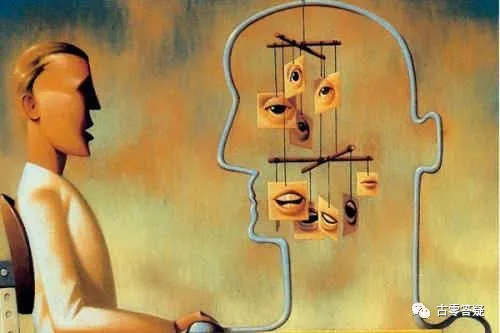
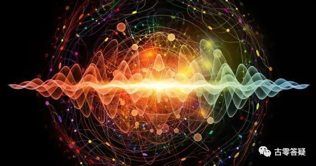

# 意识强度提升点实操指南【6】左上区：神经联络区

* 作者：古零

人体（肉体）的某些机能，与灵体*的一些衔接和相互作用。

包括：人体机能向上的传送 + 灵体机能向下的传送。是一个双向的过程。

人类的神经系统，负责这个传递工作。

*关于肉体和灵体的关系，请参考元吾氏博文《[人的多次元复合体结构（1）—–单重复合体](https://yuanwushi.org/article-6-6673.html){:target="_blank"}》。

**有 3 大部分：**

第1部分：视觉神经部分。
第2部分：听觉神经部分。
第3部分：植物神经部分。

## 第1部分：视觉神经部分

视觉神经部分，是通过人体的视觉成像系统，把接收到的图像向上传输。

其中的过程，产生一定的扭曲和变形，并非完全客观的成像。

综合量化数据（扭曲变形度）：人类平均 50~60%。

@古零（GU0）：

**3 小部分：**

* 图像采集部分。
* 视觉传输部分。
* 视觉回忆部分。

### 一、图像采集部分

综合**量化数据：**人类平均 70%。

有 6 个小点。

#### 1. 对目前画面关注点的数量

个体在目前看到的景象中，所注意到的部分的百分比。

**量化数据：**

人类平均 60%。

@古零（GU0）：

看看有多少只老虎？

#### 2. 视觉关注的重点倾向

个体对眼前看到的景象，根据自身关注倾向的不同，有不同的最为关注的重点。

**量化数据：**

人类平均 40%。

@古零（GU0）：

#### 3. 被忽视的部分

个体在看眼前成像的时候，有些部分会看不到（被忽视），这些部分会导致成像信息的部分细节缺失。

**量化数据：**

人类平均 40%。

@古零（GU0）：

图中藏着一个美女，看到了吗？

#### 4. 在无意识状态下所接收到的信息比例

当个体没有带任何主观意念去观看的时候，反而是最为客观的，所接受的信息也是更客观和更全面。

但这些一般都保存在潜意识中，对于表意识没有多少深刻的影响，因为这个时候表意识没有多少注意力。

**量化数据：**
人类平均20%。

@古零（GU0）：

你看到了什么？

#### 5. 主要的关注点对其它部分的影响程度

个体对最主要部分的关注，会影响到对其它部分的关注度，以及对其它部分的观察程度。

其它部分，会因为个体对主要部分的关注，而发生一些失真情况。

举例：当个体在观看森林的时候，主要关注点是一棵茂密的大树，那么个体就会感觉整片森林也是很茂盛的。

反过来：如果个体关注点是一棵干枯的树木，那么个体会觉得整片森林并不是那么健康和茂盛。

总的来说，就是个体的关注点会影响到个体对整体的视觉感受。

**量化数据：**

人类平均 60%。

@古零（GU0）：

就如路边大排档一样，有些人会因为关注路面的油渍，而觉得在这里吃的食物不卫生，通过关注点延展出其他主观性的脑补。

#### 6. 视觉画面受主观信念影响的程度

个体所看到的画面，会因为个体的信念系统的不同认知，而受到的主观影响。

**量化数据：**

人类平均 70%。
 
@古零（GU0）：

就如下面的云朵到底像什么，不同人或许有不同的看法

### 二、视觉传输的部分图片

有 4 个小点。

#### 1. 对非重点关注成像的上传比例

个体对看到景象的不太关注部分，在脑海里会有一个大概的印象，这种印象会有不同的处理方式，能收集到多少信息进行上传，每个人的比例也是不一样的。

**量化数据：**

人类平均 45%。
 
@古零（GU0）：

就如上面这张图，很多人只会注意到莲花，却没有怎么注意到莲蓬，更别说准确的数量了。

####  2. 对非重点关注成像的上传真实度

个体对非重点关注的部分，上传中会有一些主观上的变形，所以要检测个体上传的真实度有多少。

**量化数据：**

人类平均 40%。

@古零（GU0）：

就如上面的莲蓬，具体有哪些细节？

#### 3. 图像向上传输的损耗度

个体在传输图像过程中，每向上传输一层，都会有一些变化和失真的情况，这个传输损耗度有个体差异。

**量化数据：**

人类平均 30%。

@古零（GU0）：

A 告诉 B，B 转述给 C，C 再转述给 D，D 再…..最终传输图像的失真情况，有点像绘画传声筒的游戏 [https://v.qq.com/x/page/u0979hwuzj7.html](https://v.qq.com/x/page/u0979hwuzj7.html){:target="_blank"}。

#### 4. 传送中被外力篡改的比例

个体在向上传送图像中，会受到一定程度的外力影响和篡改。

外力篡改，包括催眠波、催眠装置的影响，以及一些视觉、听觉的其它外力的影响。

比如：在观看视觉信息的时候，同时接收的听觉信息所带来的影响，以及相邻的视觉信息带来的交叉影响。

举例：

1）听觉的影响：

比如你看到一片森林，突然你听到一些鸟发出欢快的叫声，或者听到一些欢快的音乐，这时候给视觉图像带来的影响，就是森林的颜色会更加鲜明亮丽。

如果你听到一些阴森恐怖的音乐，森林的画面视觉就会变得暗淡一些。

2）相邻视觉影响：

比如你低头看到一张恐怖的图片，然后抬头看森林，你的视角会有一种阴森恐怖的感觉（跟听到恐怖音乐效果是一样的）。

**量化数据：**

人类平均 40%。

@古零（GU0）：

这些实操性很强，可以自己去进行练习。如带个耳机，播放一些与实景气氛刚好相反的音乐，看看自己在图像传输中受干扰的程度。

### 三、视觉回忆的部分

不同场合的回忆中，视觉画面都会出现不同的变化。

有 4 个小点。

#### 1. 情绪对视觉回忆的影响

个体在不同的情绪下，对同样场景进行回忆时，画面所产生不同的失真度。

**量化数据：**

人类平均 35~45%。

@古零（GU0）：

这个可以结合古零脱敏法，在还原代入一个场景时，尝试把不同的情绪状态也代入进去，如恋爱的状态，失落的状态，愤怒的状态等，看看有哪些不同的失真。

#### 2. 思维认知对视觉回忆的影响

跟主观信念带来的影响是一个意思，个体在不同思维状态下，所回忆的图像也会受到不同影响。

**量化数据：**

人类平均 38%。

@古零（GU0）：

同上，在古零脱敏法中，在还原代入一个场景时，尝试把不同的思维状态也代入进去，就如观电影法中，看看在傻看状态（正常看电影的状态）和观察状态下，对电影画面的回忆有哪些不同？喝酒后和喝酒前对视觉回忆有哪些不同？

#### 3. 无意识图像所占的比例

个体在回忆画面的时候，会突然想起来被忽略的一些细节。

**量化数据：**

人类平均 25~35%。

@古零（GU0）：

在很多侦探电影中，如《唐人街探案123》，主人公重临案发现场，并不断通过回忆去重现案件发生的过程，会找到很多被忽略的细节，这个其实跟古零脱敏法是有类似的原理，只是此刻不是以脱敏为主题，而是以记忆还原为主体，在潜意识纯客观的状态下，往往会找到很多被忽略的细节。

#### 4. 由时间所带来的画面失真程度

随着时间的流逝，个体关注的点会逐渐淡化，对主要关注的部分也会发生一些变形。

因此，记忆系统，包括灵体的记忆系统，都是处于变化中的，并不是一成不变的，是时刻都在流动的。

任何东西，当你回忆起来的时候，都会发生变化，而且处于一种不停在变的状态中。

**量化数据：**

人类平均 45%。

@古零（GU0）：

建议多做回忆练习，拿出一个日期表，观察一下在不同时期下的事件回忆，会带来多少失真程度。

## 第2部分：听觉神经部分

**有 4 小部分：**
* 声音采集部分。
* 声音传送部分。
* 声音储存部分。
* 声音回忆部分。

### 一、声音采集部分

有 8 个小点。

#### 1. 声音关注点的数量

当个体听到一段声波的时候，会根据自己的倾向，所关注的部分的数量比例。

**量化数据：**

人类平均 60%。

@古零（GU0）：

如自己平时走在街道上，通常来说耳边会伴随着周围的街道杂音，里面混杂着各种声源，如各种汽车，行人，小贩的叫卖声，鸟叫等等，都混杂在一起，此刻个体对此刻街道的声音，有多少部分的数量是关注到的。

 
#### 2. 听觉关注的重点倾向

当个体听到一段声波的时候，有一个最为关注的地方，这种倾向的程度是多少。

**量化数据：**

人类平均 65%。 

@古零（GU0）：

举个例子，同样是上面的场景，在街道上，修车的师傅或许对汽车发动机的声音特别关注，家庭主妇或许会对小贩的叫卖声特别关注，喜欢养鸟的大爷或许对鸟叫特别关注等等，而这些关注有多少倾向程度。
   

#### 3. 视觉信息对听觉信息带来的影响

个体当前所接收的视觉信息，会对听到的声音识别，所产生的影响，

举例：如果视觉看到很欢快的画面，那么个体就很难听到或者不会听到一些不舒服的声音，包括一些普通的声音，也会转化成比这种较积极乐观的倾向。

声波说明：声波分为 4 个组成部分，分别是 “波长、振幅、波形、畸变”。每个部分都会对传输的过程产生影响，对波的形态产生变化，不是一成不变的。

**量化数据：**

人类平均 60%。

@古零（GU0）：

客观度越高，还原度越高，反之，在主观的影响下，受视觉信息影响就越明显。如街道看到一位美女或者帅哥，即使环境声很嘈杂，也容易被忽略。

#### 4. 声波中被模糊处理的部分

在听到的声音中，有些部分，会因为个体的大脑听不太懂，或者听不太清楚，最终被模糊处理。

有些个体能意识到，有些则意识不到，以为自己听清了或听懂了。

**量化数据：**

人类平均 45~55%。

@古零（GU0）：

同上的街道，如不同小贩的叫卖声或者广播声，里面又有卖菜的，卖肉的，卖早餐的等等，看看有多少被模糊处理的部分。

   
#### 5. 完全忽略的部分

个体完全没有听到的部分。

人体听觉机制，会有短暂的空白期，这个具有规律性，但个体的规律不太一样。

主要是在听一段之后，会自动停一下，在这段时间，声音就会听不到了。

这个，可以通过训练，来延缓暂停的频率。

**量化数据：**

人类平均 28%。 

@古零（GU0）：

同上的街道，看看有哪些完全被忽略的部分。

#### 6. 信念系统所带来的听觉盲点的比例

个体相信什么，想听到什么，就会听到什么。

这个，是由个体的信念系统所选择的。

**量化数据：**

人类平均 35%。

@古零（GU0）：

同上的街道，举个例子，如相信小鸟有灵性的个体，会觉得小鸟的声音里面在隐藏着一些信息。

#### 7. 语言系统的转换所带来的失真影响

掌握不同语言类型的个体，对每种语言的识别，会产生不同的变化和影响。

**量化数据：**

人类平均 27%。

@古零（GU0）：

举个例子，中英文转换，普通话和地方方言转换，在语境和语义上，不同个体会有一定的失真影响。

#### 8. 个体主观意图的影响

个体当下的意图和目的，对声音识别有很大的影响。

不同的目的，所听到的信息也是不一样的。

**量化数据：**

人类平均 37%。 

@古零（GU0）：

继续街道的例子，母亲喊孩子回来吃饭，她会特别留意孩子的声音，去餐厅赴约的人，会特别留意熟人的声音，不同人不同目的，信息也不一样。
 

### 二、声音传送部分

有 3 个小点。

#### 1. 信念系统的影响

声波在传递过程中，受到的信念系统的影响，而发生的变化。

**量化数据：**

人类平均 55%。  

@古零（GU0）：

如一段 F 音或者 F 乐在不同信仰群体中所发生的变化。

#### 2. 潜意识倾向的影响

声波在传递过程中，受到的潜意识倾向的影响，而发生的变化。

**量化数据：**

人类平均 38%。  

@古零（GU0）：

如有些声音明明是第一次听到，但却有一种熟悉感。

#### 3. 主观预设的影响

声波在传递过程中，受到个体主观目的和预设的影响，而发生的变化。

**量化数据：**

人类平均 55%。

@古零（GU0）：

如提前告诉你将要发送一段铁钉刮玻璃的声音，某些人就会因此提前代入这个情景中，即使出来是另一种完全无关的声音，也会受到影响。

### 三、声音存储部分

声音的存储，较为特殊，需要转换形式进行存储。

转换会引起一定程度的变形，也会增加其他的元素，从而导致进一步的失真。

综合量化数据（失真率）：人类平均 50~60%。

有 2 个小点。

#### 1. 因为方式转换带来的失真程度

纯粹的由转换带来的失真率。

**量化数据：**

人类平均 45%。 

@古零（GU0）：

就如口口相传，所带来的变形。

#### 2. 存储中带来的主观预设的因素

因为主观的原因，在存储中会添加一些主观的元素，导致进一步失真。

**量化数据：**

人类平均 70%。

@古零（GU0）：

### 四、声音回忆部分

个体在回忆声音过程中，会受到不同因素的影响，而产生失真。

综合量化数据（失真率）：人类平均 45%。   

有 3 个小点。

#### 1. 情绪的影响

在进行声音相关的回忆时，个体所处的主观情绪，会对声音记忆产生变形影响。

**量化数据：**

人类平均 60%。   

@古零（GU0）：

举个例子：回忆同一句话，处于高兴、失落、愤怒等情绪下，回忆的内容会相对产生一定的影响。

#### 2. 受到时间流逝所带来的遗忘的影响

由于时间的流逝，而带来的失真程度。

保留下来的，多为 “残存的部分记忆 + 主观倾向” 的组合。

**量化数据：**

人类平均 45%。

@古零（GU0）：

举个例子：回忆一段语音电话或者语音会议，随着时间流逝内容也会跟着发生不同的失真。

#### 3. 由新的不同的主观目的所带来的影响

每次回忆，由于主观目的不同，回忆出的内容，都有不同倾向的变形。

**量化数据：**

人类平均 55%。  

@古零（GU0）：

举个例子：回忆一段语音会议，不同部门所接收到的信息，会根据部门目的不同而有所变形。

## 第3部分：植物神经部分

植物神经是属于潜意识支配和控制的一套神经系统。

在这个过程中，负责潜意识的部分，会受到各种的干扰和影响。

主要有以下的影响因素。

**有 4 小部分。**

* 物质层面的影响。
* 外界刺激的影响。
* 区域与整体的影响。
* 与其它神经系统的关系。

### 一、物质层面的影响

个体受到物质层面的影响比较大，可高达 75%。

综合量化数据（失真率）：人类平均 55% 

有 3 个小点。

#### 1. 兴奋与平静的相互作用

个体在接收信息的时候，在两种不同状态下，所接收信息的变形差异。

**量化数据：**

人类平均 65%。

@古零（GU0）：

可以多觉察和自检自己在兴奋和平静下，接收相同信息下的差异。

#### 2. 流动与顺畅程度的影响

个体接收信息的流动程度和波动性，所带来的影响。

**量化数据：**

人类平均 48%。

@古零（GU0）：

举个例子：在一个课堂上接收老师教导的信息，信息是大量的，还是小量的，是快速的，还是缓慢的，是生动形象的教学传导，还是生涩抽象的教学传导，都会有不同的影响差异。

#### 3. 交叉与渗透的影响

分为3层：

1. 左旋感应；
2. 右旋感应；
3. 中央感应。

以上的三层感应，是双涡旋的增流机制的向上应用。产生相互交叉、相互渗透的影响。

这些影响会带来一系列的碰撞反应，这些反应会给机体带来一系列的化学变化，从而影响机体内部的运动过程。

这个也叫做左旋和右旋组成的双涡旋原理。

**量化数据：**

人类平均 60%。 

@古零（GU0）：

信息碰撞过程中，交叉和渗透的影响，举个例子：数、理、化三门知识同时接收，3种信息在相互碰撞之间所发生的影响，有些信息可以互相验证和促进，有些信息会形成错位和混淆，导致接收中出现混乱。

### 二、外界刺激的影响

是由内外信息粒子的同频共振，所引发的一系列的影响。

综合量化数据（影响率）：人类平均25~35%。

有 3 个小点。

#### 1. 粒子的运动方向所带来的影响

同样方向的运动，会引发舒适的感受。

不同方向的运动，会带来不适感。

长期这种不同方向的运动，会带来机体功能的混乱，从而引发疾病。

不同方向的运动，包括直线方向和旋转方向。

直线方向，多数演变为急性的疾病。

旋转方向，多数引发慢性的疾病。

如果是多层旋转性的，层数越多，疾病就越复杂。

**量化数据：**

人类平均 30%。

@古零（GU0）：

同一方向，则顺，变为互相促进，引发舒适感，如：顺其自然

不同方向，则逆，变为互相抵触，消耗，对抗，影响等，容易引发意识上的纠缠和回流，带来各种混乱，疾病也是在这种情况被显化出来。

#### 2. 粒子的震动频率所带来的不同影响

影响会让个体产生急速的应激反应，这些反应会在日常生活中常常遇到。

一些疾病的类似症状，其实是这种短暂的应激反应。如果不仔细识别的话，很容易就以为自己生病了。

人在这种状态下，处于高速运转的状态。

这方面，也和人体潜能的激发，有一定的关系。

在实验中，可以模拟外部结构的震动频率，来引发机体内的同频共振，从而达到实验的效果。

比如：声音频率的影响，是其中的一种。这种影响，有很多可值得研究的地方。

举例：一些催眠性质的音乐，可以通过引起机体内部的运动，给个体带来错觉，给个体的判断也会带来混淆。

这个影响，也被广泛应用于催眠轮回系统*的社会洗脑中。

当个体遇到相应的场景，就会产生对应的机体内部反应，从而对这种倾向起到加强的作用。

这个，也是循环控制的一个过程。

**量化数据：**

人类平均 40%。 

@古零（GU0）：

现实中，大家接触比较多的，如很多音乐频率（hz赫兹），432hz，528hz，440hz 等。其他催眠波不容易被发现，如完全安静时，所听到的耳鸣声等。还有目前军事研发中所涉及的各种声波武器等。

关于冥想音乐：

任何冥想音乐只能作为辅助的形式，目的是让自己短时间内进入状态，但不建议过于依赖这些音乐，否则容易变成外求，而这些外求会成为自己的漏洞。线上有很多形形色色、五花八门的冥想音乐，鱼目混珠的也不少，因为在冥想过程中，个体处于完全放松的状态，此刻是很容易被意识植入的，我看到某些音乐还加入了一些引导词，其实建议大家在使用前一定要认真识别，提防引导词中带有隐性催眠的指令，如它会把个体的意识引导到某些集体意识的场域中，在无法识别这些集体意识的情况下，个体容易被意识收割和隐性植入，而引导词的配音员，自身的意识强度也很重要，TA 的意识场域会对音乐带来影响，所以提醒大家要注意。如果有时间我也会筛选一些相关的音乐，供大家参考。

*关于催眠轮回系统，请参考元吾氏博文《[轮回是否存在（儿童不宜）【元吾氏】（第5版）](https://yuanwushi.org/article-6-6638.html){:target="_blank"}》。

#### 3. 由粒子聚集作用所产生的影响

一些同频的信息粒子，因为相吸而聚集在一起，对机体可能会产生一些障碍性的影响。

这个影响分为隐性和显性。

隐性：就是长期潜伏在人体内的，没有发挥作用的。但这种情况会被系统记录下来，转化成隐形基因，可以在后代中得到表达。

显性：就是造成明显的机体性障碍，也是常说的能量堵塞。

因为可被聚集起来的信息粒子，通常活性较弱，所以通常表现为负性。

而正向性的信息粒子，因为活性较强，而不宜互相吸引聚集。

在实验研究中，聚集起来的负面粒子，可通过激光照射，而引发分离效应。

该方向可以作为医学上的前沿研究。

主要研究重点，在于不同种类的粒子，对应不同频率的激光类型。

其次，就是技术上的可操作性。

还有一个重点，是检验和识别该聚集粒子的类型。这个部分，可以结合灵性。

所以，灵性和高科技的结合，是未来医学的发展趋势。

**量化数据：**

人类平均 35~45%。 

@古零（GU0）：

就如吸引力法则，利用了同频相吸，但关键是如何提高粒子的活性，才能不至于被聚集起来，产生影响。

粒子聚集作用影响大的个体，往往是意识清空能力较弱（难以快速恢复到白纸状态，归零状态），在潜意识惯性下，容易造成意识回流和纠缠，促进了粒子聚集作用下所带来的影响。

举个栗子：粉红大象的心理暗示现象，清空能力弱的个体，会一直无法忘记粉红大象，越想忘记反而越难忘记，反过来，清空能力强的个体，可以快速把焦点从“粉红大象”中抽离，恢复到清空的状态，这样意识状态会一直保持客观而不受心智的影响，负面意识粒子也就难以形成聚集。

练习参考：在顺其自然的状态下，提高意识清空（意识把控、定力）的能力。如在定向心理暗示的情况下，自身的意识焦点能自由抽离和切换。

很多时候，道理都明白，就是改变不了这些习惯，就如不当真一样，简单不等于容易，“不当真” 不是强行告诉自己不当真就完事了，这样骗得了表意识，但骗不了潜意识，一不小心，无意识下又当真了，往往提升效率上不去也是这个原因，要改善就需要更深和更细的觉察和修正，直到潜意识也不当真（表潜合一），这样才会做到时时刻刻的不当真（自动觉醒），效率也就上来了。

### 三、区域与整体的影响

机体内部的不同区域，对整体都有不同的影响。

这个被影响的客体是指人体，影响的主体是信息。即信息对人体的影响，

综合量化数据（影响率）：人类平均 55%。 

有 2 个小点。

#### 1. 反应流的触发与扩散

反应流的触发数量，与机体活力相关。

触动的越多，会让机体扩散更迅速，机体的循环性能会得到加强，运转也会更加的流畅，人体也更加健康。

**量化数据：**

人类平均 40%。

增加和激活触发，有以下几点：

* **增强敏感性：** 可通过平静的觉察或者冥想来达到。
* **通过某些特殊的活动来引发：** 这些活动比较具有个体特征，需要个体来自行探索。就是当个体投入某项活动中，对该活动产生热情的时候，会激活相应的触发点。
* **通过药物方式：** 此种方式会关闭其它的一些触发点而作为代偿，所以较有风险。

@古零（GU0）：

这种例子有不少，如被放弃治疗的绝症病者，自行通过冥想等活动得到治愈，这个过程就是反应流的触发和扩散。

#### 2. 整体平稳与区域损坏

某个区域的损伤与整体的相关联性，对整体的平稳性带来的影响。

**量化数据：**

人类平均 45%。

@古零（GU0）：

下面的信息已经非常详细了。

有以下6点：

1. ==**局部神经链的断裂对整体的影响:**== 其中有 3 组主要神经链。这 3 组神经链如果有损伤，可以互为代偿。如果神经链全部断裂，会引发机体 80% 以上的机能停止和瘫痪。
1. ==**局部功能对整体带来的影响:**== 某些局部功能遭受损伤的时候，其它较为强势的区域，可通过加强供能，以达到整体性的平稳。个体局部损伤在 30% 以下的时候，都可以通过这种方式来达到平衡。超过 30%，个体会感觉到不适，从而引发相应的疾病症状。一般来说 10% 以内可以称为健康，30% 以下是亚健康，30% 以上是非健康状态。
1. ==**区域连带作用对整体的影响:**== 一般来说，某些区域产生损伤的时候，整体系统会根据情况，将其隔离，以防止损伤进行扩散。但某些变异机制，会破坏这种隔离，产生连锁反应，引发更大的破坏。未来的医学，可以通过研究这种破坏隔离反应的原理，来研究出反破坏的技术，从而达到控制病情的作用。
1. ==**区域损伤的累积对整体的影响:**== 某些区域的累积损伤，会产生较为严重的病变。这种情况下，可以通过切割和置换来进行医治。
1. ==**复合体传导带来的影响:**== 这种通常和先天体质有关。某些较弱区域，可以追溯到复合体，来查找原因。
1. ==**家族遗传机制的影响:**== 某些区域，涉及到家族遗传相关的方面。可从家族业力历史，来查找相关的原因。

### 四、与其它神经系统的关系

植物神经对其它神经系统的影响。

综合量化数据（影响率）：人类平均65%。

有 2 个小点。

#### 1. 与感觉神经系统的关系

是既有影响、又具有独立性的关系。

**量化数据：**

人类平均 48%。 

@古零（GU0）：

感觉神经包含触觉、前庭觉、本体觉、内脏觉，植物神经包括如心脏起搏、胃部蠕动等，举个例子，植物神经中胃部蠕动与感觉神经的内脏觉既有影响又具有独立性，因为内脏觉是属于内脏接收器的感觉。我们的内脏，以及主要的血管处都有感觉接收器。内脏的活动，血流，以及血液中的化学物质，都会刺激这些接收器，并把相应的感觉信息提供给脑干，以方便大脑及时调节身体，保持身体健康，而这个过程又同时促进植物神经的健康发展。

#### 2. 与运动神经系统的关系

植物神经的活跃，可以带动运动神经的发展。通过训练，可以锻炼个体的某些技能。

**量化数据：**

人类平均 50%。

\@Saki

>guo哥可以讲讲今天的提升点嘛，属实看不明白\@GU0 

@炜航Kevin
>这个提升点：“植物神经的活跃，可以带动运动神经的发展”

>是不是类似这种，一些运动员在练习想象自己在比赛的真实情景也能取得一定的效果？\@GU0

@古零（GU0）：

是的 👍

在目前人类的研究角度，把植物神经系统定义为自主神经系统，又称为非意志可控制的神经系统，如心脏起搏、胃部蠕动等，从意识强度提升点的角度，植物神经是属于潜意识支配和控制的一套神经系统，通过潜意识的运作来带动运动神经的发展。

举个例子：

打篮球，踢足球，武术等运动，运动员通过潜意识的训练（类似于压力脱敏），不断观想自己沉浸在训练中，这样即使肉体不参与运作，也一样能提高肌肉的记忆能力和条件反射的能力。

同理延展（通透性的延展）：

1. 学习一门外语，把自己的思考（包含潜意识）语言（母语）切换成外语，在这个训练过程中，也能提高外语的能力。
1. 对于疗愈方面，根据身体机能所存在的问题，也可以通过观想训练（类似于模拟脱敏）去带动植物神经的活性，这些例子很多，如一些被医院放弃的患者，自己通过心理疗法，最后自愈的例子。
1. ........(自己去延展和实践吧）
1. 5、6...........

@炜航Kevin

>还有一些情景，有时候首先想到的是英语单词而不是中文。或者是自己的方言。

>其实怎么说，我觉得语言不过是一个翻译的过程，先有了那股 “涌动”（灵感/感觉），再转译的。

> 我昨天吃汉堡，还突然有个灵感，顺便请教下 \@GU0

> 婴儿，在未习得语言之前，脑海里按理说应该不会有各种语言形式的杂念吧？我想文，婴儿在不会说话之前，脑海里的活动是怎样的？

> 我感觉，这个时候，婴儿的语言系统还没建立，相比成人会少了各种 “碎碎念” 这种自我催眠的途径。此时婴儿的脑海活动，我猜：感觉、直觉、图像等，但没有语言。

> 还有一点，婴儿语言学习能力快，可能原因之一是意识/潜意识相对畅通，在接收了外界各种语言信息之后，潜意识内进行整合，然后遇到相应的场景，脑海就浮现出对这个场景的描述。成人以后，由于意识封闭（被催眠），这种整合能力不断被弱化，也导致不少人觉得自己的学习能力下降（心理暗示然后造成现实）。

@古零（GU0）：

👍

**【第 6 区提升点完】**

!!! Tip

     --------Disclaimer 免责声明--------

     经验分享，仅供参考。转载自由，严禁修改。

     All info is intended for experience sharing and reference only without any warranty.

     Redistribution is freely permitted provided that no modification is made whatsoever.

     2022-04-28-古零（GU0）

    (update on 28/02/2022)

**该文章由元吾氏反催眠(=催醒)游戏志愿者团队收集整理**
