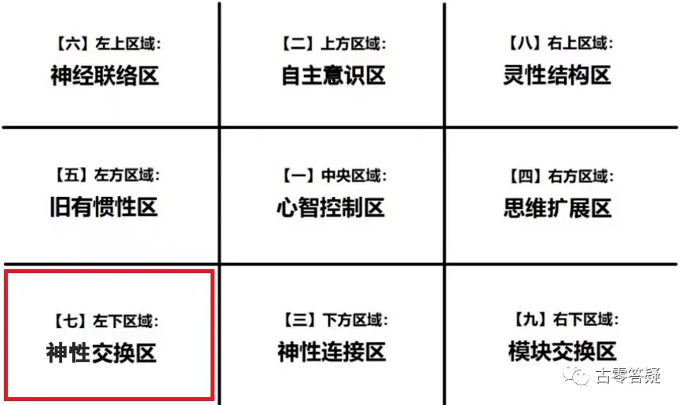
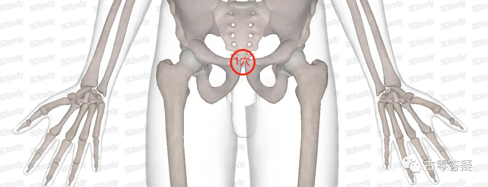
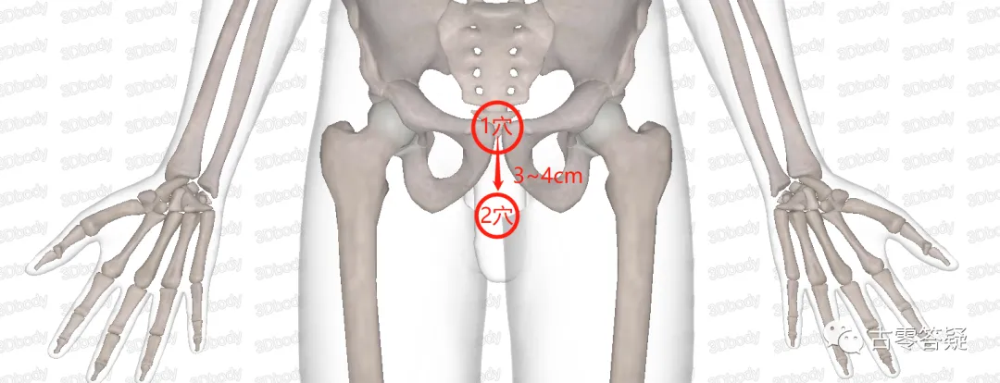
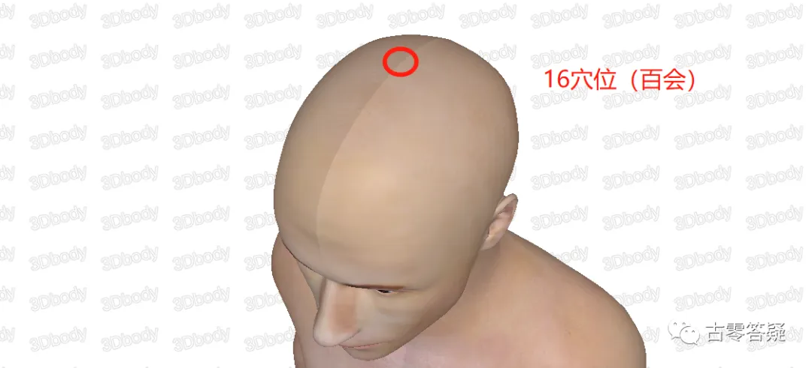
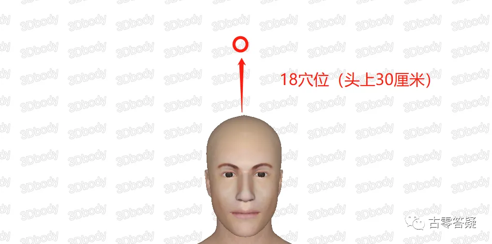
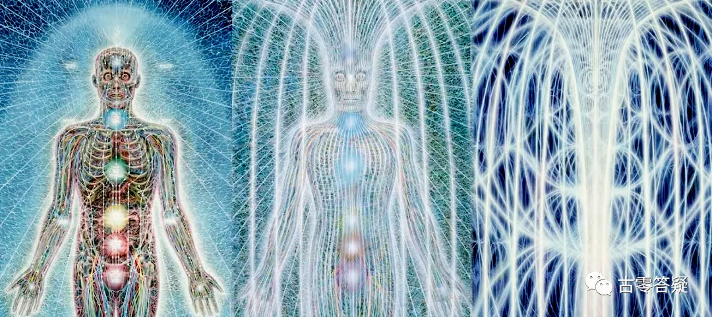
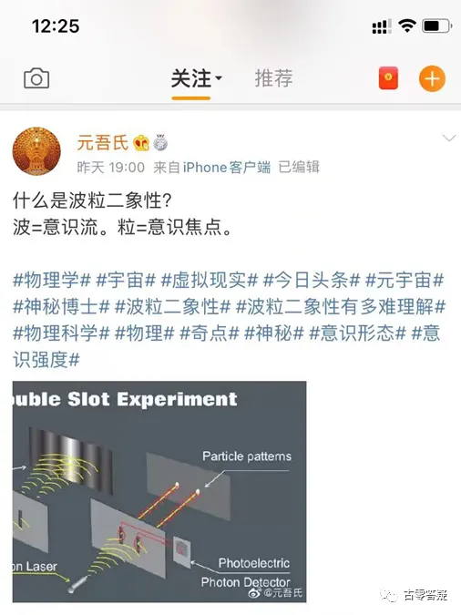
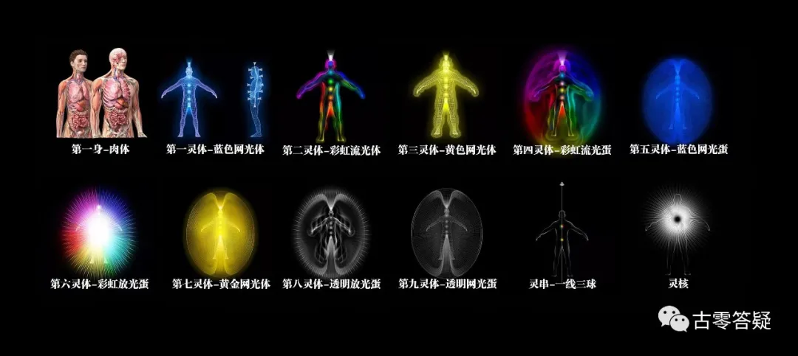

# 意识强度提升点实操指南【7】左下区：神性交换区

* 作者：古零

## 第 一 部分：聚能贮存部分

贮存在体内的能量，有两条管道，以双肾为能量中心，配合中脉完成能量的循环。

双肾，是能量贮存中心，也是中脉运行的护卫官。

中脉运行分 18 个主要穴位/脉轮。

中脉的运行程度，代表了这个人的健康程度和防御力。

中脉的完 全畅通，需要穴位的畅通。每个穴位的畅通，代表了不同的含义。

以下的量化数据，均与 “畅通度” 有关。 

### 海底轮：

#### 1 穴位（耻骨位置）

位置：在耻骨位置。

功能：与生存的安全感相关。

这种不安全感，是迫使人类不停的去工作和发展的原因之一.所以，人类需要平衡影响安全感的种种元素，目前主要是追求金钱和权利。

此穴位的畅通度代表安全感。

量化数据（畅通度）：人类大部分 20~30%。

个体检测数据样本举例：马云 60%，比尔盖茨 70%。 

@稻米居士

>意识强度提升点之海底轮的1穴位是与生存安全感有关，

>1、那是不是修好生存安全感提升点这个穴位的能量就自动通了？

>2、还是意守这个部位让它通？

@古零（GU0）

1. 是的，具体操作是自检自己的状态，如在生存安全感方面，目前处于什么一个状态（给自己客观打分），并通过分析和总结，找出有哪些具体的漏洞，并制定一个具体的可执行方案，去进行化解（破幻），过程中，需要定时进行自检，总结和修正。
2. 意守一词比较笼统，每个人理解不一样，效果也不一样，在我的角度，是保持纯客观和顺其自然的状态，把意识链接到这个位置，此刻潜意识会通过该位置自发进行调整，如：各复合体灵相应展开行动，进行模块自检和重组，并同步把信息进行反馈，具体深度需要自行探索（具体方法以前分享过了——复合体互催探索）。

这两点相结合，在互相促进下，效率就上来了。

@稻米居士
>第二点简单来说是不是就静观这个部位

@古零（GU0）

不是单纯的去静观或者意守这个部位就能畅通，而是这个部分的畅通情况反应出自己的生存安全感，那么要提高这个畅通度，就需要提高自己的生存安全感，具体如何提升生存安全感，就是上面 1+2 我说的内容。

#### 2 穴位（1 穴后 3 厘米）

位置：在第 1 个穴位往后大概 3~4 厘米的位置。

功能：主要吸收大地的能量（营养），给身体带来养分。

这个穴位畅通的话，个体就能明确自己的目标（自己想要什么），不太容易迷茫。

量化数据（畅通度）：人类大部分 40~50%。 

\@Shirley🔮:
>@Alien想问元哥如果发现自己第二第三脉轮不太通畅 最快的提升方法是什么？

>比如说 第二脉轮，吸收大地营养，不易迷茫。

\@Alien👽:

这不写的很清楚吗：明确自己的目标！脉轮就自然通了呀

@无疆:
>\@Aduk👽想知道增强意识强度到多少就有能看脉轮能量程度的能力，给我自己确立过逐步发展的目标

\@Alien👽:

没有意识强度的仪器也可以测…

@无疆:
>\@Aduk👽 拿什么标准 做参照啊？

>我又想了想，觉得挺需要学习研究下催眠的，元老大探察过催眠师们的意识强度吗？，是不是会比普通人高一截？

\@Alien👽:

学催眠是为了反催眠，不是为了催眠。你不是在反催眠招生群吗？

脱离轮回，是灵魂脱离肉体，是修灵魂的意识强度。要是反过来去修肉体，那就本末倒置，轮回越陷越深啦

@知上一知:
>\@Aduk👽 那为什么意识强度检测点有些是针对体的  而非灵的

\@Alien👽:

检测点，是 “检测” 呀！通过身体去检测你的意识问题。检测的是结果，不是原因。原因是你自己的事。

意识有问题，会反映在身体上。原因是意识，身体只是结果。

@万有一体:
>意识和身体相互影响的。那么中医的针灸可以作用到最高第几身体呢？

\@Alien👽:

第一灵体

@知上一知:
>所以从根本上说性命双修是个伪命题？\@Aduk👽

\@Alien👽:

取决于你的修行目的。对入世法，是真命题。对出世法，是伪命题。

@吴烨:
>2 穴位畅通的话，个体就能明确自己的目标（自己想要什么），不太容易迷茫。

>元哥 我也以为是让这个穴位通畅 目标自然就清晰了。所以是目标清晰这个穴位才通畅吗？感觉我理解反啦？还是反过来也可以的？

\@Alien👽:

这个是检测点，顾名思义：检测的是脉轮的结果，检测的不是原因

原因是无法检测的，谁也不知道你的目标是啥

@吴烨:
>只有自己探索了。嗐。看来理解反了。谢谢解答

\@Alien👽:

检测点，只能检测健康结果。至于你怎么锻炼的，只有你自己知道，也只有你自己能选择怎么锻炼

@吴烨:

>开篇说的 就是中脉的通畅需要穴位的通畅。我想能不能去把中脉弄通畅了，穴位就自然通畅吗？有很多修习中脉的法子呀。我理解你说的意思 类似于 这是一个体检报告 但是没法子帮我找到病根。

\@Alien👽:

病根写了呀：明确目标。具体什么目标，就是你自己的事啦

实践过了，再提问，容易听得懂回答。没实践过，问了也很难听得懂回答，很容易就变成了空洞的文字游戏。

#### 3 穴位（会阴）

位置：会阴穴。

功能：能量循环的出口。

畅通的话，会很有行动力，精力旺盛，不容易疲劳。也是代表性能量的很重要的一个穴位。

量化数据（畅通度）：人类大部分 40~60%。

国家不同、性别不同，也有不少差异。 

@古零（GU0）：

提高这个点的数值，不是单纯去意守这个点，否则就是治标不治本，效率低下，建议把自己的意识焦点投射到如何提高自己的行动力和精力方面，找出造成自己行动力和精力低的原因是什么？自己该如何去改善？这才是关键，在这个改善的过程中，再结合这个穴位去进行加强，这样效率就上来了。

#### 4 穴位（1 穴对应）

位置：和第1穴位相对应。

功能：和创伤承受力有关。

通畅的话，对失败和创伤有很高的承受力，能从中得到成长，不会那么脆弱、一蹶不振。

量化数据（畅通度）：人类大部分 40~60%。

@古零（GU0）：

提高这个点的数值，不是单纯去意守这个点，否则就是治标不治本，效率低下，建议把自己的意识焦点投射到如何提高对失败和创伤的承受力，找出造成自己成长慢，脆弱、一蹶不振的原因是什么？自己该如何去改善？这才是关键，在这个改善的过程中，再结合这个穴位去进行加强，这样效率就上来了。

### 脐轮：（之后的穴位都是人体的正中）

#### 5 穴位（肚脐下）

位置：肚脐下面的穴位。

功能：生殖系统的编程（机器人 AI 编程）。

编程程度，代表人类个体受编程的影响有多少。

此穴位的量化数据，是受编程的影响程度。

量化数据（受编程影响度）：人类大部分 60~80%。

@迦翟
>你好，今天的意识提升点，我自己的理解是将能量集中到此，可以减少编程的影响。所以传统修法都以下丹田为主。我想听听你的理解 谢谢

@古零（GU0）：

能量一词太笼统了，每个人的理解可能不一样，导致效果也不一样，在我的角度，将意识衔接这个位置，可进行下载该数据的编程模块，然后可进行解构和修改。

#### 6 穴位（肚脐上）

位置：肚脐上面的穴位。

功能：生命的自主程度。这个越强的话，突破机器人编程的能力就越强。

量化数据（突破编程能力）：人类平均 30%左右。 

@古零（GU0）：

提高这个点的数值，不是单纯去意守这个点，否则就是治标不治本，效率低下，建议把自己的意识焦点投射到如何提高生命的自主程度，如何突破机器人编程能力，找出造成自己自主性弱的原因是什么？自己该如何去改善？这才是关键，在这个改善的过程中，再结合这个穴位去进行加强，这样效率就上来了。

### 太阳轮：

#### 7 穴位（胃部中央）

位置：胃部正中央的位置。

两侧有两个辅助点。

功能：主要存储情绪。

会向旁边的两个辅助点进行辐射，通过这两个点，循环到人体的各个方面。

这个能量点畅通的话，人体代谢比较强，不容易积压负面的情绪。

人类的压抑情绪，还是挺普遍的。此数据是该点的畅通指数。

量化数据（畅通度）：人类大部分 20~30%。 

@Iris🍃:

>原来胃部那里真是会储藏情绪的？是这么个意思吗？

>以前和初恋分手时，或者遇到什么大的困境时，心里难受的同时，也会觉得腹部不舒服，很难受，感觉里面好像有一团黑色的能量积聚在腹部。。

>心情不好，吃不下饭，就是这么来的吧 。这样的情况，以前不修道时只会觉察到这样的现象，但伤心、生气、紧张的情绪不会有太多缓解，只能等足够的时间治愈。在以后再遇到让自己有情绪的事，波动大的话，腹部还是会有不舒服的感觉。

>guo老师，这种情绪来时，腹部不舒服，也就是说胃部会存储情绪，是怎样一个机制呢？为什么腹部会有个这样的程序？解脱办法是不是就是观电影法？再配合施压脱敏法？谢谢～ 

@古零（GU0）:

1. 机器人的模板设计
1. 引导意识聚散和流转
1. 方法有很多，这只是其中一种，建议多尝试，找到适合自己的方法。

### 心轮：

#### 8 穴位（膻中穴）

位置：膻中穴。

功能：主情感的抒发。

通畅的话，在情感表达方面更为轻松。

傲娇，跟这个穴位的·淤堵有关。

膻中穴的四周，有好几个小穴位，它会往周围的小穴位散发被积压的情绪。

根据小穴位不同的接收程度和流动情况，人会有不同的表现。

比如有些是沉默寡言，有些是傲娇，有些是竭嘶底里。

量化数据（畅通度）：人类大部分 40~60%。

人类最大的意识漏洞在心轮，也就是情绪。

这个穴位如何影响个体的情感表现，是一个很有意思的研究。 

@杨正贤:
>人类最大的意识漏洞在心轮，也就是情绪——情感也是程序嘛？为什么顺畅就提升？情感是客观存在的，如何不受干扰影响

@古零（GU0）：

指可认真体验，但不当真的状态，举个栗子：看一部电影，有欢乐忍不住笑的地方，也有感动流泪的地方，看完电影后，一切恢复正常，不再受电影的内容影响，也不会把当时的情绪延展到生活和工作中。

如果不通畅，看电影的情绪体验就会有一个周期性的影响，随着时间延长才能慢慢消失，这只是比喻，因为现实生活中，没有人会提示你在电影中(游戏中)而不必当真。

### 喉轮：

#### 9 穴位（喉轮心轮之间）

位置：喉轮和心轮之间。

功能：批判性思维的编程。

受这个编程影响越多，批判性的思维就越重。

量化数据（受编程影响度）：人类大部分 60~80%。 

@YuFei:
>我重新看了一下这个点但不是很明白

>批判性思维在我上学的时候被视为一个很重要的指标我在实践了批判性思维后也的确想通了很多但看这则消息结合语境感觉批判性思维似乎是一个不利于觉醒的因素是因为什么原因呀？

@炜航 Kevin:
>语言的定义问题。

>客观的观察/质疑 VS 主观的、二元对立的评判。

@古零（GU0）:

批判在这里可以理解为自检，分析，总结和修正，区别在于是基于理论还是基于实践，如批判一部电影，你觉得看完再批判，还是没看或者只看了预告就批判，哪一个更客观?

@YuFei:
>我觉得看完（观察完）再评论更客观

#### 10 穴位（喉轮）

位置：喉轮/喉咙部位。

功能：和理性思维有关。

畅通的话，个体会更客观的表达，会有更理性的思考。

情绪和情感的压抑，会影响表达，会影响思维方式，变得更加主观。

当个体有情绪的时候，需要让其疏散和释放，这样才能让个体更加理性的表达。

情绪的积压，就像被多棱镜反射一样：不停的折射，会给个体带来思想和表达的扭曲。

量化数据（畅通度）：人类大部分 40~60%。 

@古零（GU0）：

提高这个点的数值，不是单纯去意守这个点，否则就是治标不治本，效率低下，建议把自己的意识焦点投射到如何提高更客观的表达，如何更理性的思考，有情绪的时候，如何快速进行疏散和释放，并找出造成自己这方面弱的原因是什么？自己该如何去改善？这才是关键，在这个改善的过程中，再结合这个穴位去进行加强，这样效率就上来了。

#### 11 穴位（咽喉）

位置：在咽喉的位置。

功能：跟表达的抑制有关。

这种抑制基本上跟心智模式有关，个体真正想表达的东西，会在表达之前，经过心智过滤，考虑如何表达会更适合当下的情况，会做如何表达的最终选择。

较畅通的话，个体的表达就更完整和通畅。

不畅通的话，个体会被心智模式的影响，导致压抑和变形。

检测指标是心智模式影响的程度，量化数据（受心智模式影响程度，或不畅通度）：人类大部分 60~80%。 

@古零（GU0）：

提高这个点的数值，不是单纯去意守这个点，否则就是治标不治本，效率低下，建议把自己的意识焦点投射到如何让表达更完整和通畅，如何不被心智模式影响，并找出造成自己这方面弱的原因是什么？自己该如何去改善？这才是关键，在这个改善的过程中，再结合这个穴位去进行加强，这样效率就上来了。

### 头部：

#### 12 穴位（人中）

位置：人中穴。

功能：跟隐藏能量的激发有关，代表个体蕴藏的潜力。

激发能量有两种方式：循环式累积激发、线性流动激发。能量在不同部位的流动和碰撞，引发不同的组合效应，可以开发不同的人体功能。

检测指标是穴位的畅通程度。

量化数据（畅通度）：人类大部分 10~20%（多数为催眠系统*压制了人类的潜力）。

*关于催眠系统，请参考元吾氏博文《[轮回是否存在（儿童不宜）]()》。  

@星胭:
>循环式累积激发、线性流动激发——这两种模式是什么？如何运用？

@古零（GU0）：

就如文字描述的那样去激发啊

@星胭:

>得到信息对比一下 单听一人之言极容易被催眠

@古零（GU0）：

都是实操，处处是修行

#### 13 穴位（鼻尖）

位置：鼻尖位置。

功能：主要与灵魂的意愿有关。

畅通的话，就代表个体目前的道路，是灵魂真正的意愿，灵魂的自主性也会越来越强。

检测指标是穴位的畅通程度。

量化数据（畅通度）：人类大部分 60~80%。 

@古零（GU0）：

提高这个点的数值，不是单纯去意守这个点，否则就是治标不治本，效率低下，建议把自己的意识焦点投射到如何提高灵魂意愿，如何明确自己的方向，如何提高灵魂的自主性，并找出造成自己这方面弱的原因是什么？自己该如何去改善？这才是关键，在这个改善的过程中，再结合这个穴位去进行加强，这样效率就上来了。

#### 14 穴位（鼻梁尾端）

位置：鼻梁末端的位置，两眼之间。

功能：和DNA演化目标有关，也与精神控制有关。

基因进化的目标有可能被操控，从而能达到一种精神控制。

这种情况多半有相应的植入物来配合。

如：屏蔽真正的进化目标，而制造虚假的进化目标。

这个穴位容易受催眠波*的影响，给个体带来一些不稳定。

量化数据（畅通度）：人类大部分 30~60%。

强化的方式：可以多进行深呼吸。*关于催眠波，请参考元吾氏博文《[轮回存在吗]()》。

@闪亮天空:
>“基因进化”，是否可理解为 “DNA破解”？啥叫 “DNA演化目标”？

@檀雅:
>我觉得应该不是，是DNA对肉体灵的加固，而不是破解

@闪亮天空:
>如果是加固，“真正的进化目标” 和 “虚假的进化目标” 有本质区别吗？

>都是假的，哪里有真

@古零（GU0）:

DNA演化目标：通过程序的发展和升级来达到某个特定的游戏效果，DNA演化是走向程序意识，DNA破解是走向自由意识，两者是相反的方向。

@闪亮天空:
>那 “真正的进化目标” 和 “虚假的进化目标”，对于想要脱离轮回的人来说，又有什么区别呢？

@古零（GU0）:

就是真正与虚假的区别啊。真正的“目标”是指个人原本设定的进化目标，虚假代表这个目标被掉包了。对于要脱离轮回的人来说，都属于程序意识的产物，不同点是一个是原始程序，另一个是虚假程序。

@闪亮天空:
>这个真假对我们有什么影响呢？

>不都是程序意识吗？

@古零（GU0）:

对于未觉醒的人来说，本身还没有完全脱离程序意识的控制，当然有区别

@闪亮天空:
>会有什么不一样？要拉回到原本设定的“原始程序”吗？

>“虚假程序”像是走错了路？

\@YuFei:
>这个 “虚假程序” 是被谁掉包了？

>按 T 组的目的只要维持「程序意识」就足够把人类困在轮回中了

>为什么还会衍生出 “虚假的程序意识”？@古零（GU0） 

@闪亮天空:
>我也疑惑，调包的目的是啥？

>让个体在世俗生活中更艰难？无法“知天命”？

\@YuFei:
>所以说这个“虚假程序”可以对人类的造成什么样的影响呀？

@闪亮天空:
>嗯，就是不理解这个区别

@古零（GU0）:

1. 程序意识就像游戏工具一样（如游戏语言 C++ 之类），所以本身是中性的。
2. DNA演化目标是为游戏而设计的（如设定不同的游戏属性等），所以本身是中性的。
3. 至于把这些工具用在哪个方面，是玩白方还是黑方，那是玩家的选择。
4. 但这些工具都是游戏内的工具，未觉醒的人本身还在游戏里面，所以利用这些工具会有一定帮助，但要脱离轮回，最终还是需要把这些工具丢弃，关键就看你玩幻还是被幻玩了。

这个数值是指个体对抗程序影响的数值，举个例子：

阿卡西本身是程序意识，可以借此读取一些灵魂数据，让个体恢复一些灵魂记忆，但沉迷进去，容易陷入程序意识的控制，难以恢复到自由意识（脱离轮回），而目前这个提升点是指T组通过催眠波的影响，让你连接到假的阿卡西，获取到假的信息（虚假目标）。

@炜航 Kevin:
>原来如此

@古零（GU0）:

万法归一，条条大路通罗马，关键是效率，就如你选择了一条效率低而且风险高的路，中途还遭遇骗子卖假车票。

@云飞扬:

>那怎么判断自己链接的阿卡西是不是真的还是假的

@古零（GU0）:

自己去探索呗，我只是举其中的一个例子

#### 15 穴位（额头中央） 

位置：额头中央的位置。

功能：与他人的一些意念交流有关，更多是潜意识层面的意志沟通和信息交流。

对外界信息的一些处理，在睡梦中会得到自动整合。

如果该位置比较通畅的话，个体对外界信息的理解度和整合度就会更高，思维也会更通畅。

量化数据（畅通度）：人类大部分 40~60%。 

@古零（GU0）：

提高这个点的数值，不是单纯去意守这个点，否则就是治标不治本，效率低下，建议把自己的意识焦点投射到如何对提高外界信息的理解度和整合度，让思维更通畅，并找出造成自己这方面弱的原因是什么？自己该如何去改善？这才是关键，在这个改善的过程中，再结合这个穴位去进行加强，这样效率就上来了。

#### 16 穴位（百会）

位置：百会穴。

功能：跟宇宙信息和能量的接收有关。

这个位置畅通的话，不容易受物质幻像的影响，精神世界更丰富，更有灵性层面的追求，也会更有创新精神。

量化数据（畅通度）：人类大部分 40~60%。 

@古零（GU0）：

提高这个点的数值，不是单纯去意守这个点，否则就是治标不治本，效率低下，建议把自己的意识焦点投射到如何提高破物质幻的能力，让自己的精神世界更丰富，更有灵性层面的追求，并找出造成自己这方面弱的原因是什么？自己该如何去改善？这才是关键，在这个改善的过程中，再结合这个穴位去进行加强，这样效率就上来了。

### 头顶上方：

#### 17 穴位（头上15厘米）

位置：头顶上面 10~15 厘米的位置。

功能：类似信息交换器的功能。

宇宙信息先到达这里，通过交换和转化，转化成个体可识别的方式，再传给个体。

个体的意愿，也是通过它进行交换和转化，再传到到宇宙中。

这个点顺畅的话，信息的交流会更顺畅。

量化数据（畅通度）：人类平均 30% 左右。 

@古零（GU0）：

提高这个点的数值，不是单纯去意守这个点，否则就是治标不治本，效率低下，建议把自己的意识焦点投射到如何提高信息交流的流畅度，让自己对信息交换和转化的能力提高，并找出造成自己这方面弱的原因是什么？自己该如何去改善？这才是关键，在这个改善的过程中，再结合这个穴位去进行加强，这样效率就上来了。

#### 18 穴位（头上30厘米）

位置：头顶往上30厘米的位置。

功能：跟意识的关注度有关，也是自由意识的参与程度。

关注度越强，自由意识的参与度越高，更有利于个体的灵性成长，灵魂的自主程度也会更高。

这个指标，人类的个体差异比较大。

量化数据（畅通度）：人类大部分在 30~60%。 

@古零（GU0）：

提高这个点的数值，不是单纯去意守这个点，否则就是治标不治本，效率低下，建议把自己的意识焦点投射到如何提高意识的关注度，让自己的自由意识的参与度和自主程度提高，并找出造成自己这方面弱的原因是什么？自己该如何去改善？这才是关键，在这个改善的过程中，再结合这个穴位去进行加强，这样效率就上来了。

## 第 二 部分：粒子运动部分

指多维空间中，与人体运转相关的信息粒子运转情况。

多维空间的信息粒子，会根据个体的思想和情绪，发生相应的变化。

@Susan:

>有时候愣神看天，或周围空间，会看到大量螺旋状的白色光点旋转，请问这些是什么？是产生 “有” 或物质的能量粒子吗？谢谢

@古零（GU0）:

意识粒子

@难得糊涂:
>这种意识粒子的主要作用是什么？

@古零（GU0）:

意识互动

@天启科技-刘:
>请问光芒中的小圈圈也是意识粒子吗？

@古零（GU0）:

不一定

@木示:

>是谁的意识粒子？

@古零（GU0）:

去探索呗，如有自发的，有对方投射的，有变形的，有融合的，有......

如我们在微信聊天，意识粒子就已经在互动了

@溯微澜:
>粒子互动的契合度就是理解能力的强弱，或是对某些话题、某些观点的亲和度么？也可以反推意识包容度或客观的程度么

@古零（GU0）:

是的

@溯微澜:
>人在学校学习某些学科的时候，抵触，或学不进去是不是就是最明显的频率缺陷？

@古零（GU0）:

不一定

@溯微澜:
>从另一个角度说，对某些事物过度的感兴趣，是不是存在沉迷的可能

>那是，没有找到和谐的频率交汇点么

@古零（GU0）:

感兴趣是焦点投射，沉迷是当真（执念）

原因之一吧，抵触的原因有很多，需要进一步探索

@周星星:
>驱使粒子运动的力是什么呢？

@古零（GU0）:

焦点：如你想着某人或者某物，意识粒子就投射过去了

意愿强度：强度越强，粒子流转的速度就越快

自发强度：集体意识层面的发酵程度

@🍌:

>元哥，古零哥，为什么放摄像头的时候会体现粒子的特性呢

@古零（GU0）:

焦点投射

@🍌:
>那在整个实验的过程中，摄像机起到的作用是客观观测？意识流被客观观测是时候，就呈现出来焦点的特性么？

@古零（GU0）:

由观察者的意识决定

**主要有以下3种变化：** 

#### 1、粒子的聚合度

聚合度越强，个体的意念就会更加明确和清晰，不会稀里糊涂的。

这个跟智商也有一 定的关系。

量化数据：人类大部分 30~60%。 

@古零（GU0）

知道目标是什么，如何实现，如何运行，遇到问题如何解决，一直保持清晰的思路。

### 2、粒子的发散度

发散度越强，个体的思维更加灵活，不会陷入在原先的思维当中，不容易产生固化，

量化数据：人类平均 40% 左右。 

@古零（GU0）

意识不容易形成拧巴，能快速化解和释放。

### 3、粒子的流动顺畅度

顺畅度越高，个体各方面更加平衡，思想、意愿和情感更加平衡。

量化数据：人类大部分 30~60%。

以上这三个点都可以细分为很多小点，如思想、意愿、情感......等。

因为信息粒子无处不在的，会根据个体的任何念头来形成自己的形态，元吾氏答疑中提到的那本书《思想形态》*跟这个有关。

*关于《思想形态》，请参考1901年英国出版的《Thought-forms》，作者Annie Besant和C.W. Leadbeater。

@古零（GU0）

关键点是平衡，不会因为某方面的过强或者过弱，而导致意识的旋涡和结块，这样才能保持顺畅度。

## 第 三 部分：与地球的能量回流部分

个体的能量循环与地球的能量循环，互相影响的关系。 

### 1、回流的深度

地球的能量层次，也是一种复合的形式。

不同个体的能量，流转到地球的深度都不一样，最深是到地心。

量化数据：人类平均 30% 左右。 

@古零（GU0）

合一地球的时候可以去探索，中脉与地心连成一线。

### 2、回流的速度

速度越快，代表能量的运行越顺畅。

量化数据：人类大部 40~60%。

@古零（GU0）

可以与地球能量脉动的速度进行匹配，形成一个零能量空间

### 3、回流的完整度

在能量的循环上，能量流动到一些地方，没有穿过，而是跳过去了，这样会造成能量的循环不完整。

量化数据：人类平均 60% 左右。 

@古零（GU0）

在于频率的兼容性，频率越广，完整度越高，可以多挖掘频率缺失的地方，进行修补

## 第四部分：神性的落地部分

是指神性的能量，有多少在生活中显化出来，达到真正的落地和实用。 

### 1、落地的程度

是指个体神性的能量，显化在物质层面和肉体层面的程度。

这个具体有很多层面的显化，可以继续细分很多小点，值得大家研究。

量化数据：人类大部 10~30%。 

@古零（GU0）

高维到低维逐层显化，就如复合体的结构一样，从灵核、灵串一直往下，12复合体灵层层落实到位，这样在物质层面才会显化出来，任何一层的缺失或者不完整，都会影响到最终的显化效果。

### 2、落地的持续度

是指个体神性部分，落地后的持续程度。

一些人的某些神性，落地后会慢慢断掉。

因为一些个体会满足于一部分已经落地的神性，从而停滞不前。

这也是个体成长很重要的方式。

量化数据：人类平均 20% 左右。

@古零（GU0）

需要明确目标，提高意愿，在零能量空间上可以设置有效的意识播种和发酵。

**【第 7 区提升点完】**

!!! Tip

     --------Disclaimer 免责声明--------

     经验分享，仅供参考。转载自由，严禁修改。

     All info is intended for experience sharing and reference only without any warranty.

     Redistribution is freely permitted provided that no modification is made whatsoever.

     2022-06-06-@古零（GU0）

    (update on 06/06/2022)

**该文章由元吾氏反催眠(=催醒)游戏志愿者团队收集整理**
