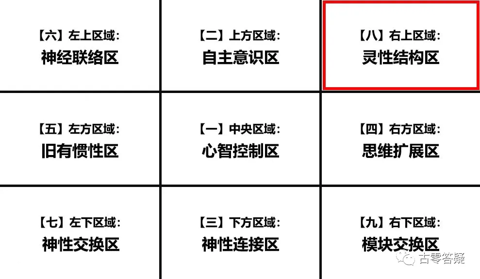
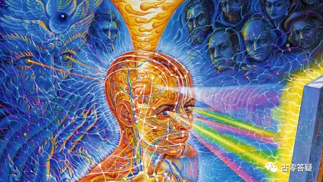
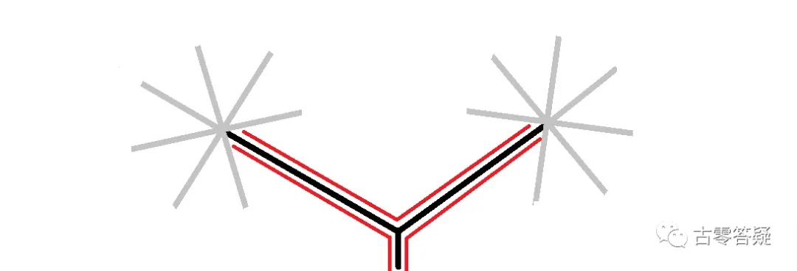
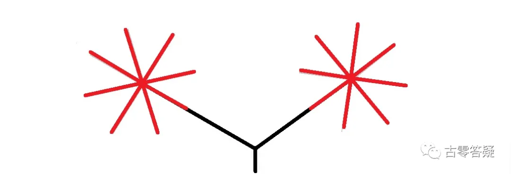
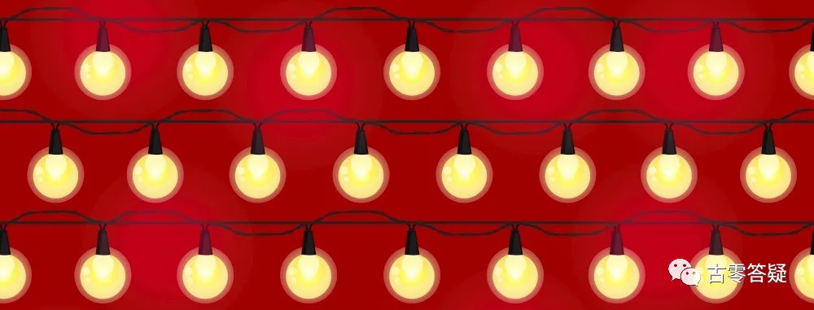
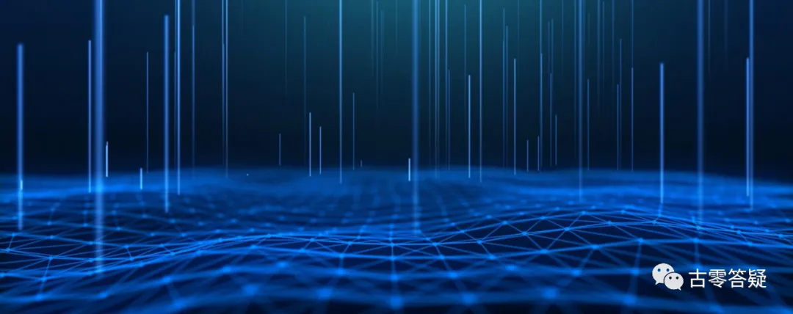
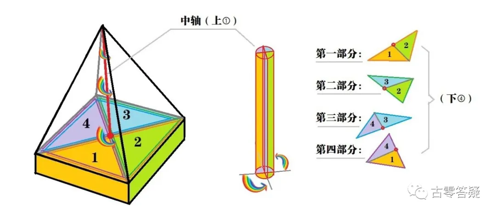
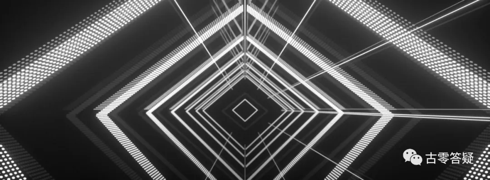

# 意识强度提升点实操指南【8】右上区：灵性结构区

* 作者：古零

本文是《[意识强度提升点（7）左下区：神性交换区](../07/index.md)》的续篇。

以下分享“第8区”的提升点。

**【八】右上区：灵性结构区**

自体灵性结构呈波浪形。

内在分两层区域：底层区域和上层区域。

底层区域是 T 组*重点研究的部分。

T组在这个区域的检测点有很多，但实用上实际只选取一部分。

这种选择是按照当前的形势来定，并非是一成不变的。

目前更新的大概有十来个点位。

*关于 T 组，请参考元吾氏博文《[轮回是否存在](https://yuanwushi.org/article-6-6638.html){:target="_blank"}》。

## 第一层区域：底层区域

量化数据（信息传输率）：人类普遍大部 20~40%。

@古零（GU0）

这里相当于信息传输的根基，决定了你的第一手信息的接收度，准确度和传输畅顺度等。举个例子：你家的宽带系统和防火墙设置，决定了你使用网络的效率和安全。

### 一、小型螺旋对流结构

结构公式：x = bn²t。

有 3 个结构。

#### 1、树形拓扑结构

此结构呈树形拓扑状，延伸出两条支线，连接相对应的星型拓扑结构。

这种连接容易被操控，造成无法正确连接。

其原因有3点：

1) **始端的状态混乱：** 能量纠缠在一起，无法形成统一有效的传送。

2) **传送不完整：** 在路径当中制造和搭建虚假的通过条件，造成信息传送不完整。

3) **在接收端制造路径误导：** 造成连接错位。

以上 3 种情况是最为常见的。

量化数据（点位通过率，或信息传输率）：人类普遍 20~40%。

@古零（GU0）:

1、状态混乱： 连接的时候去觉察一下有没有纠缠的意识流，如连接某个信息源，有没有出现小我意识的介入，混乱而不明确的意识，粘附意识和对抗意识等，通过古零脱敏法可以模拟应激期、低谷期和混乱期等状态，去练习如何保持意识稳定和纯客观的状态（白纸状态）。

2、传送不完整：连接的时候去觉察一下有没有存在某种主观性的条件和传送标准，从而影响到信息的传送度，具体如:

1. 心智系统下的模式化判断，如：必须这样，只能那样…
1. 仪式感，如：需要经历某个场景，能感受到某个特定的频率，才算达标。
1. 程序性思维，如：公式化，对等化，有序化等。
1. 主观制定的阈值范围，根据以往的经验和认知来制定一个接收范围，如：只接收自己认可的范围，自己喜欢的范围，自己能理解的范围等。

3、在接收端制造路径误导：错位连接往往是对传送目标过于模糊化、混淆化，矛盾化，钝感化。建议提防单打独斗，多借助集体意识来觉察自己是否存在错位的意识漏洞，保持纯客观的状态。

#### 2、星型拓扑结构

此结构呈星型拓扑状，核心部分接收信息后，向四周传输，维持该结构的平衡与稳定。

该结构与更深的机构联结，在向自身深层部分传递的过程中，如有干扰，则会出现各种各样的状况。有较大干扰时，甚至会造成部分层面的循环和卡顿，以至于传到更深层结构的信息所剩寥寥无几。

这个部分的关键，在于信息传递的路径。

路径错位会引发迷宫效应。

修复该结构的要点，是要重新调整信息的路径顺序。（也是一个研究重点。）

量化数据（信息传输率）：人类普遍20~30%。

@古零（GU0）:

1、对于新手，修复该结构的要点，是要重新调整信息的路径顺序，因此在信息传导前，做到信息路径顺序的设置，举个例子：在复合体结构探索的时候，根据自己的实际情况，先理顺复合体的探索顺序，对于新手，有两种方法：

第1种是协助型：先从自己最熟悉的复合体灵开始，然后在TA的帮助下，去连接其他尚未探索的复合体灵，顺序是从连接的畅顺度，从易到难依次排列。

第2种是独闯型：在完全陌生的情况下，先从第1灵开始探索，循序渐进一直探索到第12灵——灵核，中途如果遇到连接困难或者沟通不畅顺的，就跳过去，继续下一个。

每个复合体的探索结束后，记得再次确认该复合体的连接是否已经断开，保证信息完全隔断的情况下，再连接下一个，这样做的目的是防止信息串联带来的干扰，以及减低灵与灵之间被窥探的风险。

熟悉复合体的结构后，就着手建立复合体的关系图谱，这样信息的路径就更清晰的。熟悉这种经验后，会感知到不同信息路径的区别和特点，以及能通过不同路径的信息进行更客观的比对，能最大程度减低不同路径之间的带来的干扰，应用到其他方面就更得心应手了。

2、对于熟手，就是信息路径的深入探索和应用了，如：信息的复合式搭桥，信息路径的多重嵌套，信息往返式路径比对，信息路径的聚散型耦合，信息路径的蜂窝结构等等，往后再进一步分享吧。

#### 3、珠线型拓扑结构

此结构呈珠线性拓扑状，结构非常长，每一个小部分组成波浪形的形状，各部分之间有节点相连。

这些珠线上的相连节点小圆珠，像灯泡一样。灯泡的发光度，代表能量顺利通过的比重。

每个小部分，都汇结在大的节点当中。

每种类型的灯泡，有自己特定接收的信息。

灰暗的灯泡，代表该信息没有传输到位，或者只传递了部分。

可根据灯泡的亮度不同，进行判断。

所以，该点位的数值，代表该灯泡亮度的比率。

量化数据（灯泡亮度比，或信息传输率）：人类普遍 20~30%。

@古零（GU0）:

信息传输的完整性体现在灯泡的亮度，主要表现为：传达信息，读取信息，转换信息，复制信息等的时候，是否出现遗漏，缺失，延误和不畅顺等情况。实操的话，就是根据上面的点，进行复盘，多总结，多修正。

### 二、环线形双并行结构
结构公式：y = xmt²。

有 2 个并行结构。

#### 1、瞬结型网状结构

此结构相当于底层的防护网，遇到能量冲突对流，会发生作用。

此作用机制，比较单一死板，不太适合目前很多干扰的情况。

此结构属于旧式系统的一部分，不能很好适应当前的新情况，作用机制需要更新换代。

该结构目前被T组做过手脚，导致无法智能升级。

清除该结构的干扰，并进行升级，是一个研究重点。

目前对该情况有3种破解对策：

1) **通过高层授权直接修改程序：** 这一条较难达成。

2) **研发破除 T 组干扰的装置：** 但是需要先全面掌握该结构的情况，目前相应的研究还不足。全面了解之后，可以研发相应的破解装置和程序，这样可以重新激活智能升级系统。

3) **利用间谍获取 T 组相关技术的情报，来进行装置功效转换或者拆除：** 该技术保密程度较高，不易通过普通间谍获取，需要更高级别和权限的间谍。

量化数据（作用效果值）：人类普遍 5%~10%。

@古零（GU0）:

瞬结型网状结构属于T组的植入物和催眠装置重点关照的地方，对于个体这里类似于电脑系统的防火墙，T组的干扰策略集中在两方面，一个是根据个体的意识漏洞进行最大化的利用，如执着点：外求，自弱，恐惧，诱惑等，利用这些漏洞进行信息源的干扰。而另一个是在信息源中混入催眠信息，这些信息在流过这个结构的时候，会自动聚合并形成纠缠状态，让整个结构无法更好的运作。实操的话，建议多觉察和化解自己的意识漏洞，变成无缝的蛋。

#### 2、主导型拖压式结构

此结构由6层芯片组成，每层芯片存储不同频率的信息。

芯片的组成结构较为灵活自由，如环形，线形和串形。

结构特点：不停穿梭游走，接收和传递信息，运动时可有瞬间幻影的效果。

此结构因为其幻影特性，较难被捕捉，T组正大力研究捕捉该结构。

（目前对该结构掌握的资料较少，正在寻找直接参与研发的人员。）

该点的数值不便于直接检测，只能通过该结构在接触两端时，进行间接检测。

检测数值是指该结构所携带的正确信息的比率。

量化数据（正确信息比率）：人类普遍 10~50%。

@古零（GU0）:

类似于对信息进行分类加密传输，防止信息被窃取和捕获，实操的话，建议提升意识的切换能力，提高对意识焦点被锁定的警惕性，同时减少意识纠缠和回流，具体如训练自己如何快速化解粉红大象的效应。

## 第二层区域：上层区域

### 1、金字塔结构

有 5 种模式构成，上 1 下 4，整体呈金字塔型结构，从中间能分成 4 个部分，呈层级递进的关系，有一个共同的核心轴线连接。

这个轴线是七彩流动的，每个部分对应不同的流动方式。

#### 第一部分由模式 1 和 2 构成

此中轴的流动方式为断线型流动。

此部分性能极不稳定，依赖多条底层传送线。

目前，该传送线大部分被T组操控，因此严重影响了该部分的稳定程度。

操控方式为：把原有的传送线，替换为操控方的传送线。

该手段比较隐蔽，不容易被察觉，导致人类该部位普遍受损严重。

（通过获取源传送线的扭矩传送力度，即可仿制该传送线，计算扭矩传送力度有一个公式。

目前已计算出 8 条传送线的数值，被操控的有十几条，主要相关参数很难获取。

其中一个最难测量的叫镊度值，此数值测量法：相应的粒子运行一步，需要连续测量两步。

但是在那一步中会发生很多变化，引发很多变量值，变量可多达十几种，造成测量困难。）

目前的破解方法：通过另外 3 个部分的调整，来带动这个部分的提升。

量化数据（平均流动稳定性）：人类普遍15~20%。

@古零（GU0）:

决定了信息流动的稳定性，往往表现为信息的流畅度，均衡度，传输力度等，实操的话，建议针对传送线进行探索，先去自检信息传输的稳定性，去挖掘和觉察是否存在虚假的操作系统，往往表现为控制权限的不足，不同步，无法查看设置信息，信息源头的跟踪比较混乱，模糊而失真，如有发现，就需要逐步隔断虚假传送线的影响，修复原有传送线的受损部位。落地表现为，如冥想，合一，互催和连接潜意识等过程中，能否保持一个信息流动的稳定性，该数值低的话，会出现信息断断续续，画面卡顿，干扰，不同步等情况。

#### 第二部分由模式 2 和 3 构成

此心轴的运动方式为螺旋形。

这个螺旋形下到第二部分成为雾状，转变为离散结构，与该部分原有的形状结合，帮助扩张横膜阻力，进行抗压测试。

阻力两端对接时，发生碰撞火花，产生可被个体利用的动力因子。

该碰撞机制可产生 3 种动力因子：

1) **转移目标型：** 对个体增加用来临时转换的动力因子。当确定临时转换目标时，该动力因子可以帮助精准调整目标定位。调整完该动力因子，可继续保存，留下次再用。

2) **促进区域联合型：** 在不同区域间互动，达到联合的作用的动力因子。互动的方式为：通过旋转让自身的能量留在其它区域，并将该区域的能量进行携带，再返回原有的区域

3) **助力运动型：** 帮助其它信息粒子运行的动力因子，并保证整体信息粒子的运行能够稳定有序。第二部分，对整体机构的稳定，起到至关重要的作用。

其稳定性不易被破坏，是较为机械运作的部分。

量化数据（稳定性）：人类普遍 50~60%。

@古零（GU0）:

可以通过互催，灵视，清醒梦和出体等方式，针对碰撞机制所产生的3种动力因子进行观察，检测是否存在漏洞并进行改善，确保整体机构的稳定性。落地表现为：如进行意识焦点的转移，保证在转移过程中，信息之间的互联性和携带性在一个稳定而快速的状态下进行。举个例子：如你站在 A 的角度看一个问题，待观察完毕后，你接着切换到 B 的角度，那么在 B 的信息就会跟 A 的信息产生碰撞，在这个信息互动中，能否形成一个（A + B）信息叠加和促进的效果，保持整体机构的稳定至关重要，否则会产生很多错位和纠缠的意识流。

#### 第三部分由模式 3 和 4 构成

此心轴的能量方式为垂直线性，呈 S 状流动。此部分的流动，可起到清理净化的作用，可吸收并过滤掉其它部分所产生的杂质。

该部位的识别装置，受到干扰会产生清理异常。

目前的异常，主要受第一部分的影响。该部分的功能紊乱，也会对机体造成一些影响。

主要表现为：

1) **反应空白：** 个体对某些状况不知如何反应，产生无法识别，导致无法给出反应结果。

2) **思维错位：** 个体在考虑 A 的时候，会自动考虑 B，无法辨别 A 与 B 的区别。

3) **反馈错位：** 个体对一件事情所得到的反馈结论，造成错位。

这 3 点可以独立发生，也可以延续递进地发生。

量化数据（平均稳定性）：人类平均 40% 左右。 

@古零（GU0）:

建议可以针对反应空白，思维错位，反馈错位这3种情况来进行自检，这些情况往往在应激状态，混乱状态和意识低谷期等会较为突出。落地操作的话，及时对不清晰和混乱的信息进行总结和分类，并建立关系图谱，这有助于促进信息的清理和净化。

#### 第四部分由模式 4 和 1 构成

此心轴的流动装置为方形结构。

此部分汇集前 3 个部分的所有数据，传递给下一个结构。

该部分会进行最后的识别过滤，会过滤掉无效的信息，有一小部分继续参与循环。

该部分的运行较为稳定。

量化数据（稳定性）：人类普遍 60~70%。 

@古零（GU0）:

这个方面数值比较低的个体，会对信息的识别和过滤比较混乱，较难分清楚每个信息的类别和指向，举个例子：做一道菜需要 A + C + E，但个体去寻找食材的时候，表现出混乱和无法识别的情况，然后往往把无用的 B、D、F 都带回来了。

### 2、底盘结构

此结构接收来自金字塔结构的数据，通过不同的算法机制进行分流，然后输送到个体。

底盘中间的形状，类似五角星。这个信息分流机制，与几个因素有关：

1) **按基本属性分流：** 类似金、木、水、火、土这些基本元素，按照自然规律来分流。

2) **受个体倾向影响。**

3) **受个体意图影响。**

这种分流本身，是按自然规律来分的。

当受到主观影响，就会造成一些分流的混乱。

量化数据（分流稳定性）：人类普遍 40~50%。 

@古零（GU0）:

主观是导致底盘结构出现分流混乱的主要影响，建议多去觉察自己的主观倾向，关于什么是主观，什么是客观的问题，引用元哥关于主观和客观的三问：

一问

==**主观：主体的观察视角**==

==**客观：客体的观察视角**==

二问

==**主观：单一主体的单一观察视觉**==

==**客观：无数客体的无数观察视角**==

三问

==**主观：一个问题只有 { 单一主体的 / 单一观察视角的 } 一个答案**==

==**客观：一个问题可能有 { 无数客体 / 无数观察视角的 } 无数个答案**==

**【第 8 区提升点完】**

!!! Tip

     --------Disclaimer 免责声明--------

     经验分享，仅供参考。转载自由，严禁修改。

     All info is intended for experience sharing and reference only without any warranty.

     Redistribution is freely permitted provided that no modification is made whatsoever.

     2022-10-15 古零（GU0）

    (update on 15/10/2022)

**该文章由元吾氏反催眠(=催醒)游戏志愿者团队收集整理**
