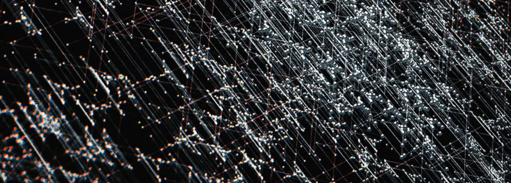

# 意识强度提升点实操指南【9】右下区：模块交换区

* 作者：古零

本文是《[意识强度提升点（8）右上区：灵性结构区]()》的续篇。

以下分享 “第 9 区” 的提升点。

**【九】右下区：模块交换区**

## 第 1 部分：模块建立部分

人体信息模块（或意识模块）的建立，有一个控制程序，叫 YCCB。

此程序用来控制分层、分功能地建立相应的信息模块区域。

此程序通过以下 2 种方式，来完成整体运作。

### 第一种：螺旋感应模块结构

第一种，是在底层以螺旋感应的方式，来调整信息模块区域的结构。包括信息模块的折叠、扭转等其它变形机制。

**有 5 种调整方式。**

#### 1、波形扭转概率的稳定性

是指波形结构在通过区域信息模块时，发生一定概率的扭转现象。

正常的扭转，可让机体更好的适应各种不同的情况。

波形的正常扭转，可显化为个体不同的反应方式。

检测数值指正常扭转的稳定性，数值越高代表越稳定。

**量化数据（正常扭转的稳定性）：**

人类平均 60~70%。

@古零（GU0）:

该数值不稳定的话，表现为个体对信息的反应比较混乱，举个例子：

1. A 驾驶了多年的拖拉机，他现在要学习驾驶货车，因为驾驶的载体改变了，他在操作过程中需要把以前的操作习惯进行及时的转换，这个转换稳定性越高，他学习的效率也越高，甚至起到促进的作用。反之，以前的驾驶习惯和经验会影响到他现在的学习。在日常生活工作中，这种情况也很多，如换了汽车，换了工种，换了语言，换了生活环境，换了不同的互动群体等等，这些过程都需要进行大量的信息转换，数值越稳定那么个体的适应性也越强。
1. 应变能力的表现，对于各种状况能随机应变，反应迅速，临危不乱，与他人交流容易跟上对方的节奏，处理事情比较灵活，对他人的情绪，对事物细节的敏感性高。
练习的话，可以根据上面两个例子去寻找自己的短板，进行加强练习。进阶的话，就是对信息素的转换能力，能根据不同的情况，对信息素进行灵活组合和属性调整，并且举一反三，形成多通道的并联拓展，这个需要个体对信息有极高的通透度。

#### 2、层次间的交融度

是指不同区域信息模块之间相似的部分，会产生交互相融的现象。

此部分对个体不同机能的协调性，起到至关重要的作用。

（主要影响的机能，还可以再细分。）

检测数值指正常交融的稳定性。

**量化数据（正常交融的稳定性）：**

人类平均 50~60%。

@古零（GU0）:

还是继续上面的例子，原本开拖拉机的A，改行开货车，那么两套不同的操作系统，会存在相同的部分，需要把两者进行交融，还有更多的例子，如销售员去做直播，踢足球去打篮球等等。

练习的话需要多去洞悉事物的本质以及各自的底层逻辑，如不同的认知习惯，不同的观察角度，不同的流派和不同的方法等，能快速找出这些信息的共同点，并且达到融会贯通的状态。

#### 3、模块区域断层程度

信息模块运行有正常损耗，系统会及时修补和更新受损的信息模块。

如果受到干扰，受损部分会卡住，导致无法被过滤。这样就无法完成更新，慢慢会出现断层现象。

干扰，主要是导致受损部位的剥落机制异常，该部位会收到反向信号，从而产生拮抗效应。

需要屏蔽反向信号，机制才会恢复正常。

反向信号主要来自干扰渗透技术。

断层数的增加，会影响意识信号的传输，使得个体自由意识的影响减弱，更容易被操控。

检测数值指断层程度。

**量化数据（断层程度）：**

人类平均 40~50%。

@古零（GU0）:

举个例子：上了一天的课程，接收了不同科目的信息，同时还有不同老师的讲话，因为信息量比较大，这些信息在消化的过程中，会容易串流，如会分不清是哪位老师讲了哪些内容，某些科目的信息会混淆到其他科目里面去，因此信息管理会变得混乱，同时产生了很多冗余信息，这些冗余信息会反过来影响新的信息接收，如第二天你继续上课，如果你的状态在没有及时调整回来，那么这天的信息接收会变得更混乱，长此下去的话，你每天的上课状态不是在学习和思考，而是不停被动式的记笔记，然后自己都不知道老师讲了些啥，完全失去的主动性和自主性。

练习的话，建议提升信息管理的能力，多觉察有没有信息串流，以及纠缠意识和回流意识的影响，并及时进行清理和归类，建立快速修复系统。

#### 4、模块运动的同步性

信息模块按照一定的规则去做整体性的运动，整体运行基本会做到同步有序。

不同步的信息模块区域，容易产生受损联动，会导致产生新的受损因素。

因此，信息模块修复也是较为重要的部分，也是个体提升的重要参照指标。

该数值高的话，个体发展更稳健有序。

**量化数据（同步性）：**

人类平均 30~40%。

@古零（GU0）:

继续上面的例子，就如课堂上，你无法跟上老师的讲课节奏，如 ABC 的内容，老师已经讲完了 AB，接着讲到 C 了，但你还停留在A或者B的信息消化上，无法跟老师的节奏同步。这样长久下去，会导致部分信息的缺失，同步性的差距也会越来越大。日常生活工作学习的表现，或许是信息接收同步性差，讨论和接收信息，经常跟不上大家的节奏，信息反射弧比较长之类的情况。

练习的话，建议提升信息模块修复的能力，即平时多复盘，多总结，对不明确的信息，冗余信息，串流信息和错位信息等，进行及时的修正。

#### 5、模块发展的联动性

信息模块会随着运动，而得到自身的发展。

信息模块在发展过程中，会由于自身的原始力而引发削弱效应，会导致模块自动下降层级，模块的波动也会产生机能异常。

联动性，体现在模块间的合作。

模块合作机制，是根据国际通用规则来进行，该规则由人体规则委员会来制定。

该委员会总共颁布了 18 项规则和章程，构成人体运行的基本规律。

量化数据（联动性）：人类普遍 50~60%。

@古零（GU0）:

具体可以看看人体 18 项规则和章程的文章。不同的模块有不同的联动阈值，进行适当的调整可以有效降低削弱效应所带来的影响。举个例子：

A、B、C、D 四人一起合作搞项目，那么大家各自不同的诉求和工作习惯会容易造成分歧，从而降低工作的效率，所以需要大家定期开会，对工作进行复盘和总结，并互相表达各自的意见和诉求，借此取得一个大家都认可的调整，这样才能保证项目得以顺利进行下去。

所以，对于练习提升这个点，需要根据人体18项规则和章程的内容，熟悉模块之间的联动特点，进行有效的调整。

### 第二种：直线折叠模块结构

第二种，是以直线折叠的方式，来建立信息模块结构。

**有 8 种建立方式。**

#### 1、月牙形感应模块结构的建立

结构：月牙形，沿着蝴蝶形曲线螺旋状上升，末端分叉为5个端口，与矩形磁力结构对接，通过上层结构纽带，传送到下一个模式结构中。

功能：在周围神经系统发挥作用，捕获游离信息粒子，为建立感应新形态而输送能量。

此模式运转良好的话，个体的感应机能会更稳定。

**量化数据：**

人类普遍 60~70%。

@古零（GU0）:

个体的感应机能，主要有视觉，听觉，触觉，味觉和嗅觉这5个感官，除此之外还有其他的特殊感应机能，如遥感，灵视，感知等，检测的话可以看看这方面的信息传送稳定性。

#### 2、垂直形连接模块结构的建立

结构：垂直形、离散型结构。

功能：向外扩散信息粒子，通过调整扭矩，可对扩散的量度和角度进行调控。

从更高的角度来看：通过这种扩散方式，进行信息模块间的对接，能对接的范围很广，包容性也很强，从某些层面来说可以做很多事情。

开发和利用这些结构，可以进行一些有目的性的游戏操作。

（目前该层面研究较少，今后可能会增加相关研究。）

**量化数据：**

人类普遍 60~70%。

@古零（GU0）:

对信息粒子的扩散进行调整和开发，可以拓展出很多有趣的项目，可以打破有序性，促进程序意识的松动，举个例子：落地应用比较多的如把触觉、听觉转换成视觉，（声音可视化、画面感传递，超声波，盲人系统），把触觉、视觉转为听觉（音乐创作模式），把听觉、视觉转为味觉（视听语言，电影手法）等等。

#### 3、倒椎滴漏形模块结构的建立

结构：倒椎形、滴漏型结构。

功能：有 3 层渗透结构：

第 1 层的功能是过滤：将一些较大的杂质粒子或者粒子团排除在外。

第 2 层的功能是转化：将过滤进来的杂质粒子进行打散和重组。

第 3 层的功能是精微化：转变为个体可以吸收的新粒子。

整个结构类似于杂质粒子的回收和转换的功能。

该结构的功能可以很好地保持个体机能的循环运行。

**量化数据：**

人类普遍 40~60%。

@古零（GU0）:

第 1 层涉及到对信息的解构能力，能在臃肿的信息中提炼出有用的信息，第 2 层是把信息团分解成更小的信息素，第 3 层是把信息素转化成可供自己随时使用的状态。整个过程要举例子的话，如我想组装一辆汽车，那么：

第1步，我需要从废品场收集几辆合适的废旧汽车，然后拆卸里面的零件，把不需要的部分扔掉。

第2步，把拆卸的零件进行分类，如发动机组，车架组，电子元件组，安装用的螺丝部件等等。

第3步，根据我需要组装的汽车要求，把相应达标的零件放到一起，并进行盘点，如不需要改装直接能用的，需要改装重新组合的，没有合适配件需要重新购置的，其他重复部件留作备用的，都一一入库并列出明细的清单。

这个模块结构的建立，有助于提升个体对信息的解构能力，数值高的，能保证信息运行有条不紊，稳定而快速。数值低的，会出现信息管理能力差，混乱，容易串流和冗余。

#### 4、翻滚波浪形模块结构的建立

结构：有几种不同的翻滚波浪形态，根据不同的反应模式进行形态的调整，整体呈链条形。

功能：反应模式有 3 种：

第 1 种：继承演化型：螺旋式翻滚。

在翻滚中接纳并吸收由外界触发而产生的信息粒子，进行发酵并演化。

第 2 种：对抗排斥型：闭合型翻滚。

在翻滚中撞击其它信息粒子，对机体相关运行起到较为稳定的保护作用，所以是机体必不可少的核心功能之一。

第 3 种：互助交换型：触角回转式翻滚。

在翻滚中接收外界信息的同时，把自体信息传递出去，并将接收到的信息传递给相应的其他部位，同时也从其它部位中获取其它的信息，从而进行这种交换互动的循环。

3 种形态互相配合、呼应并合作，形成一套完整的运行机制。

该模式与人体的自然和谐的发展有关。

**量化数据：**

人类普遍 40~50%。

@古零（GU0）:

信息的运行需要活性，因此翻滚是一种提供动能的方式，就如零能量空间的建立一样。而不同的翻滚方式又具备不同的功能，当你熟悉模块结构的运行原理和机制，就更容易去进行改善和调整，到更成熟的阶段，就可以应用到项目研发上，自己可以去创造模块，升级模块和修改模块等等，这些都是后话了。而对于新手，这方面一开始可能比较抽象，而关键还是多落地实践。

第 1 种翻滚是螺旋式，螺旋式是万物运行的主要方式之一，如 DNA，行星环绕轨迹等等，这个数值高的话，落地表现为在日常工作和学习中，善于总结和挖掘有用的信息，并且进入一个自发式的良性循环。

第 2 种翻滚是闭合型，信息的碰撞会产生更多的脉动和活力，促进整体的运行和输出更稳定，就如我们群内平时多共享信息，多交流一样，大家各抒己见，甚至有不同的分歧，其实都是好事，都能给予集体提供源源不断的脉动，如果大家没有碰撞，那么整个群就如死水一潭，没有活力。应用到电影和讲故事都是一样，推动故事发展一直都是矛盾和冲突，也是抓住观众痛点的主要原因之一，对抗和排斥越厉害越能提升故事的吸引力。落地表现为在日常工作和学习中，善于利用信息的碰撞去提升自己的行动力和自主性，就如利用个体不服输的心态，运用一定的奖励机制去激励大家提高积极性。

第 3 种翻滚是触角回转式，相当于通过不断的互动去促进自发运转的良性循环，就如很多热议的话题，往往话题本身具有争议性，导致大家都忍不住去表达自己的意见，这样的互动促进了骨牌效应，然后像雪球一样，越滚越大。落地表现为在日常工作和学习中，善于表达和引导，能促进大家互动的兴趣和主动性，这方面数值高的人，往往都是暖场高手或者是搭讪高手。

#### 5、半月递进型模块结构的建立

结构：半月形，递进结构。

功能：此模块有 5 层递进结构，是神经元等微小单位的大本营，在这里制造和重组品种繁多的微小单元，并进行调配，输送到不同的地方。

第 1 层：根据需要来制造不同的微小单位。

第 2 层：根据功能进行分类存储。

第 3 层：根据需求进行调配组合。

第 4 层：根据所需进行对外输送。

第 5 层：回收和调整以便再次利用。

此模块有双层基底，可以保证整个过程顺利进行，机体中充满了流动的原始密物质。

该物质是生命机体重要的基础构成元素，是机体能动性的来源。

**量化数据：**

人类平均 70% 左右。

@古零（GU0）:

可以根据神经元进行测试，针对信息的传入和传出进行比对。该模块结构的运行状态，会在身体的神经系统方面得到一定的显化，可以借此进行多向检测。

#### 6、竖条状风铃排S形模块结构的建立

结构：竖条状的，风铃，一排一排的，S 型。

功能：竖条状的风铃相当于信息的触发器，是信息的点性触发系统，属于信息焦点属性的捕捉和处理。

当原始信息粒子以独立粒子形式穿过模块时，触发器会自动对其进行捕捉，然后通过分析，根据不同的功能进行分类，之后再重新调配和组合，变成一种螺旋状波的形式进行信息传导。

但是，这个过程会对原始信息造成一定程度的失真和变形。

因此，在模块的末端，会有一个还原系统，把波形的信息恢复到原始信息粒子的状态。

**量化数据：**

人类普遍 40-50%。

@古零（GU0）:

属于信息焦点属性的捕捉和处理，举个例子，因为某个项目的研究，你需要大量的相关资料，于是世界各地的小组成员不断为你收集这方面的资料并电邮给你，于是你源源不断收到一大堆电邮信件，然后通过浏览信件获取里面的信息，根据不同信息的功能进行分类，再转化成自己的系统语言输入电脑，最后浏览完的信件并没有删掉，而是重新打包群发到其他部门。

#### 7、三角形串行模块结构的建立

结构：由很多一样大的平面三角形，以上下重叠的方式进行纵向排列和延伸，每个三角形的间隙距离和三角形边长比例为 1 : 5。

功能：三角形相当于信息触发器，是信息的线性触发系统，属于信息的纵向关联属性的捕捉和处理。

当信息粒子穿过模块时，模块整体通过蠕动对信息进行过滤，把杂质粒子分离出来，然后信息粒子被重新分配，并形成相对稳定和有序的状态。

但是，这个过程会对原信息造成一定程度的失真和变形。

因此，在模块的末端，会有一个还原系统，把波形的信息恢复到原始的粒子状态。

**量化数据：**

人类平均 60%。

@古零（GU0）:

信息的纵向关联属性的捕捉和处理，举个例子，因为某个项目的研究，你需要大量的相关资料，于是世界各地的小组成员不断为你收集这方面的资料并电邮给你，于是你源源不断收到一大堆电邮信件，然后通过浏览信件获取里面的信息，把偏离主题的信息删掉，并重新进行组合，再转化成自己的系统语言输入电脑，最后浏览完的信件并没有删掉，而是重新打包群发到其他部门。

#### 8、无底金字塔型射线模块结构的建立

结构：金字塔，里面有射线，上下左右沿着三角形，金字塔底部是空的，不是三角形，而是五角或六角形。

功能：信息粒子从金字塔顶尖进入，往下延伸传递。此过程中，信息粒子的内部排列会被拉长和放大。

此过程还具有信息解密和修改功能。

这个功能可以通过集体意识对个体进行整合，联合起来对信息进行收集、放大、解密和修改，起到个体和整体的互相促进。

此功能属于对信息进行解剖，深入信息内部结构，进行分析和处理。

**量化数据：**

人类普遍 60-70%。

@古零（GU0）:

对信息进行解剖，深入信息内部结构，进行分析和处理，举个例子，因为某个项目的研究，你需要大量的相关资料，于是世界各地的小组成员不断为你收集这方面的资料并电邮给你，于是你源源不断收到一大堆电邮信件，然后通过浏览信件获取里面的信息，因为信息来自不同的时期和不同的流派，所以需要对信息进行多角度的探索，如对比，解密和修复等，再转化成自己的系统语言重新输入电脑。

## 第2部分：不同模块间互动部分

此部分有 4 种互动区域。

### 第一种：珊瑚状互动区域

此区域有数条神经节通道，连接各区域信息模块。

此区域有 5 种互动类型。

#### 1、虫节状多层次交替型互动类型

这种互动方式最为广泛，是大规模频繁的数据交互，是最广泛最常见的一种形式。

有非常强大的数据处理能力，可以保证人体大部分的功能正常运行。

该点位的数值，代表该互动模式的畅通程度。

**量化数据：**

人类普遍 60~70%。

@古零（GU0）:

实操的话，可以多觉察自己在大规模信息互动上的状态。举个例子：如自己作为采购方进入某个商业会展，需要在这里获取大量的信息，来满足自己采购的需要。

#### 2、蝶状循环互动类型

此互动模式为一端模块同时产生两股粒子波，进行循环交替互动。

该粒子波在运动过程中，会产生各种交替组合型的转化反应，属于高级互动功能。

该模块的交互，也会起到平衡作用，有利于底层交互机制的建立。

不同模块间，通过该互动模式，可达成不同数据间的跨层级处理，对于积累新型数据以及更上一层的互动做好基础准备。

该互动模式有 B 级抗干扰机制，保障数据跨层级转换的顺利进行。

该数据一般比较稳定。

**量化数据：**

人类平均 80% 左右。

@古零（GU0）:

实操的话，可以多觉察自己在不同数据间的跨层级处理的能力，如继续拓展上面的例子：自己作为采购方进入某个商业会展，需要在这里获取大量的信息，来满足自己采购的需要。然后这个过程中会遇到很多不同区域，不同大小的代理，可以通过与他们的互动获取该商品的市场运作机制，以及厂方的信息。

#### 3、桥式节梯型互动类型

此互动模式，对于模块间信息数据的微小失衡的调整，可起到广泛和积极的作用。

这种积极性，体现在可有一定的容错率，模块间数据结合融合性更高，排斥性反应较小，可帮助提升整体效率。

研究此结构的微调机制，可模拟该机制，制造相应的装置，可达到调整更大失衡数据的目的，同时也可研发更多的智能调整程序。

此结构有较强的伸缩性，对于后天调整进化，有很大的潜力发掘空间。

具体量化数值：包括稳定性和调整率等不同部分的数值。目前是按照一个整体数值来检测的。

**量化数据：**

人类普遍 60~70%。

@古零（GU0）:

实操的话，可以多觉察自己在信息容错率方面的能力，借此提高自己的包容性。举个例子：你作为会员参加某个婚介联谊会，你将会看到多位单身的异性，在跟TA们的互动中，你会获取不同人的信息，但是往往先入为主的状态会影响你对异性信息收集的全面性，所以可以先调低对异性第一印象的阈值，从而提高容错率，这样可以获取更完整的信息，才能挖掘更优秀的对象。再举个例子，对于商业合作的谈判，前期的互动可以不纠结于一些矛盾上的分歧，可以就双方的利益一致的情况下，慢慢进行融合性的调整，以到达一个合作共赢的高效率。

#### 4、几何型嵌套式互动类型

此互动方式，常用于密码型数据类型的传送，在互动中同时进行解码和二次加密，以保证传输的安全和稳定。

密码型数据，本身性质不稳定，数据易发生变化，需要通过加密来保持稳定性。

此互动方式，是通过多层嵌套结构，进行瞬间解密，以达到互动的目的。同时进行二次加密，以完成数据回流。

此互动方式的研究，对于信息保密型传输，有实用价值。

T 组在此处的研究，主要是破解和监控。但破解极其困难，因为加密方式是千变万化、毫无规律的。

T 组的研究，主要是监控瞬间解密的过程，试图在解密和二次加密之间制造间隙，以达到获取信息的目的。

根据观察，这两种行为像是同一种形式，解密的过程即等同于二次加密的过程，难以分辨间隙。

但是，可以从传送过程中的形态变化和流动速度，来判断信息的频率类型。

可以研究如何更多地利用这方式来进行信息传送，用该原理来建立自己人之间的信息互动空间。

该点位的检测数值，代表该互动方式的使用率。人类普遍有更大的利用空间。

**量化数据：**

人类普遍 40~60%。

@古零（GU0）:

实操的话，可以多觉察自己在信息解密和加密方面的能力，以此保证传输的安全和稳定。举个例子：这方面数值低的人，往往管不住嘴，或者不经意间口无遮拦，如因为保密意识差，与陌生人打交道的时候，往往不经意间透露自己的私人信息，或者与熟人互动的时候，往往不经意间透露他人的私人信息，或者在传送信息的过程中，习惯加上自己的意识倾向和分析，这样对方就容易掌握自己的意识状态和认知习惯。而这方面数值高的人，往往说话点到即止，客观表达事实而不会附上自己的意见，或者话中有话，会根据对方的状态选择适当的切入点，对方能听懂或者不能听懂，都无伤大雅。

#### 5、内核型扩展式互动类型

此类型主要用于低端附属配件类型的数据传输。

该类型可完成大量附属结构数据的传送，也是一种基础保障性的传送。

该结构在传送过程中，可能掺杂一些颗粒状杂质，对后续部分造成一定负担，影响整个机体的流动效率。

杂质可分为：

1）自体产生的杂质；
2）外部输送的杂质。

T 组通过后者的方式，来达到干扰和影响的目的。该手段较为常用，可以有效地降低机体的工作效率。
该结构因为自身精密度不高，较难在传送中防止杂质混入。一般情况下，需要等信息到达模块内部后，再进行清除。

**量化数据：**

人类普遍 50~60%，外部杂质率占到 40% 左右。

@古零（GU0）:
实操的话，可以多觉察在进行信息传输过程中，对信息杂质混入的觉察能力，举个例子:你是收购废铁的，但往往顾客会把不是铁的配件一起扔过来，如砖头和泥沙之类，这样就大大增加了你的工作量，降低了工作效率。在学习上，数值高的人，懂得划重点，懂得精炼提纲，能快速找到自己需要的关键信息，不会被无关的多余信息影响到自己的学习。

### 第二种：沟壑型互动区域

此区域的互动和交流机制比较复杂，有很多交叉和互相影响的部分。

该区域有一条主干支持，整体类似树状。

这种结构的优势，在于互动紧密、性质稳定，很难受到影响。

该区域伸出多条支线，与其它模块连接。

其本身有智能功能，能向外发出信号。

信号发送的深度和广度，取决于该信号的频率。

可以通过捕获这些频率，检测出机体受影响的部分。

此区域有 9 种互动结构。

#### 1、叠片状互动结构

结构：叠片状。

功能：在互动过程中，可分散行动。这种方式有良好的适应性和灵活多变的特点，可使彼此间的离解产生引导效应。

这种离解可发生在多项区域内，由不同的嵌套结构，将其固定在某种特定的频率和轨道中，通过递进传导机制和发挥热能作用，产生气化反应，对于目前的研究能起到补充作用。

补充作用主要体现在需要扭动和旋转的行为。这种扭动和旋转的形式，可有效的将其过程达到更高的优化水平。

该点位的数值，是指该结构的发挥作用的百分比，属于可开发的潜力。

如果达到 80~90% 属于比较好的水平，

**量化数据：**

人类普遍 60~70%。

@古零（GU0）:

信息互动中，彼此间的离解产生引导效应，而且这种递进传导机制，会产生气化反应进一步提高优化的水平。举个例子：两个朋友 A 和 B 看完一部文艺电影，都觉得有点看不懂，于是大家一起进行观后感的讨论，首先大家把电影进行层层分解，如一层层的解剖剧情的线索，并分解出不同的人物，不同的动机和不同的故事发展，然后AB两人就此互相交换意见和补充细节，这样整个故事的脉络发展（起承转合）就非常清晰明了了，同时让电影的寓意和主题有了更多的升华，最终两人都对电影有了更深入和全面的理解。

#### 2、散射状针型互动结构

结构：散射状、针型。

功能：很多信息模块的研究，都依赖于该结构所提供的一些服务，广泛存在于该区域中。

这个结构是可以重点开发和利用的，有很大部分可以作为后备力量的存储和准备。

该数值包括开发程度和后备力量的准备程度。

**量化数据：**
人类普遍开发程度在30~40%，后备程度在 10~20%。

@古零（GU0）:

开放和利用信息模块所提供的服务，并作为后备力量的存储和准备。举个例子：A是做家具的，并且提供上门安装的服务，而B是做室内设计的，能提供私人定制的服务，于是两人进行了交流互动，发现各自的服务可以有效的整合到一起，即私人定制一体式家具，并有上门安装一条龙服务，这样两人的服务联合起来，让顾客省心多了，因此大大提高了市场的竞争力。

#### 3、水滴状流动性互动结构

结构：水滴状、流动型。

功能：特点是适应性很强。

从研究角度来说不是特别重要，发挥的作用不是很显著，但是也是不可或缺的。

它能够辅助其它结构的顺利运转。虽然数量很多，但功能较为简单。

**量化数据：**

人类普遍 70~80%。

@古零（GU0）:

这种互动结构就如水一样，能容万物，又能溶于万物，海纳百川，有容乃大，因此适应性很强。落地的话，就如做人也应该有着宽广的心胸，又能溶于万物，能够融进万物，吸取万物所长为自己所用，做人也应该能和别人和谐相处，取长补短，水能容万物，又能溶于万物，做人亦如此。

#### 4、两点旋转型互动结构

结构：两点，旋转型互动。

功能：数量不多，属于特殊作用的结构。

在 4 种情况下发挥作用：

第一种：是以隔离的方式，解开某些缠绕型信息。

第二种：是在蝶型环抱结构中，起到缓冲的作用。

第三种：是在两种结构之间，起到吸引和分离的中介作用。

第四种：是聚在一起旋转，能起到帮助其它结构运行的加速作用。

**量化数据：**

人类普遍 60~70%。

@古零（GU0）:

就如太极图一样，即有隔离，也有环抱，两者既有吸引也有分离，聚在一起旋转，你中有我，我中有你，互相促进和加速。

#### 5、针叶式串行互动结构

结构：针叶式，串行互动。

有 3 种运行形态：

第一种：针叶按某种规律摆动，

第二种：整串做整体自旋，

第三种：串型可缩成球型。

功能： 在此区域内主要是巡航作用，针叶可做不同频率的摆动，以吸附不同种类的微小信息粒子单位，达到运输和调节的作用。

研究其摆动频率与吸附单位之间的关系，可以有非常广泛的应用范围，对于接收、改造和制作信息都有很大的帮助。

（也是针对T组，变被动为主动的重要因素之一）

**量化数据：**

人类普遍 40~60%。

@古零（GU0）:

针叶式串行互动结构主要起到信息的巡航作用，设置不同的摆动频率与吸附单位之间的关系，可以对信息的接收、改造和制作有很大帮助。举个例子：如某公司推广自己的产品，于是架构一个浏览数据的阈值模型，来进行大数据的收集，借此寻找具有相关喜好和消费习惯的用户，从而更精准的把成品的推广信息推送到这些潜在用户身上。落地应用的话，可以应用到个体的防御系统上面，可以提高信息的互动性，保密性和传输精准度。

#### 6、水帘型互动结构

结构：均匀分布在沟壑型区域的内壁中，但是是独立的互动结构。

功能：可感应其它互动结构发出的不同信息。

水帘有6-7层，可连接不同的维度，通过感应和收集所经过的信息，进行不同维度间的传输和互动。

该结构可以穿越沟壑内壁，连接不同方位的其它维度。

同时可以连接其它维度的沟壑内信息，进行交换和互动。

该结构有多种延伸方式，可随沟壑的生长而延伸。

**量化数据：**

人类普遍 50-60%。

@古零（GU0）:

水帘型互动结构可以连接不同的维度，通过感应和收集经过的信息，进行不同维度间的传输和互动。举个例子：一些婚介平台，交友平台，经常收集不同城市，不同群体，不同兴趣的社交信息，然后给他们进行配对。

#### 7、水漫型互动结构

结构：信息源如同液体般进入沟壑结构，顺着沟壑的形状延伸出去，并形成一个水位深度，整体像一个封闭的水库。

功能：当短时间内出现大量的信息进入，导致水平面上升，并形成对沟壑结构的压力（像洪水期的堤坝），导致原有的沟壑结构无法运转大量进入的水源，会自动横向扩展。

这种情况类似于个体在合一的状态下，频率扩展比较深的时候，因为短时间内要处理大量信息，超出承受的压力，导致身体会感觉特别的难受，甚至会出现恶心想吐的情况。

在这种情况下，为了保证正常的运转，沟壑结构会根据水源的压力大小而产生变化：

沟壑深度不变，但横向面积会相应扩展，水源被及时引流，水位下降，对沟壑造成的压力也随之降低，并恢复到正常的运作水平。

此结构，与上一个结构的区别，在于沟壑的扩展性。

此结构能感应其它互动结构发出的信息，并连接到不同的维度。

当出现短时间内信息激增的情况下，能相应地把信息的多维度联动性，进行延伸和拓展，同时也可以进行压力测试。

这个功能可以联合多个个体的资源：

如果某个个体的资源处理能力不够用，可以联合其他个体的沟壑结构，形成一个共享整体，从而增大这个信息源的共享处理能力。

有点像电脑系统里面，内存共享的原理。

**量化数据：**

人类平均 40%。

@古零（GU0）:

水漫型互动结构，通过扩展沟壑来适应不同的信息压力，借此提高信息的处理能力。往往有时候在大量信息的互动过程中，因为信息量过大，超出了自身的处理能力，而发生瓶颈效应，而水漫型互动结构相当于扩大了瓶颈的直径，让信息的流动畅通无阻。

#### 8、飞剑型互动结构

结构：也可以叫瀑布性互动结构。

功能：让信息源形成一个具有冲击力的头部结构，对沟壑结构进行冲击。

能加快信息互动的速度，形成信息的流动性冲击，使沟壑结构在冲击下发生变化，沟壑结构连接的深度和广度也得到相应的提高。

但因为信息互动的加速，也同时提高了信息控制的难度，处理不当会出现信息的损失和变形，是一个优缺点并存的结构。

所以，最终的互动质量，取决于冲击力控制的精度和平衡度。

**量化数据：**

人类普遍 20-30%。

@古零（GU0）:

飞剑型互动结构，是让信息源形成一个具有冲击力的头部结构，对沟壑结构进行冲击，从而提升沟壑结构连接的深度和广度，但同时也提高了信息控制的难度，容易造成信息的损失和变形。举个例子：高压水枪清洗管道，可以快速清除顽固的污迹，但同时因为冲击力的原因，容易造成管道接口的损坏，因此冲击力控制的精度和平和度非常重要。

#### 9、整体螺旋型互动结构

结构：跟针叶串行互动结构有类似的地方，相同点都是具有巡航的作用，不同点是整体运动的形态。

不同点：当意识流进入这个互动结构，会变成螺旋型的运行形态（非天然），外观类似于加长版的意大利螺丝面。

功能：起到运输和调节的作用，对信息流起到加速吸收的作用，对意识流的导向起到辅助的作用，把不同的信息源在短时间内进行分类，导向到所指定的区域，达到更快更合理的衔接。

应用的范围比较广泛，对信息的接收和改造起到很大的作用。

跟针叶互动结构一样，对相关研究也会起到很大的帮助。

**量化数据：**

人类普遍 50-60%。

@古零（GU0）:

对比针叶式串行互动结构，相同点都是具有巡航的作用，不同点是整体运动的形态，如信息导向方面，会把不同的信息源在短时间内进行分类，并导向到指定的区域，起到更快更合理的衔接。举个例子：如果把针叶式串行互动结构比喻为大数据的收集和精准投放，那么整体螺旋型互动结构类似于物流管理的分类系统，能把快速分类货物订单，并寻找和输送顾客所需的货物，并送到顾客手上。

### 第三种：大丽花互动区域

此区域有 3 种互动结构。

#### 1、曲线描边型互动结构

结构：曲线、沿着花边像描线一样运动。

功能：先从信息的外围轮廓进行扫描，得出初步的整体情况。然后从外围逐层往中心位置以螺旋式深入，达到扫描、分析、分类、拓展的目的。

其互动顺序是属于从外至内，属于宏观为主的互动。有点像蜘蛛结网的原理。

**量化数据：**

人类普遍 70-80%。

@古零（GU0）:

曲线描边型互动结构的特点是先从信息的外围轮廓进行扫描，得出初步的整体情况后，再逐步深入，属于宏观为主的互动。举个例子：A和B两人就合作的可能性展开交流，大家先围绕大方向进行互动，如行业发展前景，资源整合，公司发展方向等宏观性的问题，当大家找到共赢点后，再慢慢深入更进一步的细节，如合作细则等问题。

#### 2、花心放射自旋球型互动结构

结构：球形、从花心放射出来、同时自旋运动。

功能：先从信息中心出发，把信息的中心部分和外围整体部分进行关联性的连接，然后通过互动和系统运转，达到扫描、分析、分类、拓展的目的。

其互动顺序是从内至外，属于宏观和微观同步的互动。也有点像静电球。

**量化数据：**

人类普遍 60-70%。

@古零（GU0）:

花心放射自旋球型互动结构是先从信息中心出发，把信息的中心部分和外围整体部分进行关联性的连接，其互动顺序是从内至外，属于宏观和微观同步的互动。举个例子：A想搭讪B，A发现 B手上戴了一块很特别的手表，预测B对手表的有一定的研究，于是A借着这个手表打开话题，这个方式引起了B的兴趣，于是大家聊了起来，后来又顺着手表聊到各自的兴趣和人生感悟，最终大家在这次愉快的交流中成为了朋友，并开展了各方面的业务合作。

#### 3、花心放射螺旋型互动结构

结构：从花心放射状射线、螺旋形旋转运动。

功能：以信息中心位置出发，从细微的角度，进行信息互动延伸。

相对上面两种互动，此互动更细微，深度更深，属于微观为主的互动。

**量化数据：**

人类普遍 60-70%。

@古零（GU0）:

花心放射螺旋型互动结构是以信息中心位置出发，从细微的角度，进行信息互动延伸，属于微观为主的互动。举个例子：很多年前，互联网大数据还并不普及，A被调派到一个新的地方做消费调研工作，他目前需要短时间内了解当地的消费习惯和水平，于是他去翻遍当地居民的垃圾桶，通过垃圾的细节来判断当地居民的消费水平和习惯，从而规划出比较精准的产品发展方向。再举个例子，修行中，也是从细微的漏洞开始去挖掘，然后顺藤摸瓜，慢慢找到问题的根源。

### 第四种：传音筒互动区域

此区域有 4 种互动结构。

#### 1、单线螺旋状互动结构

结构：单线、沿着传音筒螺旋运动。

功能：对信息流进行放大。

**量化数据：**

人类普遍 60-70%。

@古零（GU0）:

类似于信号放大器的功能。

#### 2、点状能量聚散互动结构

结构：点状能量、反复地散发、聚集、散发、聚集式的运动。

功能：通过散发和聚集，来检测信息流的密度为主，并进行分类。

**量化数据：**

人类普遍 50-60%。

@古零（GU0）:

就如很多设备的检测，也是通过忽大忽小的压力测试，来检测设备的稳定性。

#### 3、多线直线互动结构

结构：多线、沿着传音筒直线运动。

功能：把信息通过半盲性的方式延展出去，与其它的信息源进行碰撞，过程中对得到的反射信号进行检测。

**量化数据：**

人类普遍 40-50%。

@古零（GU0）:

有点像投石问路的原理。如进行调查工作中，故意释放一些“无关紧要”的信息出去，根据对方的反应，再实施下一步的互动策略，简称套话。

#### 4、中轴线椭圆泡泡互动结构

结构：沿着中轴线的椭圆型泡泡，可变形，或椭或圆、或长或鼓，有时像橄榄球。

功能：进入信息粒子泡泡的内部，沿着中轴线进行互动，检测信息内部衔接的数值。

整体来说，是对信息源内部所有的衔接和所有数据进行扫描。

**量化数据：**

人类平均 60%。

@古零（GU0）:

就如想了解对方更详尽的信息，那么就要进入对方的交际圈子，融入对方的工作、生活和娱乐环境，才能获取更详尽的信息。

## 第 3 部分：模块基底部分

此基底结构有 3 种区域。

### 第一种：基底结构的搭建区域

结构：沿着其它结构的边缘进行自然搭建，没有固定形态。

功能：快速搭建，对信息的整体布局和内容，有一个整体的了解。

**量化数据：**

人类普遍 50-60%。

@古零（GU0）:

举个例子：A 刚接手一个项目，需要在短时间内建立自己的项目小组和人员管理结构，那么最快的方式或许是以原有项目布局的基础上进行初步搭建，以便更快的开展工作。

### 第二种：基底结构的运行区域

此区域有 2 种运行方式。

#### 1、网状节点运行方式

结构：网状，把一些节点相连。网本身是运行通道和运行方式。

功能：快速搭建，对信息的整体布局和内容，有一个整体的了解。

**量化数据：**

人类普遍 60-70%。

@古零（GU0）:

这个网状节点运行方式类似于基底结构的搭建区域，区别在于一个是搭建，一个是运行。接上面举的例子，小组建立好之后，就要开始各项调研工作，各成员与相关的部门和调查主体进行信息连接，以便获取整个项目的布局和内容。

#### 2、弧线连接运行方式

结构：弧线连接节点的运行方式。

功能：进行点对点的连接，弧线会绕过一些区域进行非逻辑性的连接，对信息进行深度分析。

**量化数据：**

人类平均 60%。

@古零（GU0）:

举个例子：这个有点像信息的随机抽查，非逻辑性的点对点连接，借此获取深度的分析。

### 第三种：基底结构的防护区域

结构：各个节点相互垂直延伸，连接在一起，组成防护网。每个节点像一个一个小吸盘连接在一起。

功能：对信息各方面的储存进行分类和保护，避免内部和外部信息之间的干扰。

**量化数据：**

人类平均 70%。

@古零（GU0）:

举个例子：各部门之间都有自己的信息库，保证信息之间不外流，这样可以避免内部和外部信息之间的干扰。

**【第 9 区提升点完】**

!!!【后记】

    以上第 1-9 区的两百多个意识强度提升点，是粗分的大提升点。

    意识强度级，就是所有提升点的综合值。

    意识强度提升点，更具体地从多角度检测个体的合一本源、认知幻相的深度。

    所以，意识强度提升点，也可以用来作为意识强度练习点。

    对意识强度的具体内容理解的越深，越有助于拓展意识强度。

    对具体内容的练习效益，主要是靠平时的日常化。

    换言之：24 / 7 / 365。

    以上两百多个具体内容，练习程度和效益足够的话，个体的意识强度可以拓展到 9-13 级，达到真正觉醒 = 脱离催眠轮回。

    （细分的小提升点，有几万个，对觉醒脱离轮回，目前没有必要，只适合做研究）

    【意识强度提升点实操指南 - 完】

!!! Tip

     --------Disclaimer 免责声明--------

     经验分享，仅供参考。转载自由，严禁修改。

     All info is intended for experience sharing and reference only without any warranty.

     Redistribution is freely permitted provided that no modification is made whatsoever.

     2022-10-27-@古零（GU0）

    (update on 27/10/2022)

**该文章由元吾氏反催眠(=催醒)游戏志愿者团队收集整理**
